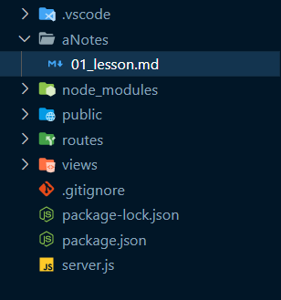

# 1. Folder Structure



# 2. package.json

```package.json
{
  "name": "mern_stack",
  "version": "1.0.0",
  "description": "teachNotes MERN Project",
  "main": "index.js",
  "scripts": {
    "start": "node server",
    "dev": "nodemon server"
  },
  "keywords": [],
  "author": "",
  "license": "ISC",
  "dependencies": {
    "colors": "^1.4.0",
    "express": "^4.18.2"
  },
  "devDependencies": {
    "nodemon": "^3.0.1"
  }
}

```

# 3. server.js

```javascript
// Import necessary modules

// Import the 'colors' module for console text colorization
const colors = require('colors');

// Import the Express framework
const express = require('express');

// Create an instance of the Express application
const app = express();

// Import the 'path' module for working with file paths
const path = require('path');

// Serve static files from the '/public' directory
app.use('/', express.static(path.join(__dirname, '/public')));
//? or  app.use(express.static('public'));

// Include routes defined in 'root.routes.js' for requests starting with '/'
app.use('/', require('./routes/root.routes.js'));

// Middleware for handling 404 errors
app.all('*', (req, res) => {
  res.status(404); // Set HTTP status code to 404 (Not Found)

  // Check if the client accepts HTML responses
  if (req.accepts('html')) {
    res.sendFile(path.join(__dirname, 'views', '404.html')); // Send an HTML file
  } else if (req.accepts('json')) {
    // Check if the client accepts JSON responses
    res.json({ message: '404 Not Found' }); // Send a JSON response
  } else {
    // Handle other cases where the client does not specify a response type
    res.type('txt').send('404 Not Found'); // Send plain text response
  }
});

// Define the server port, using the environment variable 'PORT' or default to 3500
const PORT = process.env.PORT || 3500;

// Start the server and log a message indicating the server is running
app.listen(PORT, () =>
  console.log(`Server running on PORT : ${PORT}`.magenta.bold)
);
```

Sure, I can explain the code you provided in depth.

### 1. Importing Required Modules:

- `const colors = require('colors');`: This line imports the 'colors' module, which allows you to add color to console log messages.
- `const express = require('express');`: It imports the 'express' framework, which simplifies building web applications in Node.js.
- `const app = express();`: This line creates an instance of the Express application.

### 2. Serving Static Files:

- `app.use('/', express.static(path.join(__dirname, '/public')));`: This middleware serves static files from the '/public' directory. Any files in the '/public' directory can be accessed via the root URL.

### 3. Routing:

- `app.use('/', require('./routes/root.routes.js'));`: This line includes the routes defined in the 'root.routes.js' file for any requests starting with the root URL ('/').

### 4. Handling 404 Errors:

- `app.all('*', (req, res) => { ... }`: This middleware is used to handle all requests that haven't been matched by the previous routes. It's a catch-all for handling 404 errors.
- `res.status(404);`: Sets the HTTP status code to 404 (Not Found) for the response.

### 5. Handling Different Response Types for 404:

- The code block within the `if (req.accepts('html'))` condition checks if the client accepts HTML responses. If so, it sends an HTML file ('404.html') located in the 'views' directory.
- The `else if (req.accepts('json'))` block checks if the client accepts JSON responses. If so, it sends a JSON object with a 'message' property containing '404 Not Found'.
- The `else` block handles other cases where the client does not explicitly specify a response type. It sends a plain text response with '404 Not Found'.

### 6. Setting the PORT:

- `const PORT = process.env.PORT || 3500;`: This line defines the port on which the server will listen. It checks if there's a PORT environment variable set (commonly used in cloud hosting environments like Heroku). If not, it defaults to port 3500.

### 7. Starting the Server:

- `app.listen(PORT, () => console.log(`Server running on PORT : ${PORT}`.magenta.bold))`: This code starts the Express server, listening on the specified port. It also logs a message to the console indicating that the server is running. The use of `.magenta.bold` applies color and formatting to the console message using the 'colors' module.

In summary, this code sets up an Express.js server that serves static files from the '/public' directory, defines some routes in 'root.routes.js', handles 404 errors with different response types (HTML, JSON, plain text), and starts the server on a specified port or a default port if the PORT environment variable is not set.

# 4. routes\root.routes.js

```javascript
// Import necessary modules
const router = require('express').Router(); // Create an instance of an Express router
const path = require('path'); // Import the 'path' module for working with file paths

// Define a route handling function for specific URL patterns
router.get('^/$|/index(.html)?', (req, res) => {
  // When a GET request matches this route pattern, execute this function

  // Construct the absolute file path to 'index.html' using '__dirname'
  const indexPath = path.join(__dirname, '..', 'views', 'index.html');

  // Send the 'index.html' file as the response
  res.sendFile(indexPath);
});

// Export the router module for use in other parts of the application
module.exports = router;
```

This code defines an Express.js router in a module and exports it. Let's break down the code step by step:

### 1. Importing Required Modules:

- `const router = require('express').Router();`: This line imports the `Router` function from the Express.js framework and creates an instance of a router.

- `const path = require('path');`: It imports the 'path' module for working with file paths.

### 2 . Handling HTTP GET Requests:

- `router.get('^/$|/index(.html)?', (req, res) => { ... })`: This line sets up a route for HTTP GET requests to URLs that match the regular expression pattern `^/$|/index(.html)?`. Let's break down this pattern:
  - `^/$`: This part matches the root URL ('/') exactly.
  - `|`: This is a logical OR operator.
  - `/index(.html)?`: This part matches '/index' followed by an optional '.html' extension.

### 3. Route Handling Function:

- `(req, res) => { ... }`: This is the callback function that gets executed when a matching GET request is received.
- `res.sendFile(path.join(__dirname, '..', 'views', 'index.html'));`: Inside the callback function, it sends the file located at the specified path as the response. Here's what this line does:
  - `path.join(__dirname, '..', 'views', 'index.html')`: This constructs an absolute file path to the 'index.html' file. It starts with the directory name of the current module (`__dirname`), goes up one directory ('..'), and then enters the 'views' directory to access 'index.html'.
  - `res.sendFile(...)`: This sends the 'index.html' file as the response to the client's GET request.

4. Exporting the Router:
   - `module.exports = router;`: Finally, the router instance is exported as a module so that it can be used in other parts of your application. Other parts of your application can include this router and use it to define routes for specific URLs.

In summary, this code sets up a router that handles GET requests for URLs matching the regular expression pattern `^/$|/index(.html)?`. When a matching request is received, it sends the 'index.html' file as the response. This router can be included and used in your Express application to define routes for specific URLs, such as the root URL ('/') and URLs like '/index' or '/index.html'.

# 5. views\index.html

```html
<!DOCTYPE html>
<html lang="en">
  <head>
    <meta charset="UTF-8" />
    <meta name="viewport" content="width=device-width, initial-scale=1.0" />
    <link rel="stylesheet" href="css/style.css" />
    <title>Tech Notes Api</title>
  </head>

  <body>
    <h1>Tech Notes</h1>
  </body>
</html>
```

# 6. views\404.html

```html
<!DOCTYPE html>
<html lang="en">
  <head>
    <meta charset="UTF-8" />
    <meta name="viewport" content="width=device-width, initial-scale=1.0" />
    <link rel="stylesheet" href="css/style.css" />
    <title>404 Error</title>
  </head>

  <body>
    <h1>404 Error</h1>
    <h1>Sorry!</h1>
    <p>The Resources you have requested does not exist...</p>
  </body>
</html>
```

# 7. public/css/style.css

```css
@import url('https://fonts.googleapis.com/css2?family=Share+Tech+Mono&display=swap');

* {
  margin: 0;
  padding: 0;
  box-sizing: border-box;
}

html {
  font-family: 'Share Tech Mono', monospace;
  font-size: 2.5rem;
}

body {
  min-height: 100vh;
  background-color: #000;
  color: whitesmoke;
  display: grid;
  place-content: center;
  padding: 1rem;
}
```
