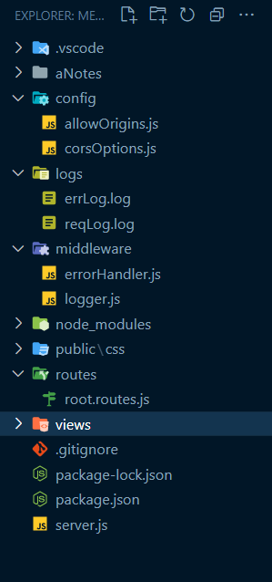

# Middleware

- Middleware is a concept commonly used in web development, including in MERN (MongoDB, Express.js, React, Node.js) stack applications.
- Middleware is essentially a function or set of functions that sit between the incoming HTTP request and the outgoing HTTP response in your application's request-response cycle.
- These functions can perform various tasks, such as processing, modifying, or terminating requests and responses.

**Here's why middleware is used in MERN applications and what purposes it serves:**

#### 1. **Modular and Reusable Code**:

- Middleware allows developers to modularize and encapsulate certain behaviors or functionalities within separate functions.
- This promotes code reusability because middleware can be applied to multiple routes or endpoints.

#### 2. **Request Processing**:

- Middleware functions can inspect and manipulate incoming HTTP requests before they reach the route handlers.
- This is useful for tasks like parsing request bodies, authenticating users, or validating input data.

#### 3. **Response Processing**:

- Similarly, middleware can process and modify the outgoing HTTP response before it is sent back to the client.
- Common use cases include adding headers, compressing responses, or formatting data.

#### 4. **Error Handling**:

- Middleware can handle errors that occur during request processing.
- For example, you can create error-handling middleware that catches errors and sends appropriate error responses to clients, helping to centralize error handling logic.

#### 5. **Authentication and Authorization**:

- Middleware plays a crucial role in implementing authentication and authorization mechanisms.
- It can verify user credentials, check permissions, and restrict access to certain routes or resources based on user roles and privileges.

#### 6. **Logging and Monitoring**:

- Middleware can log important information about requests, such as request details, response times, and errors.
- This helps in monitoring and debugging your application.

#### 7. **Security**:

- Security-related middleware can protect your application from common vulnerabilities like Cross-Site Scripting (XSS), Cross-Site Request Forgery (CSRF), and more. It can sanitize input, set secure headers, and enforce security policies.

#### 8. **Routing and URL Handling**:

- Middleware can be used to route requests based on specific criteria.
- For instance, it can route requests to different controllers or handlers based on the URL path or HTTP method.

#### 9. **Enhancing Server Performance**:

- Middleware can improve server performance by handling tasks like caching, load balancing, and rate limiting.

- In the context of a MERN stack application, middleware is particularly useful in the backend (Node.js and Express.js) to process incoming requests, perform authentication, manage sessions, and handle database interactions.
- In the frontend (React), middleware-like concepts are also used, often in the form of middleware libraries (e.g., Redux middleware) to manage application state and side effects.

**Overall,middleware is a flexible and powerful concept that allows you to add layers of functionality to your application, making it more maintainable, scalable, and secure. It helps you separate concerns and maintain a clean and organized codebase in both frontend and backend development.**

- HTTP Request -> Middleware Function -> API Response
- Additional Functionality for the API
- Preliminary Request Processing

## Types of Middleware adding in this

    1. Built-in Middleware
    2. Custom Middleware
    3. 3rd party Middleware

---

# 1. Folder Structure



# 2. package.json

```npm
npm i date-fns uuid
npm i cookie-parser
npm i cors

```

```package.json
{
  "name": "mern_stack",
  "version": "1.0.0",
  "description": "teachNotes MERN Project",
  "main": "index.js",
  "scripts": {
    "start": "node server",
    "dev": "nodemon server"
  },
  "keywords": [],
  "author": "",
  "license": "ISC",
  "dependencies": {
    "colors": "^1.4.0",
    "cookie-parser": "^1.4.6",
    "cors": "^2.8.5",
    "date-fns": "^2.30.0",
    "express": "^4.18.2",
    "uuid": "^9.0.0"
  },
  "devDependencies": {
    "nodemon": "^3.0.1"
  }
}
```

---

# 3. Server.js

```javascript
// Import necessary modules
require('colors'); // Import the 'colors' module for console text colorization
const express = require('express'); // Import the Express framework
const app = express(); // Create an instance of the Express application
const path = require('path'); // Import the 'path' module for working with file paths

// Import middleware modules
const { logger } = require('./middleware/logger'); // Custom logger middleware
const errorHandler = require('./middleware/errorHandler'); // Custom error handling middleware
const cookieParser = require('cookie-parser'); // Parse cookies

// Import and configure CORS settings
const cors = require('cors');
const corsOptions = require('./config/corsOptions'); // Custom CORS configuration

// Define the port where the server will run
const PORT = process.env.PORT || 3500;

// Use the custom logger middleware
app.use(logger);

// Enable CORS using the configured options
app.use(cors(corsOptions));

// Parse incoming JSON requests
app.use(express.json());

// Parse cookies in the request
app.use(cookieParser());

// Serve static files from the '/public' directory
app.use('/', express.static(path.join(__dirname, '/public')));

// Include routes defined in 'root.routes.js' for requests starting with '/'
app.use('/', require('./routes/root.routes.js'));

// Middleware to handle 404 errors
app.all('*', (req, res) => {
  res.status(404);

  if (req.accepts('html')) {
    res.sendFile(path.join(__dirname, 'views', '404.html')); // Send HTML response
  } else if (req.accepts('json')) {
    res.json({ message: '404 Not Found' }); // Send JSON response
  } else {
    res.type('txt').send('404 Not Found'); // Send plain text response
  }
});

// Use the custom error handling middleware
app.use(errorHandler);

// Start the server and log a message indicating the server is running
app.listen(PORT, () =>
  console.log(`Server running on PORT : ${PORT}`.magenta.bold)
);
```

This is a Node.js application that uses the Express.js framework to create a web server. Let's go through the code in depth to understand its functionality:

## 1. **Importing Necessary Modules**:

- The code starts by importing required Node.js modules. `colors` is used for console text colorization, `express` is the web application framework, and `path` is used for working with file paths.

## 2. **Importing Middleware Modules**:

- Custom middleware and third-party middleware are imported. Middleware functions are functions that have access to the request and response objects and can execute code in between the receiving of a request and sending a response.
- `logger` is a custom middleware for logging HTTP requests.
- `errorHandler` is a custom middleware for handling errors.
- `cookie-parser` is a third-party middleware used to parse cookies from incoming requests.

## 3. **CORS Configuration**:

- Cross-Origin Resource Sharing (CORS) settings are configured using the `cors` middleware. The actual configuration is defined in the `corsOptions` module, which is imported from `./config/corsOptions`.

## 4. **Defining the Port**:

- The code defines the port where the server will listen. It checks the environment variable `PORT` first, and if it's not set, it defaults to port 3500.

## 5. **Using Middleware**:

- Middleware is added to the Express application using `app.use()`.
- `logger` middleware is used to log HTTP requests.
- CORS is enabled using the configured options from `corsOptions`.
- JSON requests are parsed using `express.json()`.
- Cookies are parsed using `cookieParser()`.
- Static files in the `/public` directory are served using `express.static()`. This means that files in the `/public` directory can be accessed directly via URLs starting with `/`.

## 6. **Routing**:

- Routes are defined in separate files. In this code, the routes defined in `./routes/root.routes.js` are included for requests starting with `/`. This means that routes defined in `root.routes.js` will handle requests like `/route-path`.

## 7. **404 Handling**:

- A middleware function is defined to handle 404 errors. If a request does not match any of the defined routes, this middleware is executed.
- It sets the HTTP status to 404 and then checks the `Accept` header of the request to determine the response type.
- If the client accepts HTML, it sends an HTML file located at `./views/404.html`.
- If the client accepts JSON, it sends a JSON response with a "404 Not Found" message.
- If neither HTML nor JSON is accepted, it sends a plain text "404 Not Found" response.

## 8. **Error Handling**:

- Custom error handling middleware (`errorHandler`) is added to the application. This middleware will be invoked if any errors occur during request processing.

## 9. **Starting the Server**:

- The Express application is set to listen on the defined port (`PORT`). When the server starts successfully, a message is logged to the console indicating the server is running.

Overall, this code sets up an Express.js server, configures middleware for logging, CORS, JSON parsing, cookie parsing, and static file serving. It also defines routes, handles 404 errors, and includes error handling middleware.

---

# 4. middleware/logger.js

```javascript
// Import necessary modules
const { format } = require('date-fns'); // Import the 'format' function from the 'date-fns' library for date formatting
const { v4: uuid } = require('uuid'); // Import the 'uuid' function for generating unique identifiers
const fs = require('fs'); // Import the 'fs' module for file system operations
const fsPromises = require('fs').promises; // Import the 'promises' API of the 'fs' module for asynchronous file operations
const path = require('path'); // Import the 'path' module for working with file paths

// Define a function to log events to a file
const logEvents = async (message, logFileName) => {
  // Get the current date and time in a specific format (yyyyMMdd HH:mm:ss)
  const dateTime = format(new Date(), 'yyyyMMdd\tHH:mm:ss');

  // Create a log item with date, a generated UUID, and the provided message
  const logItem = `${dateTime}\t${uuid()}\t${message}\n`;

  try {
    // Check if the 'logs' directory exists, create it if not
    if (!fs.existsSync(path.join(__dirname, '..', 'logs'))) {
      await fsPromises.mkdir(path.join(__dirname, '..', 'logs'));
    }

    // Append the log item to the specified log file
    await fsPromises.appendFile(
      path.join(__dirname, '..', 'logs', logFileName),
      logItem
    );
  } catch (err) {
    console.log(err); // Log any errors that occur during the logging process
  }
};

// Define a middleware function for logging HTTP request events
const logger = (req, res, next) => {
  // Log the HTTP request method, URL, and origin header using the logEvents function
  logEvents(`${req.method}\t${req.url}\t${req.headers.origin}`, 'reqLog.log');

  // Log the HTTP request method and path to the console
  console.log(`${req.method} ${req.path}`);

  // Continue to the next middleware or route handler
  next();
};

// Export the logEvents and logger functions for use in other parts of the application
module.exports = { logEvents, logger };
```

Certainly, I'll provide an in-depth explanation of the code you provided:

## 1. **Importing Required Modules**:

- `const { format } = require('date-fns')`: This line imports the `format` function from the 'date-fns' library, which is used for formatting dates.
- `const { v4: uuid } = require('uuid')`: It imports the `v4` function from the 'uuid' library, allowing you to generate UUIDs (Universally Unique Identifiers).
- `const fs = require('fs')`: This imports the Node.js 'fs' module, which provides file system-related functionality.
- `const fsPromises = require('fs').promises`: It imports the 'promises' API of the 'fs' module, which allows you to perform asynchronous file operations.
- `const path = require('path')`: This imports the 'path' module for working with file paths.

## 2 . **Logging Events with `logEvents` Function**:

- `const logEvents = async (message, logFileName) => { ... }`: This function takes two arguments: `message` (the log message to be written) and `logFileName` (the name of the log file to write to).

- Inside the function:

  - `const dateTime = format(new Date(), 'yyyyMMdd\tHH:mm:ss')`: This line generates the current date and time in the format 'yyyyMMdd HH:mm:ss'.

  - `const logItem`= `${dateTime}\t${uuid()}\t${message}\n`
    : This line creates a log item with the formatted date, a generated UUID, and the provided log message.

  - Error handling is implemented with a try-catch block:

    - `if (!fs.existsSync(path.join(__dirname, '..', 'logs'))) { ... }`: This checks if the 'logs' directory exists. If not, it creates it using `fsPromises.mkdir`.

    - `await fsPromises.appendFile(...)`: This appends the `logItem` to the specified log file within the 'logs' directory. It uses `fsPromises.appendFile` for asynchronous file writing.

  - `console.log(err)`: If any errors occur during the process (e.g., directory creation or file writing), they are logged to the console.

## 3. **Middleware for Logging HTTP Requests with `logger`**:

- `const logger = (req, res, next) => { ... }`: This is a middleware function that logs HTTP request events.

- Inside the function:

  - `logEvents(...)`: It calls the `logEvents` function to log the HTTP request method, URL, and origin header. The log message is constructed as `${req.method}\t${req.url}\t${req.headers.origin}`.

  - `console.log(...)`: This logs the HTTP request method and path to the console.

  - `next()`: This call to `next` allows the middleware to pass control to the next middleware or route handler in the request processing pipeline.

## 4. **Exporting Functions**:

- `module.exports = { logEvents, logger }`: Finally, both the `logEvents` and `logger` functions are exported from the module. This allows them to be used in other parts of your application.

In summary, this code defines two important functions: `logEvents`, which logs events to files, and `logger`, a middleware that logs HTTP request events. These functions are designed for event logging within your Node.js application and can be used for debugging, monitoring, or auditing purposes. The code also handles file system operations and exports these functions for reuse in other parts of your application.

---

# 5. middleware/errorHandlers.js

```javascript
// Import the logEvents function from the 'logger' module
const { logEvents } = require('./logger');

// Define the errorHandler middleware function
const errorHandler = (err, req, res, next) => {
  // Log the error details, request method, URL, and origin using the logEvents function
  logEvents(
    `${err.name}: ${err.message}\t${req.method}\t${req.url}\t${req.headers.origin}`,
    'errLog.log'
  );

  // Log the error stack trace to the console
  console.log(err.stack);

  // Determine the HTTP status code for the response (default to 500 - Internal Server Error)
  const status = res.statusCode ? res.statusCode : 500;

  // Set the HTTP status code of the response
  res.status(status);

  // Send a JSON response with the error message
  res.json({ message: err.message });
};

// Export the errorHandler middleware function
module.exports = errorHandler;
```

This code defines an error handling middleware function called `errorHandler`. Let's go through it step by step:

## 1. **Importing `logEvents` Function**:

- `const { logEvents } = require('./logger');`: This line imports the `logEvents` function from the 'logger' module, which was explained in a previous response. It allows you to log events, including errors, to a log file.

## 2. **`errorHandler` Middleware Function**:

- `const errorHandler = (err, req, res, next) => { ... }`: This is an error handling middleware function that takes four arguments: `err` (the error object), `req` (the request object), `res` (the response object), and `next` (the next middleware function in the pipeline).

- Inside the function:

  - `logEvents(...)`: It calls the `logEvents` function from the imported 'logger' module to log the error details. The log message includes the error's name, message, the HTTP request method, URL, and origin.

  - `console.log(err.stack)`: This line logs the error stack trace to the console. It can be useful for debugging and diagnosing the error.

  - `const status = res.statusCode ? res.statusCode : 500`: This line checks if the response object (`res`) has a status code set. If a status code is set, it is used; otherwise, it defaults to 500 (Internal Server Error).

  - `res.status(status)`: This sets the HTTP status code of the response to the determined status code (either the one from `res` or 500).

  - `res.json({ message: err.message })`: It sends a JSON response with an error message. This message is extracted from the `err` object's `message` property.

## 3. **Exporting `errorHandler` Function**:

- `module.exports = errorHandler;`: Finally, the `errorHandler` middleware function is exported from the module. This allows it to be used as error handling middleware in other parts of your Express.js application.

In summary, this code defines an error handling middleware function (`errorHandler`) that logs error details, including the error message and stack trace, to a log file using the `logEvents` function. It also sets the HTTP status code for the response and sends a JSON response with the error message. This middleware is designed to be used in Express.js applications to handle errors and provide meaningful error responses to clients.

---

# 6. config/allowOrigins.js

```javascript
// Define an array of allowed origins for Cross-Origin Resource Sharing (CORS)
const allowedOrigins = [
  'http://localhost:3000', // Allow requests from the local development server
  'http://www.danrepairshop.com', // Allow requests from the 'www' version of 'danrepairshop.com'
  'http://danrepairshop.com', // Allow requests from 'danrepairshop.com' without 'www'
];

// Export the array of allowed origins
module.exports = allowedOrigins;
```

The code you've provided exports an array named `allowedOrigins` that contains a list of allowed origins (websites) for Cross-Origin Resource Sharing (CORS) in a Node.js or Express.js application.

Here's an explanation:

- `const allowedOrigins = [...]`: This line initializes an array called `allowedOrigins` and populates it with a list of origin URLs. These URLs represent websites that are allowed to make cross-origin requests to your server. In this case, three origins are specified: 'http://localhost:3000', 'http://www.danrepairshop.com', and 'http://danrepairshop.com'.

- `module.exports = allowedOrigins;`: This line exports the `allowedOrigins` array so that it can be used in other parts of your application, particularly when configuring CORS (Cross-Origin Resource Sharing) settings for your server. The array can be imported in other files to specify which origins are allowed to access your server's resources.

By exporting this array, you can easily manage and update the list of allowed origins in one place, making it easier to control and secure your server's interactions with client-side applications running on different domains.

# 7. config/corsOptions.js

The code you provided configures CORS (Cross-Origin Resource Sharing) options for an Express.js application. Here's a breakdown of the code with comments:

```javascript
// Import the list of allowed origins from 'allowOrigins' module
const allowedOrigins = require('./allowOrigins');

// Define CORS options
const corsOptions = {
  // Configure the 'origin' callback function to determine if a request's origin is allowed
  origin: (origin, callback) => {
    if (allowedOrigins.indexOf(origin) !== -1 || !origin) {
      // If the request's origin is in the 'allowedOrigins' list or is null/undefined, allow the request
      callback(null, true);
    } else {
      // If the request's origin is not in the 'allowedOrigins' list, deny the request with an error message
      callback(new Error('Not allowed by Cors'));
    }
  },
  credentials: true, // Enable credentials (cookies, HTTP authentication) for cross-origin requests
  optionsSuccessStatus: 200, // Set the success status code for preflight (OPTIONS) requests to 200
};

// Export the CORS options for use in your Express.js application
module.exports = corsOptions;
```

Here's what each part of the code does:

- `const allowedOrigins = require('./allowOrigins');`: This line imports the list of allowed origins from the 'allowOrigins' module, which you previously defined. These origins are used to determine whether incoming requests are allowed to access your server's resources.

- `const corsOptions = { ... }`: This block defines the CORS options that will be used in your Express.js application.

  - `origin: (origin, callback) => { ... }`: This is a callback function that checks if a request's origin (the domain making the request) is allowed. It takes two parameters: `origin` (the origin of the incoming request) and `callback` (a function to be called to indicate whether the request is allowed or not).

    - If the `origin` is found in the `allowedOrigins` list or if it's `null` or `undefined`, the callback allows the request by calling `callback(null, true)`.
    - If the `origin` is not found in the list, the callback denies the request by calling `callback(new Error('Not allowed by Cors'))`.

  - `credentials: true`: This option allows credentials (such as cookies and HTTP authentication) to be sent with cross-origin requests.

  - `optionsSuccessStatus: 200`: This option sets the HTTP status code to 200 for preflight (OPTIONS) requests, indicating that the preflight request was successful.

- `module.exports = corsOptions;`: Finally, the CORS options object is exported so that you can use it to configure CORS for your Express.js routes and middleware. This object specifies how cross-origin requests are handled and which origins are allowed to access your server.

---

### Notes

**<span style="color:red">
Access to fetch at 'http://localhost:3500/' from origin 'https://www.google.com' has been blocked by CORS policy: No 'Access-Control-Allow-Origin' header is present on the requested resource. If an opaque response serves your needs, set the request's mode to 'no-cors' to fetch the resource with CORS disabled.
</span>**
