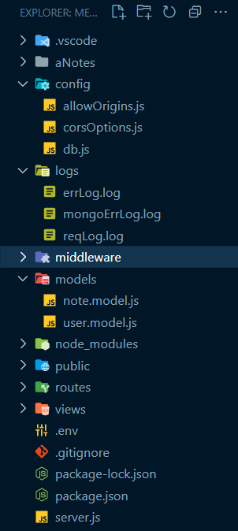

# MongoDB in MERN Applications

MongoDB is a popular **NoSQL database**.

## What is MongoDB?

1. **Document-Oriented**: MongoDB is a document-oriented NoSQL database that stores data in a flexible, JSON-like format called BSON (Binary JSON).

2. **Schema Flexibility**: MongoDB is schema-less, allowing you to insert documents with varying structures into the same collection without a predefined schema.

3. **JSON-Like Documents**: MongoDB stores data in a format that is similar to JSON, making it easy to work with data in MERN applications without complex mapping.

4. **Scalability**: MongoDB is designed to be highly scalable, allowing you to handle large amounts of data and high read/write loads.

5. **Querying and Indexing**: MongoDB provides powerful querying capabilities, including support for complex queries and aggregation operations. Indexing can be used to optimize query performance.

6. **Geospatial Data Support**: MongoDB has built-in support for geospatial data, making it suitable for location-based features.

7. **Community and Ecosystem**: MongoDB has a large and active community of developers, providing extensive resources, documentation, and third-party libraries.

8. **Mongoose**: Mongoose is a popular JavaScript library and ODM (Object-Document Mapping) for MongoDB. It simplifies working with MongoDB in Node.js applications.

9. **Real-Time Data**: MongoDB can be used for real-time data updates in conjunction with technologies like WebSocket or libraries like Socket.io.

## Why MongoDB in MERN?

1. **Schema Flexibility**: MongoDB's schema-less nature aligns well with MERN applications where data structures can evolve over time.

2. **JSON-Like Documents**: MongoDB's data format is similar to JSON, making it easy to work with data in JavaScript-based MERN applications.

3. **Scalability**: MongoDB's horizontal scalability accommodates growing workloads in MERN applications.

4. **Querying and Indexing**: MongoDB provides powerful querying and indexing options for efficient data retrieval.

5. **Geospatial Data**: Built-in support for geospatial data is useful for location-based features.

6. **Community and Ecosystem**: MongoDB benefits from a large and active developer community, offering extensive resources and libraries.

7. **Mongoose**: Mongoose simplifies MongoDB operations in Node.js applications.

8. **Real-Time Data**: MongoDB can be used for real-time data updates, essential for chat applications and live data streaming.

In conclusion, MongoDB is a versatile and widely adopted database choice for MERN stack development. Its flexibility, scalability, JSON-like format, and robust ecosystem make it a valuable component of MERN applications.

---

# 1. Folder Structure



# 2. package.json

```npm
npm i mongoose
npm i mongoose-sequence

```

```package.json
{
  "name": "mern_stack",
  "version": "1.0.0",
  "description": "teachNotes MERN Project",
  "main": "index.js",
  "scripts": {
    "start": "node server",
    "dev": "nodemon server"
  },
  "keywords": [],
  "author": "",
  "license": "ISC",
  "dependencies": {
    "colors": "^1.4.0",
    "cookie-parser": "^1.4.6",
    "cors": "^2.8.5",
    "date-fns": "^2.30.0",
    "dotenv": "^16.3.1",
    "express": "^4.18.2",
    "mongoose": "^7.5.0",
    "mongoose-sequence": "^5.3.1",
    "uuid": "^9.0.0"
  },
  "devDependencies": {
    "nodemon": "^3.0.1"
  }
}

```

# 3. server.js

```javascript
// Load environment variables from a .env file
require('dotenv').config();

// Import necessary modules
require('colors'); // Import the 'colors' module for console text colorization
const express = require('express'); // Import the Express framework
const app = express(); // Create an instance of the Express application
const path = require('path'); // Import the 'path' module for working with file paths

// Database connection setup
const connectDB = require('./config/db'); // Import a function for database connection

// Middleware
const { logger } = require('./middleware/logger'); // Import a custom logging middleware
const errorHandler = require('./middleware/errorHandler'); // Import a custom error handling middleware
const cookieParser = require('cookie-parser'); // Import the 'cookie-parser' middleware

// CORS (Cross-Origin Resource Sharing) setup
const cors = require('cors'); // Import the 'cors' middleware
const corsOptions = require('./config/corsOptions'); // Import CORS configuration options

// Log the value of the NODE_ENV environment variable (e.g., 'development' or 'production')
console.log(process.env.NODE_ENV);

// Define the server's port, using the 'PORT' environment variable or defaulting to 3500
const PORT = process.env.PORT || 3500;

// Connect to the database (specific details are likely configured within 'db.js')
connectDB();

// Use the custom 'logger' middleware to log request details
app.use(logger);

// Enable CORS using the specified configuration options
app.use(cors(corsOptions));

// Parse incoming JSON requests
app.use(express.json());

// Parse incoming cookies from requests
app.use(cookieParser());

// Serve static files from the '/public' directory for requests to the root URL ('/')
app.use('/', express.static(path.join(__dirname, '/public')));

// Include routes defined in 'root.routes.js' for requests starting with '/'
app.use('/', require('./routes/root.routes.js'));

// Middleware for handling 404 errors
app.all('*', (req, res) => {
  res.status(404);

  if (req.accepts('html')) {
    // Send an HTML 404 response
    res.sendFile(path.join(__dirname, 'views', '404.html'));
  } else if (req.accepts('json')) {
    // Send a JSON 404 response
    res.json({ message: '404 Not Found' });
  } else {
    // Send a plain text 404 response
    res.type('txt').send('404 Not Found');
  }
});

// Use the custom 'errorHandler' middleware for handling and responding to errors
app.use(errorHandler);

// Start the server and log a message indicating the server is running
app.listen(PORT, () =>
  console.log(`Server running on PORT : ${PORT}`.magenta.bold)
);
```

The code you provided is for setting up an Express.js web server with various middleware, database connection, and error handling. Let's break it down step by step:

### 1. **Importing Required Modules**:

- `require('dotenv').config();`: This line loads environment variables from a `.env` file into `process.env`. It's commonly used for configuration.
- `require('colors');`: Imports the 'colors' module for adding color to console log messages.
- `const express = require('express');`: Imports the Express.js framework.
- `const app = express();`: Creates an instance of the Express application.
- `const path = require('path');`: Imports the 'path' module for working with file paths.

### 2. **Database Connection**:

- `const connectDB = require('./config/db');`: Imports a function named `connectDB` from the 'db.js' file located in the 'config' directory. This function is likely responsible for establishing a connection to a database.

### 3. **Middleware**:

- `const { logger } = require('./middleware/logger');`: Imports a custom logging middleware function named `logger`.
- `const errorHandler = require('./middleware/errorHandler');`: Imports a custom error handling middleware function named `errorHandler`.
- `const cookieParser = require('cookie-parser');`: Imports the 'cookie-parser' middleware for parsing cookies.

### 4. **CORS Configuration**:

- `const cors = require('cors');`: Imports the 'cors' middleware for handling Cross-Origin Resource Sharing (CORS).
- `const corsOptions = require('./config/corsOptions');`: Imports CORS configuration options from the 'corsOptions.js' file located in the 'config' directory.

### 5. **Database Connection and Port Configuration**:

- `console.log(process.env.NODE_ENV);`: Logs the value of the 'NODE_ENV' environment variable to the console. This typically indicates the environment mode, such as 'development' or 'production'.
- `const PORT = process.env.PORT || 3500;`: Sets the server's port by using the 'PORT' environment variable if defined, or defaulting to port 3500.

### 6. **Database Connection**:

- `connectDB();`: Calls the `connectDB` function to establish a connection to the database. The specific details of the database connection are likely defined within the 'db.js' file in the 'config' directory.

### 7. **Middleware Setup**:

- `app.use(logger)`: Uses the custom `logger` middleware to log request details.
- `app.use(cors(corsOptions))`: Sets up CORS using the provided configuration options.
- `app.use(express.json())`: Parses incoming JSON request bodies.
- `app.use(cookieParser())`: Parses incoming cookies from requests.
- `app.use('/', express.static(path.join(__dirname, '/public')));`: Serves static files from the '/public' directory for requests to the root URL ('/').

### 8. **Route Handling**:

- `app.use('/', require('./routes/root.routes.js'));`: Includes routes defined in 'root.routes.js' for requests starting with '/'.

### 9. **Handling 404 Errors**:

- `app.all('*', (req, res) => { ... }`: Serves as a catch-all route handler for any requests that don't match the defined routes.
- Depending on the request's 'Accept' header, it sends a 404 response as either HTML, JSON, or plain text. This handles various client types.

### 10. **Error Handling Middleware**:

- `app.use(errorHandler)`: Uses the custom error handling middleware (`errorHandler`) to handle and respond to errors.

### 11. **Server Initialization**:

- `app.listen(PORT, () => console.log(`Server running on PORT : ${PORT}`.magenta.bold))`: Starts the Express server, listening on the specified port. A message indicating the server is running is logged to the console in magenta color.

# 4. config/db.js

```javascript
// Import necessary modules
const dotenv = require('dotenv'); // Import the 'dotenv' module for loading environment variables
const mongoose = require('mongoose'); // Import Mongoose, the MongoDB library
const { logEvents } = require('../middleware/logger'); // Import the custom 'logEvents' function from the logger middleware

// Load environment variables from a .env file
dotenv.config();

// Define a function to establish a database connection
const connectDB = async () => {
  try {
    // Attempt to connect to the MongoDB database using the provided URL
    const conn = await mongoose.connect(process.env.MONGODB_URL, {
      useNewUrlParser: true,
      useUnifiedTopology: true,
      // useCreateIndex: true,
    });

    // Log a success message if the connection is established
    console.log(
      `MongoDB Connected: ${conn.connection.host}`.blue.underline.bold
    );

    // Set up an error handler for MongoDB connection errors
    mongoose.connection.on('error', (err) => {
      console.error('MongoDB connection error:', err);
      // Log the MongoDB connection error details using the 'logEvents' function
      logEvents(
        `${err.no}: ${err.code}\t${err.syscall}\t${err.hostname}`,
        'mongoErrLog.log'
      );
    });
  } catch (error) {
    // Handle any errors that occur during database connection
    console.log(`Error: ${error.message}`.red.bold);
    process.exit(); // Exit the Node.js process if there's an error
  }
};

// Export the 'connectDB' function so it can be used in other parts of the application
module.exports = connectDB;
```

Here's an explanation of each part of the code:

### 1. **Environment Variables**:

- `dotenv.config();`: Loads environment variables from a `.env` file, making them accessible via `process.env`.

### 2. **Database Connection Function**:

- `const connectDB = async () => { ... }`: Defines an asynchronous function called `connectDB` responsible for establishing a connection to the MongoDB database.

### 3. **Database Connection Attempt**:

- `await mongoose.connect(process.env.MONGODB_URL, { ... });`: Attempts to connect to the MongoDB database using the URL provided in the `process.env.MONGODB_URL`. It also specifies some options for the connection, such as using the new URL parser and unified topology.

### 4. **Connection Success Logging**:

- `console.log(`MongoDB Connected: ${conn.connection.host}`.blue.underline.bold);`: If the database connection is successful, it logs a success message with the host information.

### 5. **Error Handling**:

- `mongoose.connection.on('error', err => { ... });`: Sets up an error handler for MongoDB connection errors. If there's a connection error, it logs the error details and calls the `logEvents` function to log the error details.

### 6. **Error Handling in Case of Failure**:

- `catch (error) { ... }`: Catches any errors that may occur during the database connection attempt. It logs the error message and exits the Node.js process if there's an error.

### 7. **Exporting the `connectDB` Function**:

- `module.exports = connectDB;`: Exports the `connectDB` function so that it can be imported and used in other parts of the application to establish the database connection.

**This module provides a reusable function (`connectDB`) for connecting to a MongoDB database and includes error handling to log any connection issues.**

# 5. models/user.model.js

```javascript
// Import Mongoose, the MongoDB library
const mongoose = require('mongoose');

// Define a user schema using Mongoose's Schema constructor
const userSchema = new mongoose.Schema(
  {
    // Define the structure of the user document

    // User's username, required field
    username: { type: String, required: true },

    // User's password, required field
    password: { type: String, required: true },

    // User's roles (array with a default value of "Employee")
    roles: [{ type: String, default: 'Employee' }],

    // User's activity status with a default value of true (active)
    active: { type: Boolean, default: true },
  },
  {
    // Adds createdAt and updatedAt timestamps to the user document
    timestamps: true,
  }
);

// Create a Mongoose model named 'User' based on the 'userSchema'
const User = mongoose.model('User', userSchema);

// Export the 'User' model to be used elsewhere in the application
module.exports = User;
```

Here's an explanation of each part of the code:

#### 1. **Mongoose Schema Definition**:

- `const userSchema = new mongoose.Schema({ ... });`: This code defines a Mongoose schema using the `mongoose.Schema` constructor. The schema defines the structure of a user document in the MongoDB collection.

#### 2. **Schema Fields**:

- `username`: A field for the user's username, with the `String` data type and `required` validation to ensure it's provided.
- `password`: A field for the user's password, also with the `String` data type and `required` validation.
- `roles`: An array field for the user's roles, with a default value of "Employee" if no roles are specified.
- `active`: A Boolean field for the user's activity status, with a default value of `true` to indicate that the user is active.

#### 3. **Timestamps**:

- `{ timestamps: true }`: This option is added to the schema to automatically generate `createdAt` and `updatedAt` fields for each user document. These fields store the creation and update timestamps.

#### 4. **Mongoose Model Creation**:

- `const User = mongoose.model('User', userSchema);`: This code creates a Mongoose model named 'User' based on the 'userSchema' definition. The model represents the collection in the MongoDB database and provides methods for interacting with the data.

#### 5. **Exporting the Model**:

- `module.exports = User;`: The 'User' model is exported, allowing it to be imported and used in other parts of the application to perform CRUD (Create, Read, Update, Delete) operations on user documents in the MongoDB database.

**This code provides a structured way to define and work with user data in MongoDB using Mongoose. The 'User' model can be imported and used to interact with user data in your application.**

# 6. models/note.model.js

The provided code defines a Mongoose schema and model for a "note" entity, with some additional configuration for auto-incrementing a "ticket" field. Let's break down the code with comments:

```javascript
// Import Mongoose, the MongoDB library
const mongoose = require('mongoose');

// Import the 'mongoose-sequence' plugin for auto-incrementing fields
const AutoIncrement = require('mongoose-sequence')(mongoose);

// Define a note schema using Mongoose's Schema constructor
const noteSchema = new mongoose.Schema(
  {
    // Define the structure of the note document

    // Reference to the 'User' model (assumes there's a 'User' model)
    user: {
      type: mongoose.Schema.Types.ObjectId,
      required: true,
      ref: 'User',
    },

    // Note's title, required field
    title: { type: String, required: true },

    // Note's text content, required field
    text: { type: String, required: true },

    // Note's completion status with a default value of false
    completed: { type: Boolean, default: false },
  },
  {
    // Adds createdAt and updatedAt timestamps to the note document
    timestamps: true,
  }
);

// Plugin for auto-incrementing a 'ticket' field
noteSchema.plugin(AutoIncrement, {
  // Name of the auto-incrementing field
  inc_field: 'ticket',

  // Name of the counter collection
  id: 'ticketNums',

  // Starting sequence number
  start_seq: 500,
});

// Create a Mongoose model named 'Note' based on the 'noteSchema'
const Note = mongoose.model('Note', noteSchema);

// Export the 'Note' model to be used elsewhere in the application
module.exports = Note;
```

Here's an explanation of each part of the code:

### 1. **Mongoose Schema Definition**:

- `const noteSchema = new mongoose.Schema({ ... });`: This code defines a Mongoose schema using the `mongoose.Schema` constructor. The schema defines the structure of a note document in the MongoDB collection.

### 2. **Schema Fields**:

- `user`: A reference to a user document (assuming there's a 'User' model). It's defined as an ObjectId and is required.
- `title`: A field for the note's title, with the `String` data type and `required` validation to ensure it's provided.
- `text`: A field for the note's text content, also with the `String` data type and `required` validation.
- `completed`: A Boolean field for the note's completion status, with a default value of `false`.

### 3. **Timestamps**:

- `{ timestamps: true }`: This option is added to the schema to automatically generate `createdAt` and `updatedAt` fields for each note document. These fields store the creation and update timestamps.

### 4. **Auto-Incrementing 'ticket' Field**:

- `noteSchema.plugin(AutoIncrement, { ... });`: This code applies the 'mongoose-sequence' plugin to the 'noteSchema' to enable auto-incrementing of a 'ticket' field.
- `inc_field`: Specifies the name of the auto-incrementing field as 'ticket'.
- `id`: Specifies the name of the counter collection as 'ticketNums'.
- `start_seq`: Sets the starting sequence number for auto-incrementing to 500.

### 5. **Mongoose Model Creation**:

- `const Note = mongoose.model('Note', noteSchema);`: This code creates a Mongoose model named 'Note' based on the 'noteSchema' definition. The model represents the collection in the MongoDB database and provides methods for interacting with the data.

### 6. **Exporting the Model**:

- `module.exports = Note;`: The 'Note' model is exported, allowing it to be imported and used in other parts of the application to perform CRUD (Create, Read, Update, Delete) operations on note documents in the MongoDB database.

**This code defines a structured way to work with note data in MongoDB using Mongoose and includes auto-incrementing functionality for a 'ticket' field. The 'Note' model can be imported and used to interact with note data in your application.**
