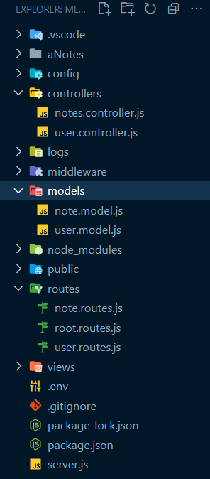

# controllers

- controllers are a part of the backend server that handle the logic for processing incoming requests from clients (usually from a frontend built with React) and returning appropriate responses.
- Controllers are a crucial component of the Model-View-Controller (MVC) architectural pattern, which helps organize the codebase and separates concerns.

## Here's a breakdown of what controllers do in a MERN application:

### 1. **Request Handling**:

- Controllers receive incoming HTTP requests from clients through routes defined in your Express.js application.
- These requests can be for various operations like creating, reading, updating, or deleting data.

### 2. **Business Logic**:

- Controllers contain the business logic of your application.
- This logic often involves interacting with the database (MongoDB) to perform CRUD (Create, Read, Update, Delete) operations on data.
- For example, if you have a task management application, a controller might handle creating a new task, fetching a list of tasks, updating task details, and deleting tasks.

### 3. **Data Validation**:

- Controllers validate the data received in requests to ensure it meets the required criteria and is safe to process.
- This may involve checking for required fields, data types, and authentication/authorization checks.

### 4. **Response Handling**:

- After processing a request and performing the necessary operations, controllers send an appropriate HTTP response back to the client.
- This response typically includes a status code (e.g., 200 for success or 404 for not found) and a JSON payload with relevant data or an error message.

### 5. **Separation of Concerns**:

- Controllers help maintain a clean separation of concerns in your application.
- They are responsible for handling requests and managing the flow of data, while other components like models interact directly with the database, and views (usually in a React frontend) handle the user interface.

### 6. **Modularity**:

- Controllers are organized into separate files, each responsible for a specific resource or feature in your application.
- For example, you might have a UserController for handling user-related operations and a TaskController for tasks.

---

# 1. Folder Structure



# 2. package.json

```npm
npm i express-async-handler bcrypt

```

```package.json
{
  "name": "mern_stack",
  "version": "1.0.0",
  "description": "teachNotes MERN Project",
  "main": "index.js",
  "scripts": {
    "start": "node server",
    "dev": "nodemon server"
  },
  "keywords": [],
  "author": "",
  "license": "ISC",
  "dependencies": {
    "bcrypt": "^5.1.1",
    "colors": "^1.4.0",
    "cookie-parser": "^1.4.6",
    "cors": "^2.8.5",
    "date-fns": "^2.30.0",
    "dotenv": "^16.3.1",
    "express": "^4.18.2",
    "express-async-handler": "^1.2.0",
    "mongoose": "^7.5.0",
    "mongoose-sequence": "^5.3.1",
    "uuid": "^9.0.0"
  },
  "devDependencies": {
    "nodemon": "^3.0.1"
  }
}


```

# 3. server.js

```javascript
// Load environment variables from a .env file
require('dotenv').config();

// Import necessary modules
require('colors'); // Import the 'colors' module for console text colorization
const express = require('express'); // Import the Express framework
const app = express(); // Create an instance of the Express application
const path = require('path'); // Import the 'path' module for working with file paths

// Database connection setup
const connectDB = require('./config/db'); // Import a function for database connection

// Middleware
const { logger } = require('./middleware/logger'); // Import a custom logging middleware
const errorHandler = require('./middleware/errorHandler'); // Import a custom error handling middleware
const cookieParser = require('cookie-parser'); // Import the 'cookie-parser' middleware

// CORS (Cross-Origin Resource Sharing) setup
const cors = require('cors'); // Import the 'cors' middleware
const corsOptions = require('./config/corsOptions'); // Import CORS configuration options

// Import routes
const rootRoutes = require('./routes/root.routes'); // Import routes for the root URL
const userRoutes = require('./routes/user.routes'); // Import user-related routes
const noteRoutes = require('./routes/note.routes'); // Import note-related routes

// Log the value of the NODE_ENV environment variable (e.g., 'development' or 'production')
console.log(process.env.NODE_ENV);

// Define the server's port, using the 'PORT' environment variable or defaulting to 3500
const PORT = process.env.PORT || 3500;

// Connect to the database (specific details are likely configured within 'db.js')
connectDB();

// Use the custom 'logger' middleware to log request details
app.use(logger);

// Enable CORS using the specified configuration options
app.use(cors(corsOptions));

// Parse incoming JSON requests
app.use(express.json());

// Parse incoming cookies from requests
app.use(cookieParser());

// Serve static files from the '/public' directory for requests to the root URL ('/')
app.use('/', express.static(path.join(__dirname, '/public')));

// Define routes using imported route handlers
app.use('/', rootRoutes); // Routes for the root URL
app.use('/users', userRoutes); // Routes related to users
app.use('/notes', noteRoutes); // Routes related to notes

// Middleware for handling 404 errors
app.all('*', (req, res) => {
  res.status(404);

  if (req.accepts('html')) {
    // Send an HTML 404 response
    res.sendFile(path.join(__dirname, 'views', '404.html'));
  } else if (req.accepts('json')) {
    // Send a JSON 404 response
    res.json({ message: '404 Not Found' });
  } else {
    // Send a plain text 404 response
    res.type('txt').send('404 Not Found');
  }
});

// Use the custom 'errorHandler' middleware for handling and responding to errors
app.use(errorHandler);

// Start the server and log a message indicating the server is running
app.listen(PORT, () =>
  console.log(`Server running on PORT : ${PORT}`.magenta.bold)
);
```

Certainly, let's provide a detailed explanation of each section of the code:

### 1. **Environment Variables and Module Imports**:

- `require('dotenv').config();`: Loads environment variables from a `.env` file using the `dotenv` package.
- `require('colors');`: Imports the 'colors' module for adding color to console log messages.
- `const express = require('express');`: Imports the Express.js framework.
- `const app = express();`: Creates an instance of the Express application.
- `const path = require('path');`: Imports the 'path' module for working with file paths.

### 2. **Database Connection Setup**:

- `const connectDB = require('./config/db');`: Imports a function for establishing a database connection. The specific details of the database connection are likely defined within 'db.js' in the 'config' directory.

### 3. **Middleware Setup**:

- `const { logger } = require('./middleware/logger');`: Imports a custom logging middleware function named `logger`.
- `const errorHandler = require('./middleware/errorHandler');`: Imports a custom error handling middleware function named `errorHandler`.
- `const cookieParser = require('cookie-parser');`: Imports the 'cookie-parser' middleware for parsing cookies.

### 4. **CORS (Cross-Origin Resource Sharing) Setup**:

- `const cors = require('cors');`: Imports the 'cors' middleware for handling CORS.
- `const corsOptions = require('./config/corsOptions');`: Imports CORS configuration options from 'corsOptions.js' in the 'config' directory.

### 5. **Route Imports**:

- `const rootRoutes = require('./routes/root.routes');`: Imports routes for the root URL.
- `const userRoutes = require('./routes/user.routes');`: Imports user-related routes.
- `const noteRoutes = require('./routes/note.routes');`: Imports note-related routes.

### 6. **Logging the Environment Mode**:

- `console.log(process.env.NODE_ENV);`: Logs the value of the 'NODE_ENV' environment variable, indicating the environment mode (e.g., 'development' or 'production').

### 7. **Server Port Configuration**:

- `const PORT = process.env.PORT || 3500;`: Defines the server's port. It uses the 'PORT' environment variable if defined, or defaults to port 3500.

### 8. **Database Connection**:

- `connectDB();`: Calls the `connectDB` function to establish a connection to the database.

### 9. **Middleware Setup**:

- `app.use(logger)`: Uses the custom `logger` middleware to log request details.
- `app.use(cors(corsOptions))`: Sets up CORS using the provided configuration options.
- `app.use(express.json())`: Parses incoming JSON request bodies.
- `app.use(cookieParser())`: Parses incoming cookies from requests.
- `app.use('/', express.static(path.join(__dirname, '/public')))`: Serves static files from the '/public' directory for requests to the root URL ('/').

### 10. **Route Definitions**:

- `app.use('/', rootRoutes)`: Includes routes defined in 'root.routes.js' for requests starting with '/'.
- `app.use('/users', userRoutes)`: Includes user-related routes under the '/users' path.
- `app.use('/notes', noteRoutes)`: Includes note-related routes under the '/notes' path.

### 11. **Handling 404 Errors**:

- `app.all('*', (req, res) => { ... }`: Serves as a catch-all route handler for any requests that don't match the defined routes.
  - Depending on the request's 'Accept' header, it sends a 404 response as either HTML, JSON, or plain text. This handles various client types.

### 12. **Error Handling Middleware**:

- `app.use(errorHandler)`: Uses the custom error handling middleware (`errorHandler`) to handle and respond to errors.

### 13. **Server Initialization**:

- `app.listen(PORT, () => console.log(`Server running on PORT : ${PORT}`.magenta.bold))`: Starts the Express server, listening on the specified port. A message indicating the server is running is logged to the console in magenta color.

**This code sets up an Express.js server with middleware for logging, error handling, CORS configuration, and route handling. It also serves static files, connects to a database, and listens on a specified port. The specific functionality of the routes and database connection would be defined in other parts of your application.**

# 4. routes/user.routes.js

This code defines a set of routes for user-related operations using Express.js Router. It imports controller functions to handle these operations and maps them to specific HTTP methods and URL paths. Let's break down the code with comments:

```javascript
// Import Express.js and create a router instance
const router = require('express').Router();

// Import controller functions for user operations
const {
  getAllUsers,
  createNewUser,
  updateUser,
  deleteUser,
} = require('../controllers/user.controller');

// Define routes for user operations and map them to controller functions

// Route for getting all users (HTTP GET)
router.get('/', getAllUsers);

// Route for creating a new user (HTTP POST)
router.post('/', createNewUser);

// Route for updating a user (HTTP PATCH)
router.patch('/', updateUser);

// Route for deleting a user (HTTP DELETE)
router.delete('/', deleteUser);

// Export the router to be used in other parts of the application
module.exports = router;
```

Here's an explanation of each part of the code:

1. **Router Setup**:

   - `const router = require('express').Router();`: Creates an instance of an Express Router. This router will be used to define and manage routes for user-related operations.

2. **Controller Function Imports**:

   - `const { ... } = require('../controllers/user.controller');`: Imports controller functions for user-related operations from the 'user.controller.js' file in the '../controllers' directory. These functions handle the business logic for each operation.

3. **Route Definitions**:

   - `router.get('/', getAllUsers);`: Defines a route for getting all users. When a GET request is made to the root URL ('/'), it will be handled by the `getAllUsers` controller function.
   - `router.post('/', createNewUser);`: Defines a route for creating a new user. When a POST request is made to the root URL ('/'), it will be handled by the `createNewUser` controller function.
   - `router.patch('/', updateUser);`: Defines a route for updating a user. When a PATCH request is made to the root URL ('/'), it will be handled by the `updateUser` controller function.
   - `router.delete('/', deleteUser);`: Defines a route for deleting a user. When a DELETE request is made to the root URL ('/'), it will be handled by the `deleteUser` controller function.

4. **Exporting the Router**:
   - `module.exports = router;`: Exports the router so that it can be used in other parts of the application, typically in the main application file where it is attached to the Express app using `app.use()`.

In summary, this code sets up routes for user-related operations (GET, POST, PATCH, DELETE) using Express Router. Each route is mapped to a corresponding controller function responsible for handling the operation. This separation of concerns helps keep the code organized and follows the principles of the Model-View-Controller (MVC) architecture.

# 5. routes/note.routes.js

This code defines a set of routes for note-related operations using Express.js Router. It imports controller functions to handle these operations and maps them to specific HTTP methods and URL paths. Let's break down the code with comments:

```javascript
// Import Express.js and create a router instance
const router = require('express').Router();

// Import controller functions for note operations
const {
  getAllNotes,
  createNewNote,
  updateNote,
  deleteNote,
} = require('../controllers/notes.controller');

// Define routes for note operations and map them to controller functions

// Route for getting all notes (HTTP GET)
router.get('/', getAllNotes);

// Route for creating a new note (HTTP POST)
router.post('/', createNewNote);

// Route for updating a note (HTTP PATCH)
router.patch('/', updateNote);

// Route for deleting a note (HTTP DELETE)
router.delete('/', deleteNote);

// Export the router to be used in other parts of the application
module.exports = router;
```

Here's an explanation of each part of the code:

1. **Router Setup**:

   - `const router = require('express').Router();`: Creates an instance of an Express Router. This router will be used to define and manage routes for note-related operations.

2. **Controller Function Imports**:

   - `const { ... } = require('../controllers/notes.controller');`: Imports controller functions for note-related operations from the 'notes.controller.js' file in the '../controllers' directory. These functions handle the business logic for each operation.

3. **Route Definitions**:

   - `router.get('/', getAllNotes);`: Defines a route for getting all notes. When a GET request is made to the root URL ('/'), it will be handled by the `getAllNotes` controller function.
   - `router.post('/', createNewNote);`: Defines a route for creating a new note. When a POST request is made to the root URL ('/'), it will be handled by the `createNewNote` controller function.
   - `router.patch('/', updateNote);`: Defines a route for updating a note. When a PATCH request is made to the root URL ('/'), it will be handled by the `updateNote` controller function.
   - `router.delete('/', deleteNote);`: Defines a route for deleting a note. When a DELETE request is made to the root URL ('/'), it will be handled by the `deleteNote` controller function.

4. **Exporting the Router**:
   - `module.exports = router;`: Exports the router so that it can be used in other parts of the application, typically in the main application file where it is attached to the Express app using `app.use()`.

In summary, this code sets up routes for note-related operations (GET, POST, PATCH, DELETE) using Express Router. Each route is mapped to a corresponding controller function responsible for handling the operation. This separation of concerns helps keep the code organized and follows the principles of the Model-View-Controller (MVC) architecture.

# 6. controllers/user.controller.js

Certainly, let's provide a more in-depth explanation of each part of the code for user-related operations:

**Import Statements**:

```javascript
const User = require('../models/user.model');
const Note = require('../models/note.model');
const asyncHandler = require('express-async-handler');
const bcrypt = require('bcrypt');
```

- This section imports necessary modules and models:
  - `User` and `Note` models are imported from their respective files ('user.model.js' and 'note.model.js') to interact with the database.
  - `asyncHandler` is a middleware used to handle asynchronous functions and manage errors gracefully.
  - `bcrypt` is a library used for hashing passwords securely.

**Get All Users**:

```javascript
const getAllUsers = asyncHandler(async (req, res) => {
  const users = await User.find().select('-password').lean();

  if (!users?.length) {
    return res.status(400).json({ message: 'No users found' });
  }

  res.json(users);
});
```

- The `getAllUsers` function is an asynchronous route handler.
- It uses `await` to fetch all users from the database, excluding their passwords, and stores the result in the `users` variable.
- If there are no users found (`!users?.length` checks for an empty array), it returns a 400 Bad Request response with a message.
- Otherwise, it sends a JSON response with the list of users.

**Create New User**:

```javascript
const createNewUser = asyncHandler(async (req, res) => {
  const { username, password, roles } = req.body;

  // Confirm data
  if (!username || !password || !Array.isArray(roles) || !roles.length) {
    return res.status(400).json({ message: 'All fields are required' });
  }

  // Check for duplicate username
  const duplicate = await User.findOne({ username }).lean().exec();

  if (duplicate) {
    return res.status(409).json({ message: 'Duplicate username' });
  }

  // Hash password
  const hashPassword = await bcrypt.hash(password, 10);

  const userObject = { username, password: hashPassword, roles };

  const user = await User.create(userObject);

  if (user) {
    res.status(201).json({ message: `New User ${username} created` });
  } else {
    res.status(400).json({ message: `Invalid user data received` });
  }
});
```

- The `createNewUser` function is an asynchronous route handler for creating a new user.
- It extracts `username`, `password`, and `roles` from the request body.
- It checks if all required fields are provided, and if not, it returns a 400 Bad Request response.
- It checks for duplicate usernames in the database. If a duplicate is found, it returns a 409 Conflict response.
- It hashes the password using `bcrypt` and creates a new user object with the hashed password.
- It attempts to create the user in the database and responds with a success message or an error message if the user creation fails.

**Update User**:

```javascript
const updateUser = asyncHandler(async (req, res) => {
  const { id, username, roles, active, password } = req.body;

  // Confirm data
  if (
    !id ||
    !username ||
    !Array.isArray(roles) ||
    !roles.length ||
    typeof active !== 'boolean'
  ) {
    return res
      .status(400)
      .json({ message: 'All fields except password are required' });
  }

  // Does the user exist to update?
  const user = await User.findById(id).exec();

  if (!user) {
    return res.status(400).json({ message: 'User Not Found' });
  }

  // check for Duplicate
  const duplicate = await User.findOne({ username }).lean().exec();

  // Allow updates to the Original User
  if (duplicate && duplicate?._id.toString() !== id) {
    return res.status(409).json({ message: 'Duplicate username' });
  }

  user.username = username;
  user.roles = roles;
  user.active = active;

  if (password) {
    // Hash password
    user.password = await bcrypt.hash(password, 10);
  }

  const updatedUser = await user.save();

  res.json({ message: `${updatedUser.username} updated` });
});
```

- The `updateUser` function is an asynchronous route handler for updating a user.
- It extracts `id`, `username`, `roles`, `active`, and `password` from the request body.
- It confirms that all required fields (except the password) are provided and have the correct data types; otherwise, it returns a 400 Bad Request response.
- It checks if the user to update exists in the database by its `id`. If not found, it returns a 400 Bad Request response.
- It checks for duplicate usernames but allows updates to the original user's username.
- It updates the user's properties based on the provided data, including updating the password if a new one is provided and hashes it.
- It saves the updated user object in the database and responds with a success message.

**Delete User**:

```javascript
const deleteUser = asyncHandler(async (req, res) => {
  const { id } = req.body;

  if (!id) {
    return res.status(400).json({ message: 'User ID Required' });
  }

  const note = await Note.findOne({ user: id }).lean().exec();

  if (note) {
    return res.status(400).json({ message: 'User has assigned notes' });
  }

  const user = await User.findById(id).exec();

  if (!user) {
    return res.status(400).json({ message: 'User Not Found' });
  }

  const result = await user.deleteOne();

  const reply = `Username ${result.username} with ID ${result._id} deleted`;

  res.json(reply);
});
```

- The `deleteUser` function is an asynchronous route handler for deleting a user.
- It extracts the `id` from the request body.
- It checks if the user has any assigned notes. If so, it returns a 400 Bad Request response.
- It checks if the user to delete exists in the database by its `id`. If not found, it returns a 400 Bad Request response.
- It deletes the user from the database and responds with a message indicating the deletion.

These controller functions handle the CRUD (Create, Read, Update, Delete) operations for users and ensure data validation and error handling. They are designed to work with routes and can be reused in different parts of the application.

# 7. controllers/notes.controller.js

This code defines controller functions for note-related operations in an Express.js application. These controller functions interact with the database and handle HTTP requests and responses. Let's break down the code with comments:

**Import Statements**:

```javascript
// Import required models and modules
const User = require('../models/user.model'); // Import the User model
const Note = require('../models/note.model'); // Import the Note model
const asyncHandler = require('express-async-handler'); // Middleware for handling asynchronous functions
```

- This section imports necessary modules and models:
  - `User` and `Note` models are imported from their respective files ('user.model.js' and 'note.model.js') to interact with the database.
  - `asyncHandler` is a middleware used to handle asynchronous functions and manage errors gracefully.

**Get All Notes**:

```javascript
const getAllNotes = asyncHandler(async (req, res) => {
  const notes = await Note.find().lean();

  if (!notes.length) {
    return res.status(400).json({ message: 'No Notes Found' });
  }

  const notesWithUser = await Promise.all(
    notes.map(async (note) => {
      const user = await User.findById(note.user).lean().exec();
      return { ...note, username: user.username };
    })
  );

  res.json(notesWithUser);
});
```

- The `getAllNotes` function is an asynchronous route handler.
- It uses `await` to fetch all notes from the database and stores the result in the `notes` variable.
- If there are no notes found (`!notes.length` checks for an empty array), it returns a 400 Bad Request response with a message.
- It then retrieves the username of the note's user by querying the `User` model using the `note.user` ID. This is done using `Promise.all` and mapping over the `notes` array.
- Finally, it sends a JSON response with the list of notes, including the associated usernames.

**Create New Note**:

```javascript
const createNewNote = asyncHandler(async (req, res) => {
  const { user, title, text } = req.body;

  // Confirm data
  if (!user || !title || !text) {
    return res.status(400).json({ message: 'All fields are required' });
  }

  // Check for duplicate title
  const duplicate = await Note.findOne({ title }).lean().exec();

  if (duplicate) {
    return res.status(409).json({ message: 'Duplicate note title' });
  }

  // Create and store the new note
  const note = await Note.create({ user, title, text });

  if (note) {
    return res.status(201).json({ message: 'New note created' });
  } else {
    return res.status(400).json({ message: 'Invalid note data received' });
  }
});
```

- The `createNewNote` function is an asynchronous route handler for creating a new note.
- It extracts `user`, `title`, and `text` from the request body.
- It checks if all required fields are provided, and if not, it returns a 400 Bad Request response.
- It checks for duplicate note titles in the database. If a duplicate is found, it returns a 409 Conflict response.
- It creates and stores the new note in the database and responds with a success message or an error message if the note creation fails.

**Update Note**:

```javascript
const updateNote = asyncHandler(async (req, res) => {
  const { id, user, title, text, completed } = req.body;

  // Confirm data
  if (!id || !user || !title || !text || typeof completed !== 'boolean') {
    return res.status(400).json({ message: 'All fields are required' });
  }

  // Confirm note exists to update
  const note = await Note.findById(id).exec();

  if (!note) {
    return res.status(400).json({ message: 'Note not found' });
  }

  // Check for duplicate title (allow renaming of the original note)
  const duplicate = await Note.findOne({ title }).lean().exec();

  if (duplicate && duplicate._id.toString() !== id) {
    return res.status(409).json({ message: 'Duplicate note title' });
  }

  // Update note properties
  note.user = user;
  note.title = title;
  note.text = text;
  note.completed = completed;

  const updatedNote = await note.save();

  res.json(`'${updatedNote.title}' updated`);
});
```

- The `updateNote` function is an asynchronous route handler for updating a note.
- It extracts `id`, `user`, `title`, `text`, and `completed` from the request body.
- It confirms that all required fields are provided and have the correct data types; otherwise, it returns a 400 Bad Request response.
- It checks if the note

to update exists in the database by its `id`. If not found, it returns a 400 Bad Request response.

- It checks for duplicate note titles but allows updates to the original note's title.
- It updates the note's properties based on the provided data and saves the updated note in the database. It responds with a message indicating the update.

**Delete Note**:

```javascript
const deleteNote = asyncHandler(async (req, res) => {
  const { id } = req.body;

  // Confirm data
  if (!id) {
    return res.status(400).json({ message: 'Note ID required' });
  }

  // Confirm note exists to delete
  const note = await Note.findById(id).exec();

  if (!note) {
    return res.status(400).json({ message: 'Note not found' });
  }

  const result = await note.deleteOne();

  const reply = `Note '${result.title}' with ID ${result._id} deleted`;

  res.json(reply);
});
```

- The `deleteNote` function is an asynchronous route handler for deleting a note.
- It extracts the `id` from the request body.
- It checks if the note to delete exists in the database by its `id`. If not found, it returns a 400 Bad Request response.
- It deletes the note from the database and responds with a message indicating the deletion.

These controller functions handle the CRUD (Create, Read, Update, Delete) operations for notes and ensure data validation and error handling. They interact with the database models and can be used in the application's routes to handle HTTP requests related to notes.
