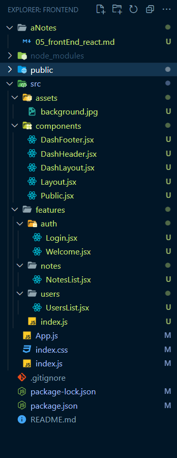

# 1. Folder Structure



# 2. package.json

```npm
npx create-react-app ./

npm i react-router-dom

npm i @fortawesome/fontawesome-svg-core @fortawesome/free-solid-svg-icons @fortawesome/react-fontawesome
```

```javascript
{
  "name": "frontend",
  "version": "0.1.0",
  "private": true,
  "dependencies": {
    "@fortawesome/fontawesome-svg-core": "^6.4.2",
    "@fortawesome/free-solid-svg-icons": "^6.4.2",
    "@fortawesome/react-fontawesome": "^0.2.0",
    "react": "^18.2.0",
    "react-dom": "^18.2.0",
    "react-router-dom": "^6.15.0",
    "react-scripts": "5.0.1"
  },
  "scripts": {
    "start": "react-scripts start",
    "build": "react-scripts build",
    "test": "react-scripts test",
    "eject": "react-scripts eject"
  },
  "eslintConfig": {
    "extends": [
      "react-app",
      "react-app/jest"
    ]
  },
  "browserslist": {
    "production": [
      ">0.2%",
      "not dead",
      "not op_mini all"
    ],
    "development": [
      "last 1 chrome version",
      "last 1 firefox version",
      "last 1 safari version"
    ]
  }
}

```

# 3. index.js

Certainly, let's break down the provided code in more detail:

```javascript
import React from 'react';
import ReactDOM from 'react-dom/client'; // Note: In newer versions of React, this import is typically just 'react-dom'
import { BrowserRouter as Router, Routes, Route } from 'react-router-dom';
import './index.css'; // Importing a CSS file
import App from './App'; // Importing the App component

// Create a root for rendering your React application
const root = ReactDOM.createRoot(document.getElementById('root'));

// Render the React application
root.render(
  <React.StrictMode>
    <Router>
      <Routes>
        {/* Define a route that matches any path and renders the App component */}
        <Route path="/*" element={<App />} />
      </Routes>
    </Router>
  </React.StrictMode>
);
```

Here's a detailed explanation of each part of the code:

#### 1. **Import Statements**:

- `React` and `ReactDOM` are imported from their respective packages.
- `react-router-dom` is used to import routing-related components, including `BrowserRouter`, `Routes`, and `Route`.
- `./index.css` imports a CSS file. This is a common practice to apply styles to your React components.

#### 2. **Creating a Root**:

- `const root = ReactDOM.createRoot(document.getElementById('root'));` creates a root using `ReactDOM.createRoot`. This is the entry point for rendering your React application. It targets the HTML element with the id 'root' as the location where your React application will be inserted.

#### 3. **Rendering the React Application**:

- `root.render(...)` is used to render the React application inside the specified root element.
- `<React.StrictMode>` is wrapped around the entire application. This component is used in development mode to highlight potential problems in your application and is generally a good practice during development.
- `<Router>` is the main routing component provided by React Router. It sets up the router for client-side navigation.
- `<Routes>` is used to define the routes for your application.
- `<Route path='/*' element={<App />} />` defines a route that matches any path ('/\*'). When this route is matched, it renders the `App` component. The `element` prop specifies the component to be rendered when the route is matched.

#### 4. **`App` Component**:

- The `App` component is imported at the top of the file. It's assumed that this component is defined in a separate file (e.g., 'App.js'). The `App` component will be rendered when any route is matched.

In summary, this code sets up the initial rendering of your React application using React Router. It creates a root element, configures routing with the `Router` and `Routes` components, and renders the `App` component when any route is matched. The use of `React.StrictMode` is a development mode feature that helps identify potential issues in your application during development.

# 4. index.css

```css
@import url('https://fonts.googleapis.com/css2?family=Nunito&display=swap');

* {
  margin: 0;
  padding: 0;
  box-sizing: border-box;
}

/* || VARIABLES */

:root {
  /* COLORS */
  --BGCOLOR: #0f172a;
  --BORDER-COLOR: #fff;
  --COLOR: #fff;
  --ERROR: firebrick;
  --INACTIVE: lightgray;
  --LINK-COLOR: whitesmoke;
  --LINK-HOVER: rgba(245, 245, 245, 0.9);
  --NOTE-BGCOLOR: hsla(240, 64%, 27%, 0.65);
  --STATUS-COMPLETE: limegreen;
  --STATUS-OPEN: firebrick;
  --TABLE-BGCOLOR: #fff;
  --TABLE-COLOR: #000;
}

/* || UTILITY CLASSES */
.errmsg {
  display: inline-block;
  background-color: var(--TABLE-BGCOLOR);
  color: var(--ERROR);
  padding: 0.25em;
  margin-bottom: 0.5em;
}

.nowrap {
  white-space: nowrap;
}

.icon-button {
  width: 48px;
  height: 48px;
  font-size: 2.5rem;
  background-color: transparent;
  border: none;
  color: var(--COLOR);
  display: grid;
  place-content: center;
}

.icon-button:hover,
.icon-button:focus-visible {
  transform: scale(1.2);
}

.icon-button[disabled] {
  visibility: hidden;
}

/* || GENERAL STYLES */

body {
  font-family: 'Nunito', sans-serif;
  min-height: 100vh;
  background-color: var(--BGCOLOR);
  color: var(--COLOR);
  background-image: url('./assets/background.jpg');
  background-size: cover;
  background-position: top right;
  background-blend-mode: multiply;
}

input,
button,
textarea,
select {
  font: inherit;
}

#root {
  /* React root div */
  min-height: 100vh;
  display: flex;
  flex-flow: column nowrap;
}

a {
  text-decoration: none;
}

a,
a:visited {
  color: var(--LINK-COLOR);
}

a:hover,
a:focus-visible {
  color: var(--LINK-HOVER);
}

/* || PAGES */

.public,
.welcome {
  display: flex;
  flex-direction: column;
  gap: 1rem;
}

.public {
  padding: 1em;
  flex-grow: 1;
}

.public__main,
.login {
  flex-grow: 1;
  border-top: 2px solid var(--BORDER-COLOR);
  border-bottom: 2px solid var(--BORDER-COLOR);
  padding: 1em 0;
}

.public__addr {
  margin-top: 1em;
}

.welcome a::before {
  content: '➜ ';
}

/* || DASH HEADER, CONTAINER & FOOTER */

.dash-header {
  position: sticky;
  top: 0;
  z-index: 1;
  background-color: var(--BGCOLOR);
  padding: 0 0.5em;
  border-bottom: 1px solid var(--BORDER-COLOR);
}

.dash-header__container {
  display: flex;
  flex-flow: row nowrap;
  justify-content: space-between;
  align-items: center;
}

.dash-header__nav {
  display: flex;
  flex-flow: row nowrap;
  justify-content: flex-end;
  gap: 0.5em;
}

.dash-container {
  padding: 0.75em 0.5em 0.5em;
  flex-grow: 1;
}

.dash-footer {
  font-size: 1rem;
  position: sticky;
  bottom: 0;
  z-index: 1;
  background-color: var(--BGCOLOR);
  padding: 0.5em;
  border-top: 1px solid var(--BORDER-COLOR);
  display: flex;
  flex-flow: row nowrap;
  justify-content: flex-start;
  gap: 1em;
}

.dash-footer__button {
  font-size: 1rem;
  width: auto;
  height: auto;
}
```

# 5. App.js

```javascript
import React from 'react';
import { Routes, Route } from 'react-router-dom';
import Layout from './components/Layout';
import Public from './components/Public';
import Login from './features/auth/Login';
import DashLayout from './components/DashLayout';
import Welcome from './features/auth/Welcome';
import NotesList from './features/notes/NotesList';
import UsersList from './features/users/UsersList';

const App = () => {
  return (
    <Routes>
      {/* Define the root route */}
      <Route path="/" element={<Layout />}>
        {/* Render the Public component as the index page */}
        <Route index element={<Public />} />

        {/* Render the Login component when navigating to "/login" */}
        <Route path="login" element={<Login />} />

        {/* Define the DashLayout */}
        <Route path="dash" element={<DashLayout />}>
          {/* Render the Welcome component as the index page of the DashLayout */}
          <Route index element={<Welcome />} />

          {/* Define the "notes" section under "dash" */}
          <Route path="notes">
            {/* Render the NotesList component as the index page of the "notes" section */}
            <Route index element={<NotesList />} />
          </Route>

          {/* Define the "users" section under "dash" */}
          <Route path="users">
            {/* Render the UsersList component as the index page of the "users" section */}
            <Route index element={<UsersList />} />
          </Route>
        </Route>
        {/* End DashLayout */}
      </Route>
    </Routes>
  );
};

export default App;
```

# 6. components/Layout.jsx

```javascript
import React from 'react';
import { Outlet } from 'react-router-dom';

// The Layout component is a container for rendering child routes.
const Layout = () => {
  // The Outlet component serves as a placeholder for child route content.
  return <Outlet />;
};

export default Layout;
```

Here are comments explaining each part of the code:

### 1. `import React from 'react';`:

- This line imports the `React` library, which is necessary for creating React components.

### 2. `import { Outlet } from 'react-router-dom';`:

- This line imports the `Outlet` component from the 'react-router-dom' library.
- The `Outlet` component is used for rendering child routes in a parent route.

### 3. `const Layout = () => { ... }`:

- This defines a functional component named `Layout`.
- It's an arrow function component, and it doesn't accept any props.

### 4. `return <Outlet />;`:

- Inside the `Layout` component, it returns JSX, which consists of an `<Outlet />` component.
- The `<Outlet />` component acts as a placeholder for rendering child routes.
- Any child routes defined under a parent route that uses this `Layout` component will be rendered inside this `<Outlet />`.

### 5. `export default Layout;`:

- This exports the `Layout` component as the default export of this module.
- It allows you to import and use the `Layout` component in other parts of your application.

In summary, this code defines a simple React component called `Layout`, which is intended to serve as a layout for rendering child routes. It uses the `Outlet` component from React Router to specify where the content of child routes should be inserted. This component can be used as a template for creating layouts in a React Router-based application.

# 7. components/Public

The code you provided appears to be a React functional component named `Public`. This component seems to represent a public-facing page or section of a web application, and it includes JSX elements for rendering content. Here's a breakdown of what's happening inside this component:

```javascript
import { Link } from 'react-router-dom';

// Define the Public component
const Public = () => {
  // JSX content to be rendered
  const content = (
    <section className="public">
      <header>
        <h1>
          Welcome to <span className="nowrap">Dan D. Repairs!</span>
        </h1>
      </header>
      <main className="public__main">
        <p>
          Located in Beautiful Downtown Foo City, Dan D. Repairs provides a
          trained staff ready to meet your tech repair needs.
        </p>
        <address className="public__addr">
          Dan D. Repairs
          <br />
          555 Foo Drive
          <br />
          Foo City, CA 12345
          <br />
          <a href="tel:+15555555555">(555) 555-5555</a>
        </address>
        <br />
        <p>Owner: Dan Davidson</p>
      </main>
      <footer>
        <Link to="/login">Employee Login</Link>
      </footer>
    </section>
  );

  // Return the JSX content
  return content;
};

// Export the Public component as the default export
export default Public;
```

Here's an explanation of the key parts of this component:

#### 1. **Import Statement**:

- The `Link` component is imported from 'react-router-dom'. This component is used to create a link that allows navigation to other routes within the application.

#### 2. **Component Definition**:

- `Public` is a functional component that doesn't take any props. It returns JSX content to be rendered.

#### 3. **JSX Content**:

- The `content` variable contains the JSX elements that make up the content of the `Public` component. It includes:

  - A `<section>` element with the class name "public" to encapsulate the content.
  - A `<header>` with a title.
  - A `<main>` section containing a description and address.
  - An `<address>` element with contact information.
  - A "Owner: Dan Davidson" paragraph.
  - A `<footer>` with a `Link` to "/login," which presumably leads to the employee login page. The `Link` component is used here for client-side navigation.

#### 4. **Return Statement**:

- The component returns the `content` variable, which contains the JSX elements. This content will be rendered when this component is used.

#### 5. **Export Statement**:

- The `Public` component is exported as the default export of this module, making it available for use in other parts of your application.

Overall, this component represents a public-facing page with a welcome message, business information, and a link for employees to log in. It utilizes React Router's `Link` for navigation.

# 8. components/DashLayout

```javascript
import React from 'react';
import { Outlet } from 'react-router-dom';

// Import the dashboard
import DashHeader from './DashHeader'; // header component
import DashFooter from './DashFooter'; // footer component

const DashLayout = () => {
  return (
    <>
      {/* Render the dashboard header */}
      <DashHeader />
      {/* Create a container for dashboard content */}
      <div className="dash-container">
        {/* Use Outlet to render child route content here */}
        <Outlet />
      </div>
      {/* Render the dashboard footer */}
      <DashFooter />
    </>
  );
};

export default DashLayout;
```

**Here are detailed comments for each part of the code:**

#### 1. **Import Statements**:

- `React` is imported from the 'react' library.
- `{ Outlet }` is imported from 'react-router-dom'. It's used to render child route content.
- `DashHeader` and `DashFooter` components are imported from their respective files. These components are used to render the dashboard's header and footer.

#### 2. **Component Definition**:

- `DashLayout` is a functional component defined using an arrow function.

#### 3. **Return Statement**:

- Inside the `return` statement, JSX elements define the layout structure of the dashboard.
- `<DashHeader />` is used to render the dashboard's header.
- `<div className="dash-container">` creates a container for the main content of the dashboard.
- `<Outlet />` is a placeholder where child routes will be rendered. It allows child route content to be inserted here.
- `<DashFooter />` is used to render the dashboard's footer.

#### 4. **Fragment (`<> ... </>`)**:

- The empty angle brackets `<>` and `</>` are used as a React fragment. Fragments allow multiple JSX elements to be returned without needing a wrapping parent element.

#### 5. **Export Statement**:

- The `DashLayout` component is exported as the default export of this module. It will be available for use in other parts of your application as the default export.

In summary, `DashLayout` is a layout component for a dashboard page. It includes a header, a container for the main content (where child routes will be rendered), and a footer. The comments help clarify the purpose of each part of the code.

# 9. components/DashHeader

```javascript
import { Link } from 'react-router-dom';

// Define the DashHeader component
const DashHeader = () => {
  const content = (
    <header className="dash-header">
      <div className="dash-header__container">
        <Link to="/dash">
          <h1 className="dash-header__title">techNotes</h1>
        </Link>
        <nav className="dash-header__nav">
          {/* Add navigation buttons later */}
        </nav>
      </div>
    </header>
  );

  // Return the JSX content
  return content;
};

// Export the DashHeader component as the default export
export default DashHeader;
```

Here's an explanation of the key parts of this component:

#### 1. **Import Statement**:

- The `Link` component is imported from 'react-router-dom'. It is used to create a link that allows navigation to other routes within the application.

#### 2. **Component Definition**:

- `DashHeader` is a functional component defined using an arrow function syntax.

#### 3. **Return Statement**:

- The `return` statement contains JSX elements that define the content of the `DashHeader` component.
- `<header className="dash-header">` creates a header element with the class name "dash-header".
- `<div className="dash-header__container">` creates a container element within the header for better organization.
- `<Link to="/dash">` is a link that navigates to the "/dash" route. It wraps around the `<h1>` element, creating a link back to the dashboard's main page.
- `<h1 className="dash-header__title">techNotes</h1>` is the title displayed in the header.
- `<nav className="dash-header__nav">` is a placeholder for navigation buttons. It currently does not contain any content but suggests that navigation buttons will be added later.

#### 4. **Export Statement**:

- The `DashHeader` component is exported as the default export of this module, making it available for use in other parts of your application.

In summary, the `DashHeader` component represents the header section of a dashboard. It includes a title and a link back to the dashboard's main page. Additionally, it has a placeholder for navigation buttons that can be added in the future.

# 10. components/DashFooter

The code you provided is a React functional component named `DashFooter`. It appears to represent the footer section of a dashboard. Let's break down what's happening inside this component:

```javascript
import { FontAwesomeIcon } from '@fortawesome/react-fontawesome';
import { faHouse } from '@fortawesome/free-solid-svg-icons';
import { useNavigate, useLocation } from 'react-router-dom';

// Define the DashFooter component
const DashFooter = () => {
  // Get the navigate function from React Router
  const navigate = useNavigate();

  // Get the current pathname from the location
  const { pathname } = useLocation();

  // Function to handle clicking on the "Go Home" button
  const onGoHomeClicked = () => navigate('/dash');

  // Initialize a variable to store the "Go Home" button
  let goHomeButton = null;

  // Check if the current pathname is not '/dash'
  if (pathname !== '/dash') {
    // If not on the dashboard page, create a "Go Home" button
    goHomeButton = (
      <button
        className="dash-footer__button icon-button"
        title="Home"
        onClick={onGoHomeClicked}
      >
        <FontAwesomeIcon icon={faHouse} />
      </button>
    );
  }

  // Define the JSX content of the footer
  const content = (
    <footer className="dash-footer">
      {goHomeButton}
      <p>Current User:</p>
      <p>Status:</p>
    </footer>
  );

  // Return the JSX content
  return content;
};

// Export the DashFooter component as the default export
export default DashFooter;
```

Here's an explanation of the key parts of this component:

#### 1. **Import Statements**:

- `FontAwesomeIcon` is imported from '@fortawesome/react-fontawesome'. It's used for rendering Font Awesome icons.
- `faHouse` is imported from '@fortawesome/free-solid-svg-icons'. It represents a house icon from Font Awesome.
- `useNavigate` and `useLocation` are imported from 'react-router-dom'. These hooks are used for navigation and getting the current location.

#### 2. **Component Definition**:

- `DashFooter` is a functional component defined using an arrow function syntax.

#### 3. **Hook Usage**:

- `useNavigate()` is used to get the `navigate` function from React Router. This function is used to navigate to different routes.
- `useLocation()` is used to get the current `pathname` from the location.

#### 4. **Event Handling**:

- `onGoHomeClicked` is a function that's called when the "Go Home" button is clicked. It uses the `navigate` function to navigate to the '/dash' route.

#### 5. **Conditional Rendering**:

- The code checks whether the current `pathname` is not equal to '/dash'. If it's not the dashboard page, it creates a "Go Home" button with a Font Awesome house icon. Otherwise, the `goHomeButton` remains `null`.

#### 6. **JSX Content**:

- The `content` variable contains JSX elements that define the content of the `DashFooter` component. It includes the "Go Home" button (if applicable), a "Current User" paragraph, and a "Status" paragraph.

#### 7. **Export Statement**:

- The `DashFooter` component is exported as the default export of this module, making it available for use in other parts of your application.

In summary, the `DashFooter` component represents the footer section of a dashboard. It conditionally renders a "Go Home" button (if not on the dashboard page) and displays additional information about the current user and status.

# 11. features/auth/Welcome

The code you've provided is a React functional component named `Welcome`. It appears to represent a welcome page or section of your application. Let's break down what's happening inside this component:

```javascript
import { Link } from 'react-router-dom';

// Define the Welcome component
const Welcome = () => {
  // Create a new JavaScript Date object representing the current date and time
  const date = new Date();

  // Create an options object for formatting
  const options = { dateStyle: 'full', timeStyle: 'long' };

  // Use the Intl.DateTimeFormat constructor with the specified options to format the date and time
  const today = new Intl.DateTimeFormat('en-IN', options).format(date);

  // Define the JSX content of the welcome section
  const content = (
    <section className="welcome">
      <p>{today}</p>
      <h1>Welcome!</h1>
      <p>
        <Link to="/dash/notes">View techNotes</Link>
      </p>
      <p>
        <Link to="/dash/users">View User Settings</Link>
      </p>
    </section>
  );

  // Return the JSX content
  return content;
};

// Export the Welcome component as the default export
export default Welcome;
```

Here's an explanation of the key parts of this component:

#### 1. **Import Statement**: The `Link` component is imported from 'react-router-dom'. It is used to create links for navigation to other routes within the application.

#### 2. **Component Definition**: `Welcome` is a functional component defined using an arrow function syntax.

#### 3. **Current Date and Time**:

- The `date` variable is created by initializing a new JavaScript `Date` object, which represents the current date and time.
- The `today` variable uses the `Intl.DateTimeFormat` constructor to format the `date` in a human-readable format, including both the date and time. It's displayed as a greeting message.

#### 4. **JSX Content**:

- The `content` variable contains JSX elements that define the content of the `Welcome` component.
- It includes a paragraph displaying the current date and time (`today`), a welcome message with an `<h1>` element, and **two links:**
  - `<Link to="/dash/notes">View techNotes</Link>` is a link to the "/dash/notes" route.
  - `<Link to="/dash/users">View User Settings</Link>` is a link to the "/dash/users" route.

#### 5. **Export Statement**:

- The `Welcome` component is exported as the default export of this module, making it available for use in other parts of your application.

In summary, the `Welcome` component represents a welcome section of your application. It displays the current date and time, a welcome message, and links to navigate to different sections of the application using React Router's `Link` component.

# 12. features/auth/Login

```javascript
import React from 'react';

const Login = () => {
  return <h1>Login</h1>;
};

export default Login;
```

# 13. features/notes/NotesList

```javascript
import React from 'react';

const NotesList = () => {
  return <div>NotesList</div>;
};

export default NotesList;
```

# 14. features/users/UsersList

```javascript
import React from 'react';

const UsersList = () => {
  return <div>UsersList</div>;
};

export default UsersList;
```
