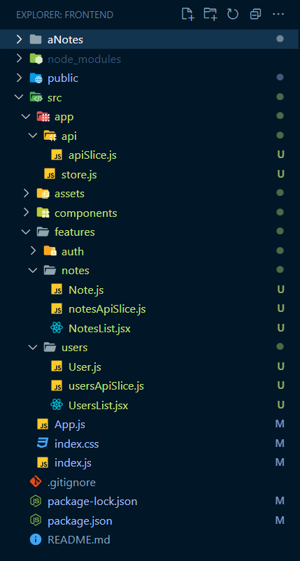

# 1. Folder Structure



# 2. package.json

```npm
npm i @reduxjs/toolkit react-redux
```

```javascript
{
  "name": "frontend",
  "version": "0.1.0",
  "private": true,
  "dependencies": {
    "@fortawesome/fontawesome-svg-core": "^6.4.2",
    "@fortawesome/free-solid-svg-icons": "^6.4.2",
    "@fortawesome/react-fontawesome": "^0.2.0",
    "@reduxjs/toolkit": "^1.9.5",
    "react": "^18.2.0",
    "react-dom": "^18.2.0",
    "react-redux": "^8.1.2",
    "react-router-dom": "^6.15.0",
    "react-scripts": "5.0.1"
  },
  "scripts": {
    "start": "react-scripts start",
    "build": "react-scripts build",
    "test": "react-scripts test",
    "eject": "react-scripts eject"
  },
  "eslintConfig": {
    "extends": [
      "react-app",
      "react-app/jest"
    ]
  },
  "browserslist": {
    "production": [
      ">0.2%",
      "not dead",
      "not op_mini all"
    ],
    "development": [
      "last 1 chrome version",
      "last 1 firefox version",
      "last 1 safari version"
    ]
  }
}
```

# 3. app\store.js

```javascript
// Import necessary functions and modules from Redux Toolkit and your custom API slice.
import { configureStore } from '@reduxjs/toolkit';
import { apiSlice } from './api/apiSlice';

// Create a Redux store with configuration options.
export const store = configureStore({
  // Define the reducer for your store.
  reducer: { [apiSlice.reducerPath]: apiSlice.reducer },

  // Configure middleware for your store.
  middleware: (getDefaultMiddleware) =>
    getDefaultMiddleware().concat(apiSlice.middleware),

  // Enable Redux DevTools for debugging purposes.
  devTools: true,
});
```

### 1. `import` Statements:

- You import the necessary functions and modules from Redux Toolkit and your custom API slice.
- These imports are essential for setting up your Redux store and integrating it with API functionality.

### 2. `configureStore`:

- You create a Redux store using the `configureStore` function from Redux Toolkit.
- This function provides a convenient way to configure your store with various options.

### 3. `reducer`:

- In the `reducer` field, you specify the reducers for your store. Here, you use an object to map the `apiSlice.reducer` to a key in the `reducer` object.
- This means that the state managed by the `apiSlice` will be stored under the specified key (`apiSlice.reducerPath`) in the store's state.
- This is a common practice when you have multiple slices in your store.

### 4. `middleware`:

- In the `middleware` field, you configure middleware for your store. You use a function that takes `getDefaultMiddleware` as an argument.
- This function allows you to customize the middleware stack.
- You call `getDefaultMiddleware()` to get the default middleware stack provided by Redux Toolkit, which includes middleware like Redux Thunk and Redux Logger.
- You concatenate the `apiSlice.middleware` to the default middleware stack.
- This addition is necessary to handle API requests and responses using the middleware provided by `apiSlice`.
- This middleware is typically responsible for making asynchronous API calls and managing loading and error states.

### 5. `devTools`:

- You set the `devTools` option to `true` to enable Redux DevTools. Redux DevTools is a powerful tool for debugging your Redux store.
- It allows you to inspect the state, actions, and perform time-travel debugging to analyze your application's state changes.

**In summary,**

- this code snippet demonstrates how to configure a Redux store using Redux Toolkit.

- It combines the `apiSlice` reducer and middleware with the default middleware stack and enables Redux DevTools for debugging.

- This setup is commonly used in applications that need to manage API data and state in a structured and efficient manner.

# 4. app\api\apiSlice.js

```javascript
// Import necessary functions and modules from Redux Toolkit's query package.
import { createApi, fetchBaseQuery } from '@reduxjs/toolkit/query/react';

// Create an API slice using createApi
export const apiSlice = createApi({
  // Define the base query function with a base URL for API requests.
  baseQuery: fetchBaseQuery({ baseUrl: 'http://localhost:3500' }),

  // Define tag types for entities related to the API data (optional).
  tagTypes: ['Note', 'User'],

  // Define API endpoints using a builder function.
  endpoints: (builder) => ({}),
});
```

### 1. Import Statements:

- You import the necessary functions and modules from Redux Toolkit's query package.
- This package provides tools for creating and managing API-related logic in your Redux store.

### 2. `createApi` Function:

- You use the `createApi` function to create an API slice.
- This function takes an object as its argument, which contains various configuration options for your API slice.

### 3. `baseQuery`:

- In the `baseQuery` field, you configure the base query function for making API requests.
- You use the `fetchBaseQuery` function, which takes an object with a `baseUrl` property.
- This `baseUrl` specifies the root URL for all API requests.
- In this case, it's set to 'http://localhost:3500', which is where your API is hosted.

### 4. `tagTypes` (optional):

- You define an array of tag types in the `tagTypes` field. Tag types are used to identify and manage entities related to the API data.
- For example, you might have 'Note' and 'User' tag types to categorize data fetched from different API endpoints.
- This field is optional and can be useful for organizing your API data.

### 5. `endpoints`:

- In the `endpoints` field, you use a builder function to define specific API endpoints.

- Currently, the `endpoints` object is empty (`{}`), so you haven't defined any specific API endpoints yet.
- You can add endpoints to this object to specify the different API operations (e.g., fetching, creating, updating, deleting) you want to perform.

**In summary,**

- this code sets up the foundation for an API slice using Redux Toolkit's query package.
- It configures the base URL for API requests and provides the option to define tag types for organizing API data.
- To complete the setup, you should add specific API endpoints to the `endpoints` object to handle various API operations within your application.

# 5. feature\userApiSlice.js

```javascript
// Import necessary functions and modules from Redux Toolkit and your API slice.
import { createSelector, createEntityAdapter } from '@reduxjs/toolkit';
import { apiSlice } from '../../app/api/apiSlice';

// Create an entity adapter for managing normalized user data.
const usersAdapter = createEntityAdapter({});

// Initialize the state using the entity adapter.
const initialState = usersAdapter.getInitialState();

// Inject endpoints into the API slice for user-related operations.
export const usersApiSlice = apiSlice.injectEndpoints({
  endpoints: (builder) => ({
    // Define an endpoint to fetch users.
    getUsers: builder.query({
      query: () => '/users',
      validateStatus: (response, result) => {
        return response.status === 200 && !result.isError;
      },
      keepUnusedDataFor: 5,
      transformResponse: (responseData) => {
        // Normalize and transform the response data before storing it in the state.
        const loadedUsers = responseData.map((user) => {
          user.id = user._id;
          return user;
        });
        return usersAdapter.setAll(initialState, loadedUsers);
      },
      providesTags: (result, error, arg) => {
        // Define tags for caching and invalidation.
        if (result?.ids) {
          return [
            { type: 'User', id: 'LIST' },
            ...result.ids.map((id) => ({ type: 'User', id })),
          ];
        } else return [{ type: 'User', id: 'LIST' }];
      },
    }),
  }),
});

// Export the query function generated for fetching users.
export const { useGetUsersQuery } = usersApiSlice;

// Select the query result object for fetching users.
export const selectUsersResult = usersApiSlice.endpoints.getUsers.select();

// Create a memoized selector to access the user data.
const selectUsersData = createSelector(
  selectUsersResult,
  (usersResult) => usersResult.data
  // Extract normalized user data.
);

// Generate selectors for querying user data using the entity adapter.
export const {
  selectAll: selectAllUsers,
  selectById: selectUserById,
  selectIds: selectUserIds,
} = usersAdapter.getSelectors(
  (state) => selectUsersData(state) ?? initialState
);
```

### 1. Entity Adapter and Initial State:

- You create an entity adapter named `usersAdapter` using `createEntityAdapter`.
- This adapter is used to manage normalized user data.

### 2. Initial State:

- You initialize the state with the entity adapter using `usersAdapter.getInitialState()`.
- This will be the initial state of your users slice.

### 3. Injecting Endpoints:

- You inject endpoints into the `usersApiSlice` using `apiSlice.injectEndpoints()`.
- These endpoints define how to interact with the API, including how to fetch users and handle the response.

### 4. `getUsers` Endpoint:

- Within the endpoints definition, you define a `getUsers` endpoint using `builder.query()`.
- This endpoint specifies how to fetch users from the API, how to transform the response data, and how to handle caching and invalidation.

### 5. Exporting Query Function:

- You export the `useGetUsersQuery` function generated by the `getUsers` endpoint.
- This function can be used to initiate the user-fetching query.

### 6. Selectors:

- You create a selector named `selectUsersResult` to select the result object of the `getUsers` query.

### 7. Memoized Selector:

- You create a memoized selector named `selectUsersData` using `createSelector`.
- This selector extracts the normalized user data from the query result.

### 8. Entity Adapter Selectors:

- You use `usersAdapter.getSelectors()` to generate selectors for accessing user data.
- These selectors include `selectAllUsers`, `selectUserById`, and `selectUserIds`.
- They are used to query the user data stored in the Redux store.

**In summary,**

- this code sets up an API slice for managing user data, normalizes the data using an entity adapter, and provides selectors to access user data in a structured way.
- It also includes caching and invalidation logic for efficient data management.

# 6. feature\UserList.jsx

```javascript
import { useGetUsersQuery } from './usersApiSlice';
import User from './User';

const UsersList = () => {
  // Use the useGetUsersQuery hook to fetch user data.
  const {
    data: users, // The user data received from the API.
    isLoading, // Boolean indicating if the data is loading.
    isSuccess, // Boolean indicating if the data was fetched successfully.
    isError, // Boolean indicating if an error occurred during the request.
    error, // Information about the error, if there was one.
  } = useGetUsersQuery();

  let content;

  // Display loading message while data is being fetched.
  if (isLoading) content = <p>Loading...</p>;

  // Display an error message if an error occurred during the request.
  if (isError) {
    content = <p className="errmsg">{error?.data?.message}</p>;
  }

  // Display the list of users if the request was successful.
  if (isSuccess) {
    const { ids } = users;

    // Generate a table of users based on the user IDs.
    const tableContent = ids?.length
      ? ids.map((userId) => <User key={userId} userId={userId} />)
      : null;

    content = (
      <table className="table table--users">
        <thead className="table__thead">
          <tr>
            <th scope="col" className="table__th user__username">
              Username
            </th>
            <th scope="col" className="table__th user__roles">
              Roles
            </th>
            <th scope="col" className="table__th user__edit">
              Edit
            </th>
          </tr>
        </thead>
        <tbody>{tableContent}</tbody>
      </table>
    );
  }

  // Render the appropriate content based on the API request status.
  return content;
};

export default UsersList;
```

Here's a summary of what the component does:

- It uses the `useGetUsersQuery` hook to fetch user data from the API.

- It displays a loading message (`<p>Loading...</p>`) when the data is being fetched (`isLoading` is `true`).

- It displays an error message (`<p className="errmsg">{error?.data?.message}</p>`) if an error occurs during the API request (`isError` is `true`). It attempts to extract the error message from the `error` object.

- If the data is successfully fetched (`isSuccess` is `true`), it generates a table to display the user data. It maps over the user IDs to render a `User` component for each user.

- The `User` component is presumably responsible for displaying individual user information.

- The rendered content (`<p>`, error message, or user table) is stored in the `content` variable and returned as the component's output.

This component provides a dynamic and responsive UI for displaying a list of users based on the API request status and the data received from the API.

# 7. feature\User.jsx

```javascript
import { FontAwesomeIcon } from '@fortawesome/react-fontawesome';
import { faPenToSquare } from '@fortawesome/free-solid-svg-icons';
import { useNavigate } from 'react-router-dom';

import { useSelector } from 'react-redux';
import { selectUserById } from './usersApiSlice';

const User = ({ userId }) => {
  // Use the `useSelector` hook to retrieve user data from the Redux store.
  const user = useSelector((state) => selectUserById(state, userId));

  // Use the `useNavigate` hook from 'react-router-dom' for navigation.
  const navigate = useNavigate();

  if (user) {
    // Define a function to handle user edit.
    const handleEdit = () => navigate(`/dash/users/${userId}`);

    // Convert user roles to a comma-separated string.
    const userRolesString = user.roles.toString().replaceAll(',', ', ');

    // Determine the CSS class for the cell based on user's active status.
    const cellStatus = user.active ? '' : 'table__cell--inactive';

    // Render the user data in a table row.
    return (
      <tr className="table__row user">
        <td className={`table__cell ${cellStatus}`}>{user.username}</td>
        <td className={`table__cell ${cellStatus}`}>{userRolesString}</td>
        <td className={`table__cell ${cellStatus}`}>
          {/* Render an edit button with FontAwesome icon */}
          <button className="icon-button table__button" onClick={handleEdit}>
            <FontAwesomeIcon icon={faPenToSquare} />
          </button>
        </td>
      </tr>
    );
  } else {
    // If the user data is not available, return null (don't render anything).
    return null;
  }
};

export default User;
```

Here's an explanation of what this component does:

### 1. **Import Statements:**

- You import necessary libraries and components, including FontAwesome icons, the `useNavigate` hook from 'react-router-dom,' and Redux-related functions for selecting user data.

### 2. **Component Function:**

- This is a functional component that takes a `userId` prop as input, which is used to identify and fetch the specific user's data.

### 3. **Redux Data Retrieval:**

- You use the `useSelector` hook to retrieve user data from the Redux store.
- The `selectUserById` selector is used to select the user data based on the `userId` prop.

### 4. **Navigation Handling:**

- The `useNavigate` hook is used to obtain a navigation function that can be used to redirect the user to an edit page when the edit button is clicked.

### 5. **Rendering User Data:**

- If user data is available (`if (user)`), the component renders a table row (`<tr>`) with user information.
- The user's `username` and `roles` are displayed in two cells of the row.
- The `handleEdit` function is called when the edit button is clicked, allowing the user to navigate to the edit page for this user.
- The `FontAwesome` icon is used within the button for the edit action.

### 6. **Conditional Rendering:**

- If the user data is not available (for example, if it hasn't been loaded from the Redux store yet), the component returns `null`, indicating that nothing should be rendered.
- This is a common pattern for handling asynchronous data loading in React components.

**In summary,**

- this `User` component fetches user data from the Redux store, displays it in a table row, and provides an edit button that triggers navigation to an edit page.
- It also handles conditional rendering to ensure that it doesn't render anything if user data is not available yet.

# 8. feature\notesApiSlice.js

```javascript
// Import necessary functions and modules from Redux Toolkit and your API slice.
import { createSelector, createEntityAdapter } from '@reduxjs/toolkit';
import { apiSlice } from '../../app/api/apiSlice';

// Create an entity adapter for managing normalized notes data.
const notesAdapter = createEntityAdapter({
  // Define a custom sorting comparer for notes based on 'completed' field.
  sortComparer: (a, b) =>
    a.completed === b.completed ? 0 : a.completed ? 1 : -1,
});

// Initialize the state using the entity adapter.
const initialState = notesAdapter.getInitialState();

// Inject endpoints into the API slice for note-related operations.
export const notesApiSlice = apiSlice.injectEndpoints({
  endpoints: (builder) => ({
    // Define an endpoint to fetch notes.
    getNotes: builder.query({
      query: () => '/notes',
      validateStatus: (response, result) => {
        return response.status === 200 && !result.isError;
      },
      keepUnusedDataFor: 5,
      transformResponse: (responseData) => {
        // Normalize and transform the response data before storing it in the state.
        const loadedNotes = responseData.map((note) => {
          note.id = note._id;
          return note;
        });
        return notesAdapter.setAll(initialState, loadedNotes);
      },
      providesTags: (result, error, arg) => {
        // Define tags for caching and invalidation.
        if (result?.ids) {
          return [
            { type: 'Note', id: 'LIST' },
            ...result.ids.map((id) => ({ type: 'Note', id })),
          ];
        } else return [{ type: 'Note', id: 'LIST' }];
      },
    }),
  }),
});

// Export the query function generated for fetching notes.
export const { useGetNotesQuery } = notesApiSlice;

// Select the query result object for fetching notes.
export const selectNotesResult = notesApiSlice.endpoints.getNotes.select();

// Create a memoized selector to access the notes data.
const selectNotesData = createSelector(
  selectNotesResult,
  (notesResult) => notesResult.data // Extract normalized notes data.
  // The 'notesResult.data' represents the normalized state object with 'ids' and 'entities'.
);

// Generate selectors for querying notes data using the entity adapter.
export const {
  selectAll: selectAllNotes,
  selectById: selectNoteById,
  selectIds: selectNoteIds,
} = notesAdapter.getSelectors(
  (state) => selectNotesData(state) ?? initialState
);
```

### 1. **Imports**:

- Import necessary functions and modules, including `createSelector` and `createEntityAdapter` from Redux Toolkit and your API slice from the app.

### 2. **Create Entity Adapter**:

- Create an entity adapter named `notesAdapter`.
- This adapter is used to manage normalized note data.
- You provide a custom `sortComparer` function to sort notes based on the `completed` field.

### 3. **Initialize State**:

- Initialize the state using the entity adapter with `getInitialState()`.
- This will be the initial state of your notes slice.

### 4. **Inject Endpoints**:

- Inject endpoints into the `notesApiSlice` using `apiSlice.injectEndpoints()`.
- These endpoints define how to interact with the API, including how to fetch notes and handle the response.

### 5. **`getNotes` Endpoint**:

- Define a `getNotes` endpoint within the endpoints definition.
- This endpoint specifies how to fetch notes from the API, how to transform the response data, and how to handle caching and invalidation.

### 6. **Export Query Function**:

- Export the `useGetNotesQuery` function generated by the `getNotes` endpoint.
- This function can be used to initiate the note-fetching query.

### 7. **Select Query Result**:

- Create a selector named `selectNotesResult` to select the result object of the `getNotes` query.

### 8. **Memoized Selector**:

- Create a memoized selector named `selectNotesData` using `createSelector`. This selector extracts the normalized notes data from the query result.

### 9. **Generate Entity Adapter Selectors**:

- Use `notesAdapter.getSelectors()` to generate selectors for accessing note data. These selectors include `selectAllNotes`, `selectNoteById`, and `selectNoteIds`. They are used to query the note data stored in the Redux store.

In summary,

- this code sets up an API slice for managing note data, normalizes the data using an entity adapter, and provides selectors to access note data in a structured way. It also includes caching and invalidation logic for efficient data management.

# 9. feature\NotesList.jsx

```javascript
// Import necessary dependencies and components.
import { useGetNotesQuery } from './notesApiSlice';
import Note from './Note';

// Define the NotesList component.
const NotesList = () => {
  // Use the useGetNotesQuery hook to fetch note data.
  const {
    data: notes, // The note data received from the API.
    isLoading, // Boolean indicating if the data is loading.
    isSuccess, // Boolean indicating if the data was fetched successfully.
    isError, // Boolean indicating if an error occurred during the request.
    error, // Information about the error, if there was one.
  } = useGetNotesQuery();

  let content;

  // Display a loading message while data is being fetched.
  if (isLoading) content = <p>Loading...</p>;

  // Display an error message if an error occurred during the request.
  if (isError) {
    content = <p className="errmsg">{error?.data?.message}</p>;
  }

  // If the request was successful, render the notes table.
  if (isSuccess) {
    const { ids } = notes;

    const tableContent = ids?.length
      ? ids.map((noteId) => <Note key={noteId} noteId={noteId} />)
      : null;

    content = (
      <table className="table table--notes">
        <thead className="table__thead">
          <tr>
            <th scope="col" className="table__th note__status">
              Username
            </th>
            <th scope="col" className="table__th note__created">
              Created
            </th>
            <th scope="col" className="table__th note__updated">
              Updated
            </th>
            <th scope="col" className="table__th note__title">
              Title
            </th>
            <th scope="col" className="table__th note__username">
              Owner
            </th>
            <th scope="col" className="table__th note__edit">
              Edit
            </th>
          </tr>
        </thead>
        <tbody>{tableContent}</tbody>
      </table>
    );
  }

  return content;
};

// Export the NotesList component.
export default NotesList;
```

### 1. **Imports**:

- You import the necessary dependencies, including the `useGetNotesQuery` hook from `notesApiSlice` and the `Note` component.

### 2. **NotesList Component**:

- This is a functional component called `NotesList`.

### 3. **Fetching Note Data**:

- You use the `useGetNotesQuery` hook to fetch note data from the API.
- The `useGetNotesQuery` hook provides access to the query result, loading status, success status, error status, and error details.

### 4. **Conditional Rendering**:

- Depending on the loading and error states, you conditionally render different content:
  - If `isLoading` is true, you display a "Loading..." message.
  - If `isError` is true, you display an error message based on the `error` object.

### 5. **Rendering Notes Table**:

- If the request was successful (`isSuccess` is true), you prepare the content for rendering the notes in a table.
- You extract the `ids` array from the `notes` data, which presumably contains the IDs of the notes to be displayed.
- You map over the `ids` array to render individual `Note` components for each note.

### 6. **Table Structure**:

- You define the structure of the notes table using HTML elements, such as `<table>`, `<thead>`, and `<tbody>`.
- The table headers (`<th>`) indicate the columns of the table.

### 7. **Rendering Note Components**:

- You render the `tableContent`, which consists of individual `Note` components for each note.
- The `key` and `noteId` props are passed to each `Note` component for proper rendering and identification.

### 8. **Return Content**:

- Finally, you return the `content` variable, which contains either the loading message, error message, or the notes table based on the API request status.

**In summary,**

- this `NotesList` component fetches note data from the API, displays loading and error messages as needed, and renders the notes in a table format when the data is successfully fetched. The individual notes are rendered using the `Note` component.

# 10. feature\Note.jsx

```javascript
// Import necessary dependencies and components.
import { FontAwesomeIcon } from '@fortawesome/react-fontawesome';
import { faPenToSquare } from '@fortawesome/free-solid-svg-icons';
import { useNavigate } from 'react-router-dom';

import { useSelector } from 'react-redux';
import { selectNoteById } from './notesApiSlice';

// Define the Note component.
const Note = ({ noteId }) => {
  // Use the useSelector hook to retrieve note data from the Redux store.
  const note = useSelector((state) => selectNoteById(state, noteId));

  // Use the useNavigate hook from 'react-router-dom' for navigation.
  const navigate = useNavigate();

  if (note) {
    // Format the 'createdAt' and 'updatedAt' dates.
    const created = new Date(note.createdAt).toLocaleString('en-IN', {
      day: 'numeric',
      month: 'long',
    });
    const updated = new Date(note.updatedAt).toLocaleString('en-IN', {
      day: 'numeric',
      month: 'long',
    });

    // Define a function to handle note editing.
    const handleEdit = () => navigate(`/dash/notes/${noteId}`);

    // Return the JSX for rendering the note in a table row.
    return (
      <tr className="table__row">
        <td className="table__cell note__status">
          {note.completed ? (
            <span className="note__status--completed">Completed</span>
          ) : (
            <span className="note__status--open">Open</span>
          )}
        </td>
        <td className="table__cell note__created">{created}</td>
        <td className="table__cell note__updated">{updated}</td>
        <td className="table__cell note__title">{note.title}</td>
        <td className="table__cell note__username">{note.username}</td>

        <td className="table__cell">
          {/* Render an edit button with FontAwesome icon */}
          <button className="icon-button table__button" onClick={handleEdit}>
            <FontAwesomeIcon icon={faPenToSquare} />
          </button>
        </td>
      </tr>
    );
  } else {
    // If the note data is not available, return null (don't render anything).
    return null;
  }
};

// Export the Note component.
export default Note;
```

### 1. **Imports**:

- Import necessary dependencies and components, including FontAwesome icons, the `useNavigate` hook from 'react-router-dom,' Redux-related functions for selecting note data (`useSelector` and `selectNoteById`).

### 2. **Note Component**:

- Define a functional component called `Note` that takes a `noteId` prop as input.
- This prop is used to identify and fetch the specific note's data.

### 3. **Redux Data Retrieval**:

- Use the `useSelector` hook to retrieve note data from the Redux store.
- The `selectNoteById` selector is used to select the note data based on the `noteId` prop.

### 4. **Navigation Handling**:

- Obtain a navigation function using the `useNavigate` hook for navigation when the edit button is clicked.

### 5. **Data Formatting**:

- If the `note` data is available, format the `createdAt` and `updatedAt` dates into a more user-friendly format using `toLocaleString`.

### 6. **Handle Edit**:

- Define a `handleEdit` function that is called when the edit button is clicked.
- This function uses the `navigate` function to navigate to the edit page for this specific note.

### 7. **Rendering**:

- If the `note` data is available, render the note information in a table row format with appropriate CSS classes for styling.
- It displays the note's status (completed or open), creation date, update date, title, and owner username.
- It also includes an edit button with a FontAwesome icon.

### 8. **Conditional Rendering**:

- If the `note` data is not available (for example, if it hasn't been loaded from the Redux store yet), the component returns `null`, indicating that nothing should be rendered.
- This is a common pattern for handling asynchronous data loading in React components.

**In summary,**

- this `Note` component fetches note data from the Redux store, formats and renders it in a table row format, and provides an edit button for navigating to the edit page for the specific note.

# 11. index.js

```javascript
import React from 'react';
import ReactDOM from 'react-dom/client';
import { BrowserRouter as Router, Routes, Route } from 'react-router-dom';
import './index.css';
import App from './App';

// Import Redux Toolkit store and Provider.
import { store } from './app/store';
import { Provider } from 'react-redux';

// Create a root element for rendering the application.
const root = ReactDOM.createRoot(document.getElementById('root'));

// Use ReactDOM.createRoot to render your application.
root.render(
  <React.StrictMode>
    {/* Wrap your application with the Redux Provider, which provides access to the store. */}
    <Provider store={store}>
      {/* Set up your application's routing with React Router. */}
      <Router>
        <Routes>
          {/* Define a default route that renders the App component. */}
          <Route path="/*" element={<App />} />
        </Routes>
      </Router>
    </Provider>
  </React.StrictMode>
);
```
