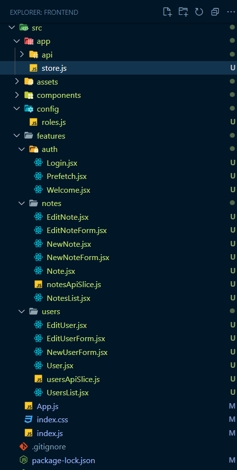

# 1. Folder Structure



# 2. package.json

```javascript
{
  "name": "frontend",
  "version": "0.1.0",
  "private": true,
  "dependencies": {
    "@fortawesome/fontawesome-svg-core": "^6.4.2",
    "@fortawesome/free-solid-svg-icons": "^6.4.2",
    "@fortawesome/react-fontawesome": "^0.2.0",
    "@reduxjs/toolkit": "^1.9.5",
    "react": "^18.2.0",
    "react-dom": "^18.2.0",
    "react-redux": "^8.1.2",
    "react-router-dom": "^6.15.0",
    "react-scripts": "5.0.1"
  },
  "scripts": {
    "start": "react-scripts start",
    "build": "react-scripts build",
    "test": "react-scripts test",
    "eject": "react-scripts eject"
  },
  "eslintConfig": {
    "extends": [
      "react-app",
      "react-app/jest"
    ]
  },
  "browserslist": {
    "production": [
      ">0.2%",
      "not dead",
      "not op_mini all"
    ],
    "development": [
      "last 1 chrome version",
      "last 1 firefox version",
      "last 1 safari version"
    ]
  }
}
```

# 3. App.js

Certainly, I can provide comments inside your code to explain each part more explicitly:

```javascript
import { Routes, Route } from 'react-router-dom';
import Layout from './components/Layout';
import Public from './components/Public';
import Login from './features/auth/Login';
import DashLayout from './components/DashLayout';
import Welcome from './features/auth/Welcome';
import NotesList from './features/notes/NotesList';
import UsersList from './features/users/UsersList';
import EditUser from './features/users/EditUser';
import NewUserForm from './features/users/NewUserForm';
import EditNote from './features/notes/EditNote';
import NewNote from './features/notes/NewNote';
import Prefetch from './features/auth/Prefetch';

function App() {
  return (
    <Routes>
      {/* Top-level route for the root path */}
      <Route path="/" element={<Layout />}>
        {/* Index route for the root path, displays Public component */}
        <Route index element={<Public />} />
        {/* Route for the login page */}
        <Route path="login" element={<Login />} />

        {/* Nested route with Prefetch component */}
        <Route element={<Prefetch />}>
          {/* Nested route for the dashboard */}
          <Route path="dash" element={<DashLayout />}>
            {/* Index route for the dashboard, displays Welcome component */}
            <Route index element={<Welcome />} />

            {/* Nested route for managing users */}
            <Route path="users">
              {/* Index route for users, displays UsersList component */}
              <Route index element={<UsersList />} />
              {/* Route for editing a user */}
              <Route path=":id" element={<EditUser />} />
              {/* Route for creating a new user */}
              <Route path="new" element={<NewUserForm />} />
            </Route>

            {/* Nested route for managing notes */}
            <Route path="notes">
              {/* Index route for notes, displays NotesList component */}
              <Route index element={<NotesList />} />
              {/* Route for editing a note */}
              <Route path=":id" element={<EditNote />} />
              {/* Route for creating a new note */}
              <Route path="new" element={<NewNote />} />
            </Route>
          </Route>
          {/* End Dash */}
        </Route>
      </Route>
    </Routes>
  );
}

export default App;
```

# 4. app\store.js

```javascript
import { configureStore } from '@reduxjs/toolkit';
import { apiSlice } from './api/apiSlice';
import { setupListeners } from '@reduxjs/toolkit/query';

// Create a Redux store using Redux Toolkit's `configureStore` function.
export const store = configureStore({
  // Configure the reducers for the store.
  reducer: {
    [apiSlice.reducerPath]: apiSlice.reducer, // Use the reducer from the apiSlice and associate it with a key.
  },
  // Configure middleware for the store.
  middleware: (getDefaultMiddleware) =>
    getDefaultMiddleware().concat(apiSlice.middleware), // Extend the default middleware with the API slice's middleware.
  // Enable Redux DevTools for debugging in development.
  devTools: true,
});

// Set up listeners for actions dispatched by the API slice.
setupListeners(store.dispatch);
```

Here's a more detailed explanation with comments for each section of your code:

1. Import necessary libraries and functions:

   - `configureStore`: Import the `configureStore` function from Redux Toolkit to create your Redux store.
   - `apiSlice`: Import the API slice (presumably created using Redux Toolkit's `createSlice`) from the "./api/apiSlice" file.
   - `setupListeners`: Import the `setupListeners` function from Redux Toolkit's query toolkit, which is used to set up listeners for actions dispatched by the API slice.

2. Create the Redux store:

   - Use `configureStore` to create your Redux store.
   - The `reducer` field is an object that specifies the reducers to be combined. In this case, it associates the API slice's reducer with the key `[apiSlice.reducerPath]`. This is a common pattern when using Redux Toolkit's API slices.
   - The `middleware` field extends the default middleware stack using `getDefaultMiddleware`. It concatenates the API slice's middleware, which handles API requests and cache management.
   - The `devTools` field is set to `true` to enable Redux DevTools, which aids in debugging during development.

3. Set up listeners for actions:
   - Call `setupListeners(store.dispatch)` to configure listeners for actions dispatched by the API slice. This step is important for handling asynchronous API requests and ensuring that caching and invalidation mechanisms work correctly.

The code you've provided is a common setup for managing asynchronous data and API requests in a Redux application using Redux Toolkit and the query toolkit for API interactions.

# 5. config\roles.js

```javascript
export const ROLES = {
  Employee: 'Employee',
  Manager: 'Manager',
  Admin: 'Admin',
};
```

# 6. users\NewUserFrom.jsx

```javascript
import { useState, useEffect } from 'react';
import { useAddNewUserMutation } from './usersApiSlice';
import { useNavigate } from 'react-router-dom';
import { FontAwesomeIcon } from '@fortawesome/react-fontawesome';
import { faSave } from '@fortawesome/free-solid-svg-icons';
import { ROLES } from '../../config/roles';

// Regular expressions for input validation
const USER_REGEX = /^[A-z]{3,20}$/;
const PWD_REGEX = /^[A-z0-9!@#$%]{4,12}$/;

const NewUserForm = () => {
  // Use Redux Toolkit's useAddNewUserMutation hook for API interactions
  const [addNewUser, { isLoading, isSuccess, isError, error }] =
    useAddNewUserMutation();

  const navigate = useNavigate();

  // State variables for form inputs and validation
  const [username, setUsername] = useState('');
  const [validUsername, setValidUsername] = useState(false);
  const [password, setPassword] = useState('');
  const [validPassword, setValidPassword] = useState(false);
  const [roles, setRoles] = useState(['Employee']);

  // Use effects to validate username and password inputs
  useEffect(() => {
    setValidUsername(USER_REGEX.test(username));
  }, [username]);

  useEffect(() => {
    setValidPassword(PWD_REGEX.test(password));
  }, [password]);

  // Use effect to reset form fields and navigate after successful user creation
  useEffect(() => {
    if (isSuccess) {
      setUsername('');
      setPassword('');
      setRoles([]);
      navigate('/dash/users');
    }
  }, [isSuccess, navigate]);

  // Event handlers for input changes
  const onUsernameChanged = (e) => setUsername(e.target.value);
  const onPasswordChanged = (e) => setPassword(e.target.value);

  // Event handler for role selection changes
  const onRolesChanged = (e) => {
    const values = Array.from(
      e.target.selectedOptions, // HTMLCollection
      (option) => option.value
    );
    setRoles(values);
  };

  // Determine if the form can be saved
  const canSave =
    [roles.length, validUsername, validPassword].every(Boolean) && !isLoading;

  // Event handler for saving the user
  const onSaveUserClicked = async (e) => {
    e.preventDefault();
    if (canSave) {
      await addNewUser({ username, password, roles });
    }
  };

  // Generate role options for the select element
  const options = Object.values(ROLES).map((role) => {
    return (
      <option key={role} value={role}>
        {' '}
        {role}
      </option>
    );
  });

  // Determine the error message display class
  const errClass = isError ? 'errmsg' : 'offscreen';
  const validUserClass = !validUsername ? 'form__input--incomplete' : '';
  const validPwdClass = !validPassword ? 'form__input--incomplete' : '';
  const validRolesClass = !Boolean(roles.length)
    ? 'form__input--incomplete'
    : '';

  // JSX content for the form
  const content = (
    <>
      <p className={errClass}>{error?.data?.message}</p>

      <form className="form" onSubmit={onSaveUserClicked}>
        {/* Form title and save button */}
        <div className="form__title-row">
          <h2>New User</h2>
          <div className="form__action-buttons">
            <button className="icon-button" title="Save" disabled={!canSave}>
              <FontAwesomeIcon icon={faSave} />
            </button>
          </div>
        </div>

        {/* Username input */}
        <label className="form__label" htmlFor="username">
          Username: <span className="nowrap">[3-20 letters]</span>
        </label>
        <input
          className={`form__input ${validUserClass}`}
          id="username"
          name="username"
          type="text"
          autoComplete="off"
          value={username}
          onChange={onUsernameChanged}
        />

        {/* Password input */}
        <label className="form__label" htmlFor="password">
          Password: <span className="nowrap">[4-12 chars incl. !@#$%]</span>
        </label>
        <input
          className={`form__input ${validPwdClass}`}
          id="password"
          name="password"
          type="password"
          value={password}
          onChange={onPasswordChanged}
        />

        {/* Roles selection */}
        <label className="form__label" htmlFor="roles">
          ASSIGNED ROLES:
        </label>
        <select
          id="roles"
          name="roles"
          className={`form__select ${validRolesClass}`}
          multiple={true}
          size="3"
          value={roles}
          onChange={onRolesChanged}
        >
          {options}
        </select>
      </form>
    </>
  );

  return content;
};

export default NewUserForm;
```

This is a React component named `NewUserForm`, presumably used for creating a new user. Let's break down what this code does:

1. **Imports**: You import various dependencies and components needed for this form.

2. **Regular Expressions**: You define regular expressions (`USER_REGEX` and `PWD_REGEX`) to validate the username and password inputs.

3. **State Variables**:

   - You use the `useState` hook to manage several state variables, including `username`, `validUsername`, `password`, `validPassword`, and `roles`. These variables are used to control the form's input fields and manage their validity.

4. **Use Effects**:

   - You use `useEffect` to monitor changes in the `username` and `password` fields and update the `validUsername` and `validPassword` state variables accordingly.

   - Another `useEffect` listens for changes in the `isSuccess` state variable (possibly from an API call) and resets the form fields and navigates to a new URL when a user is successfully created.

5. **Event Handlers**:

   - You have event handlers (`onUsernameChanged`, `onPasswordChanged`, `onRolesChanged`, `onSaveUserClicked`) for handling input changes and form submission.

   - The `onRolesChanged` handler processes multi-select options and updates the `roles` state.

   - The `onSaveUserClicked` handler submits the form data when the user clicks the save button, but only if the form is in a valid state (`canSave`).

6. **Rendering**:

   - You render the form content conditionally based on `isError`. If there is an error, you display an error message.

   - The form structure includes labels and input fields for the username, password, and assigned roles.

   - You use CSS classes (`validUserClass`, `validPwdClass`, `validRolesClass`) to apply styling based on input validity.

   - You have a select element for choosing user roles, allowing multiple selections.

   - The form includes a "Save" button, which is disabled if the form is not in a valid state.

7. **Options**: You generate options for the user roles select element based on some data (possibly defined in the `ROLES` object).

8. **Return**: Finally, you return the JSX content for this component.

Overall, this code represents a form component for creating a new user with input validation and conditional rendering based on form state and errors. It seems to be part of a larger application dealing with user management.

# 7. users\EditUser.jsx

This is a React component named `EditUser`. Its purpose appears to be to edit user information based on the `id` parameter from the URL. Let's add comments to explain the code:

```javascript
import { useParams } from 'react-router-dom';
import { useSelector } from 'react-redux';
import { selectUserById } from './usersApiSlice';
import EditUserForm from './EditUserForm';

const EditUser = () => {
  // Get the `id` parameter from the URL using React Router's useParams hook
  const { id } = useParams();

  // Use Redux Toolkit's useSelector to retrieve the user with the specified `id`
  const user = useSelector((state) => selectUserById(state, id));

  // Conditionally render an EditUserForm component if user data is available,
  // or display "Loading..." while waiting for data
  const content = user ? <EditUserForm user={user} /> : <p>Loading...</p>;

  return content;
};

export default EditUser;
```

Here's a breakdown of the code:

1. **Imports**: You import necessary dependencies such as `useParams` for accessing URL parameters, `useSelector` for accessing Redux store data, `selectUserById` from your API slice, and the `EditUserForm` component.

2. **URL Parameter**: You use the `useParams` hook to extract the `id` parameter from the URL. This parameter likely represents the unique identifier of the user to be edited.

3. **Redux Selector**: You use the `useSelector` hook to select and retrieve the user data from the Redux store. The `selectUserById` function is used to retrieve the user based on the `id` parameter obtained from the URL.

4. **Conditional Rendering**: You conditionally render content based on whether the `user` data is available. If `user` exists (i.e., not `null` or `undefined`), you render the `EditUserForm` component and pass the user data as a prop. If `user` is not available, you display a "Loading..." message.

5. **Return**: The `content` variable containing the conditional rendering is returned as the component's content.

In summary, this `EditUser` component is responsible for fetching user data based on the `id` parameter from the URL, and if the data is available, it renders the `EditUserForm` component for editing the user's information. While waiting for the data, it displays a "Loading..." message.

# 8. users\EditUserFrom.jsx

I've added comments to explain different parts of your `EditUserForm` component:

```javascript
import { useState, useEffect } from 'react';
import { useUpdateUserMutation, useDeleteUserMutation } from './usersApiSlice';
import { useNavigate } from 'react-router-dom';
import { FontAwesomeIcon } from '@fortawesome/react-fontawesome';
import { faSave, faTrashCan } from '@fortawesome/free-solid-svg-icons';
import { ROLES } from '../../config/roles';

// Regular expressions for input validation
const USER_REGEX = /^[A-z]{3,20}$/;
const PWD_REGEX = /^[A-z0-9!@#$%]{4,12}$/;

const EditUserForm = ({ user }) => {
  // Use Redux Toolkit's useUpdateUserMutation hook for updating user data
  const [updateUser, { isLoading, isSuccess, isError, error }] =
    useUpdateUserMutation();

  // Use Redux Toolkit's useDeleteUserMutation hook for deleting a user
  const [
    deleteUser,
    { isSuccess: isDelSuccess, isError: isDelError, error: delerror },
  ] = useDeleteUserMutation();

  const navigate = useNavigate();

  // State variables for form inputs and validation
  const [username, setUsername] = useState(user.username);
  const [validUsername, setValidUsername] = useState(false);
  const [password, setPassword] = useState('');
  const [validPassword, setValidPassword] = useState(false);
  const [roles, setRoles] = useState(user.roles);
  const [active, setActive] = useState(user.active);

  // Use effects to validate username and password inputs
  useEffect(() => {
    setValidUsername(USER_REGEX.test(username));
  }, [username]);

  useEffect(() => {
    setValidPassword(PWD_REGEX.test(password));
  }, [password]);

  // Use effect to handle successful updates or deletions and navigate
  useEffect(() => {
    console.log(isSuccess);
    if (isSuccess || isDelSuccess) {
      setUsername('');
      setPassword('');
      setRoles([]);
      navigate('/dash/users');
    }
  }, [isSuccess, isDelSuccess, navigate]);

  // Event handlers for input changes
  const onUsernameChanged = (e) => setUsername(e.target.value);
  const onPasswordChanged = (e) => setPassword(e.target.value);

  // Event handler for role selection changes
  const onRolesChanged = (e) => {
    const values = Array.from(
      e.target.selectedOptions,
      (option) => option.value
    );
    setRoles(values);
  };

  // Event handler for toggling user active status
  const onActiveChanged = () => setActive((prev) => !prev);

  // Event handler for saving user changes
  const onSaveUserClicked = async (e) => {
    if (password) {
      await updateUser({ id: user.id, username, password, roles, active });
    } else {
      await updateUser({ id: user.id, username, roles, active });
    }
  };

  // Event handler for deleting a user
  const onDeleteUserClicked = async () => {
    await deleteUser({ id: user.id });
  };

  // Generate role options for the select element
  const options = Object.values(ROLES).map((role) => {
    return (
      <option key={role} value={role}>
        {role}
      </option>
    );
  });

  // Determine if the form can be saved based on input validity and loading state
  let canSave;
  if (password) {
    canSave =
      [roles.length, validUsername, validPassword].every(Boolean) && !isLoading;
  } else {
    canSave = [roles.length, validUsername].every(Boolean) && !isLoading;
  }

  // Determine the error message display class and content
  const errClass = isError || isDelError ? 'errmsg' : 'offscreen';
  const validUserClass = !validUsername ? 'form__input--incomplete' : '';
  const validPwdClass =
    password && !validPassword ? 'form__input--incomplete' : '';
  const validRolesClass = !Boolean(roles.length)
    ? 'form__input--incomplete'
    : '';
  const errContent = (error?.data?.message || delerror?.data?.message) ?? '';

  // JSX content for the form
  const content = (
    <>
      <p className={errClass}>{errContent}</p>

      <form className="form" onSubmit={(e) => e.preventDefault()}>
        <div className="form__title-row">
          <h2>Edit User</h2>
          <div className="form__action-buttons">
            <button
              className="icon-button"
              title="Save"
              onClick={onSaveUserClicked}
              disabled={!canSave}
            >
              <FontAwesomeIcon icon={faSave} />
            </button>
            <button
              className="icon-button"
              title="Delete"
              onClick={onDeleteUserClicked}
            >
              <FontAwesomeIcon icon={faTrashCan} />
            </button>
          </div>
        </div>
        <label className="form__label" htmlFor="username">
          Username: <span className="nowrap">[3-20 letters]</span>
        </label>
        <input
          className={`form__input ${validUserClass}`}
          id="username"
          name="username"
          type="text"
          autoComplete="off"
          value={username}
          onChange={onUsernameChanged}
        />

        <label className="form__label" htmlFor="password">
          Password: <span className="nowrap">[empty = no change]</span>{' '}
          <span className="nowrap">[4-12 chars incl. !@#$%]</span>
        </label>

        <input
          className={`form__input ${validPwdClass}`}
          id="password"
          name="password"
          type="password"
          value={password}
          onChange={onPasswordChanged}
        />

        <label
          className="form__label form__checkbox-container"
          htmlFor="user-active"
        >
          ACTIVE:
          <input
            className="form__checkbox"
            id="user-active"
            name="user-active"
            type="checkbox"
            checked={active}
            onChange={onActiveChanged}
          />
        </label>

        <label className="form__label" htmlFor="roles">
          ASSIGNED ROLES:
        </label>
        <select
          id="roles"
          name="roles"
          className={`form__select ${validRolesClass}`}
          multiple={true}
          size="3"
          value={roles}
          onChange={onRolesChanged}
        >
          {options}
        </select>
      </form>
    </>
  );

  return content;
};

export default EditUserForm;
```

This code is an enhanced form component for editing user information. I've added comments to explain various aspects of the component, including state management, event handlers, validation, and API interactions.

# 9. notes\NewNoteFrom.jsx

Here are comments added to explain different parts of your `NewNoteForm` component:

```javascript
import { useState, useEffect } from 'react';
import { useNavigate } from 'react-router-dom';
import { useAddNewNoteMutation } from './notesApiSlice';
import { FontAwesomeIcon } from '@fortawesome/react-fontawesome';
import { faSave } from '@fortawesome/free-solid-svg-icons';

const NewNoteForm = ({ users }) => {
  // Use Redux Toolkit's useAddNewNoteMutation hook for adding new notes
  const [addNewNote, { isLoading, isSuccess, isError, error }] =
    useAddNewNoteMutation();

  // Use React Router's navigate hook for navigation
  const navigate = useNavigate();

  // State variables for form inputs
  const [title, setTitle] = useState('');
  const [text, setText] = useState('');
  const [userId, setUserId] = useState(users[0].id);

  // Effect to handle successful note creation and navigate to the notes page
  useEffect(() => {
    if (isSuccess) {
      setTitle('');
      setText('');
      setUserId('');
      navigate('/dash/notes');
    }
  }, [isSuccess, navigate]);

  // Event handlers for input changes
  const onTitleChanged = (e) => setTitle(e.target.value);
  const onTextChanged = (e) => setText(e.target.value);
  const onUserIdChanged = (e) => setUserId(e.target.value);

  // Determine if the form can be saved based on input validity and loading state
  const canSave = [title, text, userId].every(Boolean) && !isLoading;

  // Event handler for saving a new note
  const onSaveNoteClicked = async (e) => {
    e.preventDefault();
    if (canSave) {
      await addNewNote({ user: userId, title, text });
    }
  };

  // Generate user options for the select element
  const options = users.map((user) => {
    return (
      <option key={user.id} value={user.id}>
        {' '}
        {user.username}
      </option>
    );
  });

  // Determine the error message display class
  const errClass = isError ? 'errmsg' : 'offscreen';
  const validTitleClass = !title ? 'form__input--incomplete' : '';
  const validTextClass = !text ? 'form__input--incomplete' : '';

  // JSX content for the form
  const content = (
    <>
      <p className={errClass}>{error?.data?.message}</p>

      <form className="form" onSubmit={onSaveNoteClicked}>
        <div className="form__title-row">
          <h2>New Note</h2>
          <div className="form__action-buttons">
            <button className="icon-button" title="Save" disabled={!canSave}>
              <FontAwesomeIcon icon={faSave} />
            </button>
          </div>
        </div>
        <label className="form__label" htmlFor="title">
          Title:
        </label>
        <input
          className={`form__input ${validTitleClass}`}
          id="title"
          name="title"
          type="text"
          autoComplete="off"
          value={title}
          onChange={onTitleChanged}
        />

        <label className="form__label" htmlFor="text">
          Text:
        </label>
        <textarea
          className={`form__input form__input--text ${validTextClass}`}
          id="text"
          name="text"
          value={text}
          onChange={onTextChanged}
        />

        <label
          className="form__label form__checkbox-container"
          htmlFor="username"
        >
          ASSIGNED TO:
        </label>
        <select
          id="username"
          name="username"
          className="form__select"
          value={userId}
          onChange={onUserIdChanged}
        >
          {options}
        </select>
      </form>
    </>
  );

  return content;
};

export default NewNoteForm;
```

I've added comments to explain the purpose of various parts of your component, including state management, event handling, validation, and the use of hooks and components.

# 10. notes\NewNote.jsx

Here are comments added to explain the code of your `NewNote` component:

```javascript
import { useSelector } from 'react-redux';
import { selectAllUsers } from '../users/usersApiSlice';
import NewNoteForm from './NewNoteForm';

const NewNote = () => {
  // Use Redux Toolkit's useSelector to retrieve all users
  const users = useSelector(selectAllUsers);

  // Conditionally render NewNoteForm component if user data is available,
  // or display "Loading..." while waiting for data
  const content = users ? <NewNoteForm users={users} /> : <p>Loading...</p>;

  return content;
};

export default NewNote;
```

Here's a breakdown of the code:

1. **Imports**: You import necessary dependencies, including `useSelector` from React Redux and `selectAllUsers` from your users API slice, as well as the `NewNoteForm` component.

2. **Redux Selector**: You use the `useSelector` hook to select and retrieve all users using the `selectAllUsers` selector from your users API slice.

3. **Conditional Rendering**: You conditionally render content based on whether the `users` data is available. If `users` exists (i.e., not `null` or `undefined`), you render the `NewNoteForm` component and pass the `users` data as a prop. If `users` is not available, you display a "Loading..." message.

4. **Return**: The `content` variable containing the conditional rendering is returned as the component's content.

In summary, this `NewNote` component is responsible for fetching a list of users using Redux, and if the user data is available, it renders the `NewNoteForm` component to allow the creation of a new note. While waiting for the user data, it displays a "Loading..." message.

# 11. notes\EditNoteFrom.jsx

Here are comments added to explain the code of your `EditNoteForm` component:

```javascript
import { useState, useEffect } from 'react';
import { useUpdateNoteMutation, useDeleteNoteMutation } from './notesApiSlice';
import { useNavigate } from 'react-router-dom';
import { FontAwesomeIcon } from '@fortawesome/react-fontawesome';
import { faSave, faTrashCan } from '@fortawesome/free-solid-svg-icons';

const EditNoteForm = ({ note, users }) => {
  // Use Redux Toolkit's useUpdateNoteMutation hook for updating notes
  const [updateNote, { isLoading, isSuccess, isError, error }] =
    useUpdateNoteMutation();

  // Use Redux Toolkit's useDeleteNoteMutation hook for deleting notes
  const [
    deleteNote,
    { isSuccess: isDelSuccess, isError: isDelError, error: delerror },
  ] = useDeleteNoteMutation();

  // Use React Router's navigate hook for navigation
  const navigate = useNavigate();

  // State variables for form inputs, initialized with note data
  const [title, setTitle] = useState(note.title);
  const [text, setText] = useState(note.text);
  const [completed, setCompleted] = useState(note.completed);
  const [userId, setUserId] = useState(note.user);

  // Effect to handle successful note update or deletion and navigate to the notes page
  useEffect(() => {
    if (isSuccess || isDelSuccess) {
      setTitle('');
      setText('');
      setUserId('');
      navigate('/dash/notes');
    }
  }, [isSuccess, isDelSuccess, navigate]);

  // Event handlers for input changes
  const onTitleChanged = (e) => setTitle(e.target.value);
  const onTextChanged = (e) => setText(e.target.value);
  const onCompletedChanged = (e) => setCompleted((prev) => !prev);
  const onUserIdChanged = (e) => setUserId(e.target.value);

  // Determine if the form can be saved based on input validity and loading state
  const canSave = [title, text, userId].every(Boolean) && !isLoading;

  // Event handler for saving an updated note
  const onSaveNoteClicked = async (e) => {
    if (canSave) {
      await updateNote({ id: note.id, user: userId, title, text, completed });
    }
  };

  // Event handler for deleting a note
  const onDeleteNoteClicked = async () => {
    await deleteNote({ id: note.id });
  };

  // Format date strings for created and updated timestamps
  const created = new Date(note.createdAt).toLocaleString('en-US', {
    day: 'numeric',
    month: 'long',
    year: 'numeric',
    hour: 'numeric',
    minute: 'numeric',
    second: 'numeric',
  });
  const updated = new Date(note.updatedAt).toLocaleString('en-US', {
    day: 'numeric',
    month: 'long',
    year: 'numeric',
    hour: 'numeric',
    minute: 'numeric',
    second: 'numeric',
  });

  // Generate user options for the select element
  const options = users.map((user) => {
    return (
      <option key={user.id} value={user.id}>
        {' '}
        {user.username}
      </option>
    );
  });

  // Determine the error message display class
  const errClass = isError || isDelError ? 'errmsg' : 'offscreen';
  const validTitleClass = !title ? 'form__input--incomplete' : '';
  const validTextClass = !text ? 'form__input--incomplete' : '';

  // Get the error message content
  const errContent = (error?.data?.message || delerror?.data?.message) ?? '';

  // JSX content for the form
  const content = (
    <>
      <p className={errClass}>{errContent}</p>

      <form className="form" onSubmit={(e) => e.preventDefault()}>
        <div className="form__title-row">
          <h2>Edit Note #{note.ticket}</h2>
          <div className="form__action-buttons">
            <button
              className="icon-button"
              title="Save"
              onClick={onSaveNoteClicked}
              disabled={!canSave}
            >
              <FontAwesomeIcon icon={faSave} />
            </button>
            <button
              className="icon-button"
              title="Delete"
              onClick={onDeleteNoteClicked}
            >
              <FontAwesomeIcon icon={faTrashCan} />
            </button>
          </div>
        </div>
        <label className="form__label" htmlFor="note-title">
          Title:
        </label>
        <input
          className={`form__input ${validTitleClass}`}
          id="note-title"
          name="title"
          type="text"
          autoComplete="off"
          value={title}
          onChange={onTitleChanged}
        />

        <label className="form__label" htmlFor="note-text">
          Text:
        </label>
        <textarea
          className={`form__input form__input--text ${validTextClass}`}
          id="note-text"
          name="text"
          value={text}
          onChange={onTextChanged}
        />
        <div className="form__row">
          <div className="form__divider">
            <label
              className="form__label form__checkbox-container"
              htmlFor="note-completed"
            >
              WORK COMPLETE:
              <input
                className="form__checkbox"
                id="note-completed"
                name="completed"
                type="checkbox"
                checked={completed}
                onChange={onCompletedChanged}
              />
            </label>

            <label
              className="form__label form__checkbox-container"
              htmlFor="note-username"
            >
              ASSIGNED TO:
            </label>
            <select
              id="note-username"
              name="username"
              className="form__select"
              value={userId}
              onChange={onUserIdChanged}
            >
              {options}
            </select>
          </div>
          <div className="form__divider">
            <p className="form__created">
              Created:
              <br />
              {created}
            </p>
            <p className="form__updated">
              Updated:
              <br />
              {updated}
            </p>
          </div>
        </div>
      </form>
    </>
  );

  return content;
};

export default EditNoteForm;
```

I've added comments to explain the various parts of your `EditNoteForm` component, including state management, event handling, form submission, and the use of Redux Toolkit's mutations.

# 12. notes\EditNote.jsx

Here are comments added to explain the code of your `EditNote` component:

```javascript
import { useParams } from 'react-router-dom';
import { useSelector } from 'react-redux';
import { selectNoteById } from './notesApiSlice';
import { selectAllUsers } from '../users/usersApiSlice';
import EditNoteForm from './EditNoteForm';

const EditNote = () => {
  // Extract the 'id' parameter from the URL using useParams
  const { id } = useParams();

  // Use Redux Toolkit's useSelector to select the note with the given 'id'
  const note = useSelector((state) => selectNoteById(state, id));

  // Use Redux Toolkit's useSelector to select all users
  const users = useSelector(selectAllUsers);

  // Conditionally render EditNoteForm component if both note and users data are available,
  // or display "Loading..." while waiting for data
  const content =
    note && users ? (
      <EditNoteForm note={note} users={users} />
    ) : (
      <p>Loading...</p>
    );

  return content;
};

export default EditNote;
```

Here's a breakdown of the code:

1. **Imports**: You import necessary dependencies, including `useParams` from React Router, `useSelector` from React Redux, and various selectors and the `EditNoteForm` component.

2. **URL Parameter**: You use the `useParams` hook to extract the `id` parameter from the URL. This `id` corresponds to the note you want to edit.

3. **Redux Selectors**: You use the `useSelector` hook to select the note with the given `id` using `selectNoteById` and select all users using `selectAllUsers` from your Redux slices.

4. **Conditional Rendering**: You conditionally render content based on whether both the `note` and `users` data are available. If both are available, you render the `EditNoteForm` component and pass the `note` and `users` data as props. If either of them is not available, you display a "Loading..." message.

5. **Return**: The `content` variable containing the conditional rendering is returned as the component's content.

In summary, this `EditNote` component is responsible for fetching the specific note and user data needed for editing a note. It conditionally renders the `EditNoteForm` component with the necessary data or displays a "Loading..." message while waiting for the data to be available.

# 13. auth\Prefetch.jsx

Here are comments added to explain the code of your `Prefetch` component:

```javascript
import { store } from '../../app/store';
import { notesApiSlice } from '../notes/notesApiSlice';
import { usersApiSlice } from '../users/usersApiSlice';
import { useEffect } from 'react';
import { Outlet } from 'react-router-dom';

const Prefetch = () => {
  useEffect(() => {
    // When this component mounts, initiate API requests for notes and users data.
    // This is done using Redux Toolkit's store.dispatch and API endpoints.
    console.log('subscribing');
    const notes = store.dispatch(notesApiSlice.endpoints.getNotes.initiate());
    const users = store.dispatch(usersApiSlice.endpoints.getUsers.initiate());

    // When this component unmounts (cleanup phase), unsubscribe from the initiated API requests.
    console.log('unsubscribing');
    notes.unsubscribe();
    users.unsubscribe();
  }, []); // The empty dependency array ensures this effect runs only once when the component mounts.

  // Render the nested routes defined in the parent route component.
  return <Outlet />;
};

export default Prefetch;
```

Here's a breakdown of the code:

1. **Imports**: You import the necessary dependencies, including the Redux store, API slices for notes and users, and React components and hooks.

2. **Effect with `useEffect`**: You use the `useEffect` hook to perform actions when the component mounts. In this case, you're initiating API requests for notes and users using Redux Toolkit's `store.dispatch` and the API endpoints defined in your slices.

3. **Logging**: You log messages to the console to indicate when the component is subscribing (mounting) and unsubscribing (unmounting). This helps with debugging and understanding the component's lifecycle.

4. **Cleanup**: In the cleanup phase of the effect (when the component unmounts), you unsubscribe from the initiated API requests by calling the `unsubscribe` method on the `notes` and `users` objects returned from the dispatch actions. This ensures that any pending requests are canceled when the component is no longer in use.

5. **Return**: Finally, you render the `<Outlet />` component. This component is a placeholder for nested routes defined in the parent route component. It allows the child routes to be rendered within the parent's layout.

In summary, the `Prefetch` component serves as a mechanism to prefetch data by initiating API requests for notes and users when it mounts and cleaning up those requests when it unmounts. This is often used to improve data loading efficiency in route-based applications.

# 14. auth\Welcome.jsx

Here are comments added to explain the code of your `Welcome` component:

```javascript
import { Link } from 'react-router-dom';

const Welcome = () => {
  // Get the current date and format it in a user-friendly way
  const date = new Date();
  const today = new Intl.DateTimeFormat('en-US', {
    dateStyle: 'full',
    timeStyle: 'long',
  }).format(date);

  // Define the content of the Welcome component
  const content = (
    <section className="welcome">
      {/* Display the formatted current date */}
      <p>{today}</p>

      {/* Display a welcoming message */}
      <h1>Welcome!</h1>

      {/* Provide links to various sections of the application */}
      <p>
        {/* Link to the "techNotes" section */}
        <Link to="/dash/notes">View techNotes</Link>
      </p>

      <p>
        {/* Link to the "Add New techNote" section */}
        <Link to="/dash/notes/new">Add New techNote</Link>
      </p>

      <p>
        {/* Link to the "User Settings" section */}
        <Link to="/dash/users">View User Settings</Link>
      </p>

      <p>
        {/* Link to the "Add New User" section */}
        <Link to="/dash/users/new">Add New User</Link>
      </p>
    </section>
  );

  // Return the JSX content to be rendered
  return content;
};

export default Welcome;
```

Here's a breakdown of the code:

1. **Imports**: You import the `Link` component from `react-router-dom` to create navigation links within your application.

2. **Date Formatting**: You get the current date using `new Date()` and format it in a user-friendly way using `Intl.DateTimeFormat`. The formatted date is stored in the `today` variable.

3. **Content**: You define the content of the `Welcome` component, which includes:

   - Displaying the formatted current date.
   - A welcoming message.
   - Links to various sections of the application using `Link` components. These links allow users to navigate to different parts of your app, such as viewing techNotes, adding new techNotes, viewing user settings, and adding new users.

4. **Return**: You return the JSX content to be rendered by the component.

In summary, the `Welcome` component provides a friendly welcome message along with navigation links to different sections of your application, allowing users to easily access and interact with those sections.
