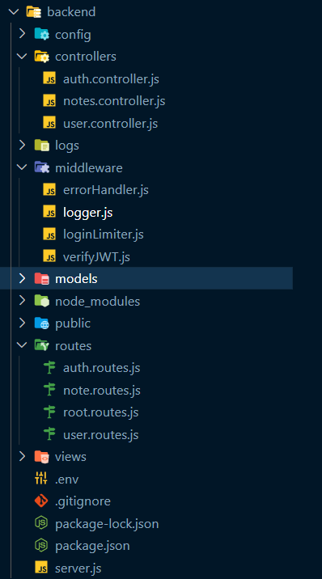

# 1. Folder Structure



# 2. package.json

```npm
npm i express-rate-limit
npm i jsonwebtoken

```

```javascript
{
  "name": "mern_stack",
  "version": "1.0.0",
  "description": "teachNotes MERN Project",
  "main": "index.js",
  "scripts": {
    "start": "node server",
    "dev": "nodemon server"
  },
  "keywords": [],
  "author": "",
  "license": "ISC",
  "dependencies": {
    "bcrypt": "^5.1.1",
    "colors": "^1.4.0",
    "cookie-parser": "^1.4.6",
    "cors": "^2.8.5",
    "date-fns": "^2.30.0",
    "dotenv": "^16.3.1",
    "express": "^4.18.2",
    "express-async-handler": "^1.2.0",
    "express-rate-limit": "^6.11.0",
    "jsonwebtoken": "^9.0.2",
    "mongoose": "^7.5.0",
    "mongoose-sequence": "^5.3.1",
    "uuid": "^9.0.0"
  },
  "devDependencies": {
    "nodemon": "^3.0.1"
  }
}

```

# 3. env

```javascript
NODE_ENV=development
MONGODB_URL=
ACCESS_TOKEN_SECRET=
REFRESH_TOKEN_SECRET=

```

```js
$ node
Welcome to Node.js v18.16.1.
Type ".help" for more information.

> require('crypto').randomBytes(64).toString('hex')
//'f0b57f7c3464667d742979af1afe6da67faa1d2b08c7f69e8f5501a7090f7d7c174300e37cd7be2706e0c39d7ee157b02b635c9920e856eb9893a7da183a058e'

> require('crypto').randomBytes(64).toString('hex')
//'ff4d227e8047ccf63734d900a4c88a285820962a1f165964b38073d7f5582ed0106132d56535aa573c8743dac21d3e43c612e15fc697167c72325857ba38b92d'

```

# 4. server.js

```js
require('dotenv').config();
require('colors');
const express = require('express');
const app = express();
const path = require('path');

//*db
const connectDB = require('./config/db');

//* middleware
const { logger } = require('./middleware/logger');
const errorHandler = require('./middleware/errorHandler');
const cookieParser = require('cookie-parser');

//* cors
const cors = require('cors');
const corsOptions = require('./config/corsOptions');

//* routes
const rootRoutes = require('./routes/root.routes');
const authRoutes = require('./routes/auth.routes'); // added auth routes
const userRoutes = require('./routes/user.routes');
const noteRoutes = require('./routes/note.routes');

console.log(process.env.NODE_ENV);

const PORT = process.env.PORT || 3500;

//* Connect to the database
connectDB();

app.use(logger);

app.use(cors(corsOptions));

app.use(express.json());

app.use(cookieParser());

app.use('/', express.static(path.join(__dirname, '/public')));

app.use('/', rootRoutes);
app.use('/auth', authRoutes); // added auth routes
app.use('/users', userRoutes);
app.use('/notes', noteRoutes);

app.all('*', (req, res) => {
  res.status(404);

  if (req.accepts('html')) {
    res.sendFile(path.join(__dirname, 'views', '404.html'));
  } else if (req.accepts('json')) {
    res.json({ message: '404 Not Found' });
  } else {
    res.type('txt').send('404 Not Found');
  }
});

app.use(errorHandler);

app.listen(PORT, () =>
  console.log(`Server running on PORT : ${PORT}`.magenta.bold)
);
```

# 5. routes/auth.routes.js

```javascript
// Import the Express.js router module and create a new router instance
const router = require('express').Router();

// Import a middleware function named 'loginLimiter' from a separate file
const loginLimiter = require('../middleware/loginLimiter');

// Import controller functions for handling authentication-related logic
const { login, refresh, logout } = require('../controllers/auth.controller.js');

// Define a POST route at the root path ('/') for user login
router.post('/', loginLimiter, login);

// Define a GET route at the '/refresh' path for token refresh
router.get('/refresh', refresh);

// Define a POST route at the '/logout' path for user logout
router.post('/logout', logout);

// Export the router object for use in other parts of the application
module.exports = router;
```

#### 1. The first route (`router.post('/', loginLimiter, login)`)

- is for user login, using the `loginLimiter` middleware to limit login attempts and the `login` controller function to handle the login logic.

#### 2. The second route (`router.get('/refresh', refresh)`)

- is for token refresh, using the `refresh` controller function.

#### 3. The third route (`router.post('/logout', logout)`)

- is for user logout, using the `logout` controller function.

# 6. routes/note.routes.js

```js
const router = require('express').Router();
const {
  getAllNotes,
  createNewNote,
  updateNote,
  deleteNote,
} = require('../controllers/notes.controller');

// Import a middleware function named 'verifyJWT' for JWT (JSON Web Token) verification
const verifyJWT = require('../middleware/verifyJWT');

// Use the 'verifyJWT' middleware for all routes defined below this point
router.use(verifyJWT);

router.get('/', getAllNotes);
router.post('/', createNewNote);
router.patch('/', updateNote);
router.delete('/', deleteNote);

module.exports = router;
```

# 7. middleware/loginLimiter.js

- This code exports a rate-limiting middleware using the Express.js `express-rate-limit` package.
- This middleware is typically used to limit the rate of incoming requests, in this case, to prevent brute-force login attempts.

```javascript
// Import the express-rate-limit package
const rateLimit = require('express-rate-limit');

// Import a logger function named 'logEvents' from a separate file ('logger.js')
const { logEvents } = require('./logger');

// Create a rate limiter middleware with specific configuration
const loginLimiter = rateLimit({
  // Define a time window for rate limiting in milliseconds (1 minute in this case)
  windowMs: 60 * 1000,

  // Limit each IP to 5 login requests per `window` per minute
  max: 5,

  // Message to send when the rate limit is exceeded
  message: {
    message:
      'Too many login attempts from this IP, please try again after a 60-second pause',
  },

  // Handler function to execute when the rate limit is exceeded
  handler: (req, res, next, options) => {
    // Log the rate-limiting event, including the request method, URL, and origin
    logEvents(
      `Too Many Requests: ${options.message.message}\t${req.method}\t${req.url}\t${req.headers.origin}`,
      'errLog.log'
    );

    // Set the HTTP response status code and send the rate-limiting message
    res.status(options.statusCode).send(options.message);
  },

  // Return rate limit info in the `RateLimit-*` headers
  standardHeaders: true,

  // Disable the `X-RateLimit-*` headers
  legacyHeaders: false,
});

// Export the loginLimiter middleware for use in other parts of the application
module.exports = loginLimiter;
```

- The code starts by importing the `express-rate-limit` package, which provides rate-limiting middleware for Express.js applications.

- It also imports a logger function named `logEvents` from a separate file, presumably used for logging rate-limiting events.

**The `loginLimiter` middleware is created with specific configuration options:**

1. `windowMs`: Specifies a time window in milliseconds during which rate limiting will be applied. In this case, it's set to 1 minute (60,000 milliseconds).
2. `max`: Limits the number of requests allowed per IP address during the specified time window. Here, it's set to 5 login requests per minute.

3. `message`: Defines the message to be sent when the rate limit is exceeded. This message is sent as a response to the client.

4. `handler`: Specifies a custom handler function to execute when the rate limit is exceeded. It logs the event and sends an error response.
5. `standardHeaders`: Enables returning rate limit information in the `RateLimit-*` headers.
6. `legacyHeaders`: Disables the `X-RateLimit-*` headers, which are older-style headers for rate limiting.

- Finally, the `loginLimiter` middleware is exported for use in other parts of the application, typically to be applied to routes that require rate limiting on login requests.

- This middleware will restrict the number of login requests from a single IP address to 5 per minute and log any rate-limiting events that occur.
- When the rate limit is exceeded, it will respond with a predefined message and status code.

# 8. middleware/verifyJWT.js

```javascript
// Import the 'jsonwebtoken' package for JWT handling
const jwt = require('jsonwebtoken');

// Define the 'verifyJWT' middleware function
const verifyJWT = (req, res, next) => {
  // Get the 'Authorization' header from the request
  const authHeader = req.headers.authorization || req.headers.Authorization;

  // Check if the 'Authorization' header starts with 'Bearer '
  if (!authHeader?.startsWith('Bearer ')) {
    // If it doesn't, respond with a 401 Unauthorized status and a message
    return res.status(401).json({ message: 'Unauthorized' });
  }

  // Split the 'Authorization' header to extract the token (it's assumed to be in the format 'Bearer <token>')
  const token = authHeader.split(' ')[1];

  // Verify the JWT token using the provided secret (process.env.ACCESS_TOKEN_SECRET)
  jwt.verify(token, process.env.ACCESS_TOKEN_SECRET, (err, decoded) => {
    // If there's an error during verification, respond with a 403 Forbidden status and a message
    if (err) {
      return res.status(403).json({ message: 'Forbidden' });
    }

    // If the token is successfully verified, set the decoded user information and roles in the request object
    req.user = decoded.UserInfo.username;
    req.roles = decoded.UserInfo.roles;

    // Continue to the next middleware or route handler
    next();
  });
};

// Export the 'verifyJWT' middleware for use in other parts of the application
module.exports = verifyJWT;
```

Certainly, let's break down the `verifyJWT` middleware into numbered points for clarity:

1. Import the 'jsonwebtoken' package to work with JSON Web Tokens (JWTs).

2. Define the `verifyJWT` middleware function with `(req, res, next)` as its parameters.

3. Attempt to extract the JWT from the 'Authorization' header in a case-insensitive manner.

4. Check if the 'Authorization' header starts with 'Bearer '. If not, respond with a 401 Unauthorized status and a JSON error message.

5. If the 'Authorization' header starts with 'Bearer ', split the header to extract the token part after 'Bearer '.

6. Verify the extracted token using the provided secret (`process.env.ACCESS_TOKEN_SECRET`) using `jwt.verify`.

7. If there's an error during token verification (e.g., expired or invalid token), respond with a 403 Forbidden status and a JSON error message.

8. If the token is valid, attach the decoded user information (e.g., username and roles) to the request object (`req.user` and `req.roles`).

9. Call `next()` to pass control to the next middleware or route handler, allowing the request to continue processing.

10. Export the `verifyJWT` middleware for use in other parts of the application to protect routes that require authentication via JWTs.

This middleware helps ensure that incoming requests have a valid JWT and attaches user information to the request for authorized access to protected routes. If the JWT is missing or invalid, it responds with appropriate status codes and error messages.

# 9. controllers/auth.controller.js

```javascript
const User = require('../models/user.model');
const bcrypt = require('bcrypt');
const jwt = require('jsonwebtoken');
const asyncHandler = require('express-async-handler');

// @desc Login
// @route POST /auth
// @access Public
const login = asyncHandler(async (req, res) => {
  const { username, password } = req.body;

  // Check if both username and password are provided
  if (!username || !password) {
    return res.status(400).json({ message: 'All fields are required' });
  }

  // Find a user by the provided username
  const foundUser = await User.findOne({ username }).exec();

  // If no user is found or the user is not active, respond with Unauthorized
  if (!foundUser || !foundUser.active) {
    return res.status(401).json({ message: 'Unauthorized' });
  }

  // Compare the provided password with the hashed password in the database
  const match = await bcrypt.compare(password, foundUser.password);

  // If the passwords don't match, respond with Unauthorized
  if (!match) return res.status(401).json({ message: 'Unauthorized' });

  // Generate an access token and a refresh token
  const accessToken = jwt.sign(
    { UserInfo: { username: foundUser.username, roles: foundUser.roles } },
    process.env.ACCESS_TOKEN_SECRET,
    { expiresIn: '15m' }
  );

  const refreshToken = jwt.sign(
    { username: foundUser.username },
    process.env.REFRESH_TOKEN_SECRET,
    { expiresIn: '7d' }
  );

  // Create a secure cookie with the refresh token
  res.cookie('jwt', refreshToken, {
    httpOnly: true, // Accessible only by the web server
    secure: true, // Requires HTTPS
    sameSite: 'None', // Cross-site cookie
    maxAge: 7 * 24 * 60 * 60 * 1000, // Cookie expiry: set to match refresh token's expiry
  });

  // Send the access token containing username and roles
  res.json({ accessToken });
});

// @desc Refresh
// @route GET /auth/refresh
// @access Public - because access token has expired

const refresh = (req, res) => {
  const cookies = req.cookies;

  // Check if a 'jwt' cookie exists
  if (!cookies?.jwt) {
    return res.status(401).json({ message: 'Unauthorized' });
  }
  const refreshToken = cookies.jwt;

  // Verify the refresh token
  jwt.verify(
    refreshToken,
    process.env.REFRESH_TOKEN_SECRET,
    asyncHandler(async (err, decoded) => {
      if (err) {
        return res.status(403).json({ message: 'Forbidden' });
      }

      // Find a user by the decoded username
      const foundUser = await User.findOne({
        username: decoded.username,
      }).exec();

      if (!foundUser) {
        return res.status(401).json({ message: 'Unauthorized' });
      }

      // Generate a new access token
      const accessToken = jwt.sign(
        { UserInfo: { username: foundUser.username, roles: foundUser.roles } },
        process.env.ACCESS_TOKEN_SECRET,
        { expiresIn: '15m' }
      );

      // Send the new access token as a response
      res.json({ accessToken });
    })
  );
};

// @desc Logout
// @route POST /auth/logout
// @access Public - just to clear cookie if exists

const logout = (req, res) => {
  const cookies = req.cookies;

  // Check if a 'jwt' cookie exists
  if (!cookies?.jwt) {
    return res.sendStatus(204); // No Content
  }

  // Clear the 'jwt' cookie
  res.clearCookie('jwt', {
    httpOnly: true, // Accessible only by the web server
    secure: true, // Requires HTTPS
    sameSite: 'None', // Cross-site cookie
  });

  // Send a JSON response indicating that the cookie has been cleared
  res.json({ message: 'Cookie cleared' });
};

module.exports = { login, refresh, logout };
```

### 1. **Login Function (`login`):**

- This function handles user login.
- It uses the `express-async-handler` middleware to handle asynchronous operations within the function.
- It extracts the `username` and `password` from the request body.
- It checks if both `username` and `password` are provided in the request body; if not, it responds with a 400 Bad Request status and a JSON error message.
- It attempts to find a user with the provided `username` in the database using the `User` model.
- If no user is found or the found user is not marked as "active," it responds with a 401 Unauthorized status.
- It uses `bcrypt` to compare the provided `password` with the hashed password stored in the database. If they don't match, it responds with a 401 Unauthorized status.
- If the credentials are valid, it generates an access token and a refresh token using `jsonwebtoken`. The access token contains user information (username and roles) and expires in 15 minutes, while the refresh token contains the username and expires in 7 days.
- It creates a secure cookie (`jwt`) containing the refresh token and sends it with HTTP-only, secure, and SameSite settings.
- Finally, it sends the access token as a JSON response.

### 2. **Refresh Function (`refresh`):**

- This function handles token refresh when the access token has expired.
- It checks if a `jwt` cookie exists in the request.
- If no cookie is found, it responds with a 401 Unauthorized status.
- If a cookie is found, it extracts the refresh token.
- It verifies the refresh token using the `REFRESH_TOKEN_SECRET`. If verification fails, it responds with a 403 Forbidden status.
- If the refresh token is valid, it retrieves the user associated with the token from the database.
- It generates a new access token with an expiration of 15 minutes.
- It sends the new access token as a JSON response.

### 3. **Logout Function (`logout`):**

- This function handles user logout and clears the `jwt` cookie.
- It checks if a `jwt` cookie exists in the request.
- If no cookie is found, it responds with a 204 No Content status.
- If a cookie is found, it clears the `jwt` cookie by setting it to expire immediately.
- It sends a JSON response indicating that the cookie has been cleared.

These functions work together to facilitate user authentication, token refresh, and logout in your application. The use of JWTs and secure cookies helps maintain user sessions and enhance security.
