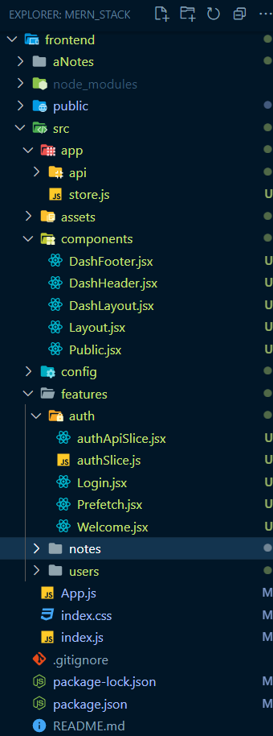

# 1. Folder Structure



# 2. package.json

- No package.json or No dependencies

# 3. app/store.js

```js
// Import necessary functions and modules from Redux Toolkit and other files
import { configureStore } from '@reduxjs/toolkit';
import { apiSlice } from './api/apiSlice'; // Import API-related slice
import { setupListeners } from '@reduxjs/toolkit/query';
import authReducer from '../features/auth/authSlice'; // Import authentication slice

// Configure the Redux store
export const store = configureStore({
  reducer: {
    // Define the store's reducers. Each reducer is assigned to a specific slice of the store state.
    // - [apiSlice.reducerPath]: This dynamically assigns the apiSlice's reducer to a specific path in the store.
    //   The apiSlice is used for handling asynchronous API calls.
    [apiSlice.reducerPath]: apiSlice.reducer,

    // - auth: authReducer: This assigns the authReducer to the auth slice of the store.
    //   The authReducer is likely responsible for managing authentication-related state.
    auth: authReducer,
  },

  // Configure middleware for the store.
  // - getDefaultMiddleware: A function that retrieves the default middleware provided by Redux Toolkit.
  middleware: (getDefaultMiddleware) =>
    // Concatenate the apiSlice.middleware to the default middleware.
    // This adds middleware for handling asynchronous API requests and responses.
    getDefaultMiddleware().concat(apiSlice.middleware),

  // Enable the Redux DevTools extension for debugging.
  devTools: true,
});

// Set up listeners for asynchronous actions from apiSlice.
setupListeners(store.dispatch);
```

# 4. features/auth/authSlice.js

```javascript
// Import necessary modules and slices
import { apiSlice } from '../../app/api/apiSlice'; // Import the apiSlice module
import { logOut } from './authSlice'; // Import the logOut action from the authSlice

// Define the authApiSlice by injecting endpoints
export const authApiSlice = apiSlice.injectEndpoints({
  endpoints: (builder) => ({
    // Login Mutation
    login: builder.mutation({
      query: (credentials) => ({
        url: '/auth',
        method: 'POST',
        body: { ...credentials },
      }),
    }),

    // Refresh Mutation
    refresh: builder.mutation({
      query: () => ({
        url: 'auth/refresh',
        method: 'GET',
      }),
    }),

    // Logout Mutation
    sendLogout: builder.mutation({
      query: () => ({
        url: '/auth/logout',
        method: 'POST',
      }),
      async onQueryStarted(arg, { dispatch, queryFulfilled }) {
        try {
          await queryFulfilled; // Wait for the logout query to be fulfilled
          dispatch(logOut()); // Dispatch the logOut action from the authSlice
          dispatch(apiSlice.util.resetApiState()); // Reset the API state to its initial state
        } catch (err) {
          console.log(err);
        }
      },
    }),
  }),
});

// Export generated hooks for using the mutations
export const { useLoginMutation, useSendLogoutMutation, useRefreshMutation } =
  authApiSlice;
```

Here's a more detailed breakdown of the code with comments:

### 1. **Imports**: Import the necessary modules and slices:

- `apiSlice` is imported from the `apiSlice` module located in `'../../app/api/apiSlice'`. This module likely contains utility functions for managing API-related state and actions.
- `logOut` is imported from the `authSlice` module, which is expected to contain Redux Toolkit logic for handling authentication-related actions and state.

### 2. **`authApiSlice` Definition**:

- This section defines the `authApiSlice` using the `apiSlice.injectEndpoints` function, which is part of Redux Toolkit's API Slice functionality.

### 3. **Login Mutation (`login`)**:

- This mutation is defined for handling user login.
- It is defined using `builder.mutation` within the `endpoints` configuration.
- The `query` function specifies the details of the API request for login. It includes the URL (`'/auth'`), the HTTP method (`'POST'`), and the request body, which is populated with `credentials`.

### 4. **Refresh Mutation (`refresh`)**:

- This mutation is defined for token refresh.
- It is defined in a similar manner to the login mutation but with different URL and HTTP method specifications.

### 5. **Logout Mutation (`sendLogout`)**:

- This mutation is defined for user logout.
- It includes a `query` function that specifies the URL (`'/auth/logout'`) and HTTP method (`'POST'`) for the logout API request.
- The `onQueryStarted` async function is defined to handle actions when the logout query is initiated. Upon successful logout, it dispatches two actions:
  - `dispatch(logOut())`: Dispatches the `logOut` action from the `authSlice`. This action is likely used to clear authentication-related state.
  - `dispatch(apiSlice.util.resetApiState())`: Dispatches a Redux Toolkit action to reset the API state to its initial state. This ensures that any cached data related to API calls is cleared.

### 6. **Export Generated Hooks**:

- The generated hooks for using these mutations are exported for integration into React components.
- These hooks provide a convenient way to trigger the mutations in React components and manage the associated asynchronous actions.

**_In summary,_**

- this code sets up an `authApiSlice` using Redux Toolkit's API Slice functionality.
- It defines mutations for login, token refresh, and logout, each with specific API request configurations.
- The `onQueryStarted` function in the logout mutation allows for additional actions to be dispatched upon successful logout.
- Finally, hooks for using these mutations are exported for use in React components.

# 5. features/auth/authApiSlice.js

The provided code defines an authentication slice using Redux Toolkit's `createSlice` function. This slice handles authentication-related state, including storing and clearing user authentication tokens. Here's a detailed explanation of the code with comments:

```javascript
// Import necessary function from Redux Toolkit
import { createSlice } from '@reduxjs/toolkit';

// Define the authSlice
const authSlice = createSlice({
  name: 'auth', // Name of the slice
  initialState: { token: null }, // Initial state with a null token
  reducers: {
    // Action: setCredentials
    setCredentials: (state, action) => {
      const { accessToken } = action.payload;
      state.token = accessToken; // Set the token in the state to the provided accessToken
    },
    // Action: logOut
    logOut: (state, action) => {
      state.token = null; // Clear the token in the state (logout)
    },
  },
});

// Export the actions generated by createSlice
export const { setCredentials, logOut } = authSlice.actions;

// Export the reducer generated by createSlice
export default authSlice.reducer;

// Selector: selectCurrentToken
export const selectCurrentToken = (state) => state.auth.token;
```

Here's the breakdown of the code with comments:

### 1. **Import Statement**:

- Import the `createSlice` function from Redux Toolkit, which is used to define the authentication slice.

### 2. **AuthSlice Definition**:

- `name`: Name of the slice, set as `'auth'`. This will be used to reference this slice in the Redux store.
- `initialState`: Initial state of the slice, with an object containing a `token` property set to `null`.

### 3. **Reducers**:

- Two reducers (`setCredentials` and `logOut`) are defined within the `reducers` object.

#### 1. `setCredentials`:

- This reducer is responsible for setting user credentials in the state.
- It takes the current `state` and an `action` as parameters.
- It extracts the `accessToken` from the `action.payload` and sets it in the state's `token` property.

#### 2. `logOut`:

- This reducer handles the logout action.
- It takes the current `state` and an `action` as parameters.
- It clears the `token` property in the state by setting it to `null`.

### 4. **Exported Actions and Reducer**:

- The actions generated by `createSlice` (`setCredentials` and `logOut`) are exported for use in other parts of the application.
- The reducer generated by `createSlice` is also exported as `authSlice.reducer`.

### 5. **Selector (`selectCurrentToken`)**:

- A selector function is defined to retrieve the current token from the state.
- It takes the `state` as a parameter and returns the `token` property from the `auth` slice of the state.

**_In summary,_**

- this code defines an authentication slice with two actions (`setCredentials` and `logOut`) for setting and clearing authentication tokens in the state.
- It also provides a selector (`selectCurrentToken`) to retrieve the current token from the state.
- This slice can be used in conjunction with the Redux store to manage authentication-related state in a Redux-powered application.

# 6. features/auth/Login.jsx

The provided code is a React component called `Login`. It represents a login page in a web application. This component handles user input for username and password, communicates with a server using Redux Toolkit's `useLoginMutation`, and dispatches actions to store user credentials. Here's a detailed explanation of the code with comments:

```javascript
import { useRef, useState, useEffect } from 'react';
import { useNavigate, Link } from 'react-router-dom';

// Import necessary Redux related functions and actions
import { useDispatch } from 'react-redux';
import { setCredentials } from './authSlice';
import { useLoginMutation } from './authApiSlice';

const Login = () => {
  const userRef = useRef();
  const errRef = useRef();

  const [username, setUsername] = useState('');
  const [password, setPassword] = useState('');
  const [errMsg, setErrMsg] = useState('');

  const navigate = useNavigate();
  const dispatch = useDispatch();

  // Use the login mutation from authApiSlice
  const [login, { isLoading }] = useLoginMutation();

  // Focus on the username input when the component mounts
  useEffect(() => {
    userRef.current.focus();
  }, []);

  // Clear error message when username or password changes
  useEffect(() => {
    setErrMsg('');
  }, [username, password]);

  // Handle form submission
  const handleSubmit = async (e) => {
    e.preventDefault();
    try {
      // Attempt to login and get the accessToken
      const { accessToken } = await login({ username, password }).unwrap();
      // Dispatch the accessToken to store user credentials
      dispatch(setCredentials({ accessToken }));
      // Clear username and password fields
      setUsername('');
      setPassword('');
      // Navigate to the dashboard
      navigate('/dash');
    } catch (err) {
      if (!err.status) {
        setErrMsg('No Server Response');
      } else if (err.status === 400) {
        setErrMsg('Missing Username or Password');
      } else if (err.status === 401) {
        setErrMsg('Unauthorized');
      } else {
        setErrMsg(err.data?.message);
      }
      errRef.current.focus();
    }
  };

  // Handle user input for username
  const handleUserInput = (e) => setUsername(e.target.value);

  // Handle user input for password
  const handlePwdInput = (e) => setPassword(e.target.value);

  // Determine the CSS class for displaying error messages
  const errClass = errMsg ? 'errmsg' : 'offscreen';

  // If the login mutation is in progress, display a loading message
  if (isLoading) return <p>Loading...</p>;

  // Render the login form and content
  const content = (
    <section className="public">
      <header>
        <h1>Employee Login</h1>
      </header>

      {/* Login Form */}
      <main className="login">
        <p ref={errRef} className={errClass} aria-live="assertive">
          {errMsg}
        </p>

        <form className="form" onSubmit={handleSubmit}>
          <label htmlFor="username">Username:</label>
          <input
            className="form__input"
            type="text"
            id="username"
            ref={userRef}
            value={username}
            onChange={handleUserInput}
            autoComplete="off"
            required
          />

          <label htmlFor="password">Password:</label>
          <input
            className="form__input"
            type="password" // Change type to 'password' for password input
            id="password"
            onChange={handlePwdInput}
            value={password}
            required
          />
          <button className="form__submit-button">Sign In</button>
        </form>
      </main>

      {/* Footer */}
      <footer>
        <Link to="/">Back to Home</Link>
      </footer>
    </section>
  );

  return content;
};

export default Login;
```

Here's a detailed explanation of the code with comments:

### 1. **Imports**:

- Import necessary React hooks, components, and Redux-related functions and actions.

### 2. **Component State**:

- `userRef` and `errRef` are `useRef` hooks used to reference DOM elements.
- `username` and `password` are state variables for storing user input.
- `errMsg` stores error messages that may occur during login.

### 3. **React Router Navigation**:

- `navigate` is a hook from React Router that provides navigation functionality.

### 4. **Redux Setup**:

- `dispatch` is used to dispatch actions to the Redux store.
- `useLoginMutation` is a hook generated by Redux Toolkit's `authApiSlice` to initiate the login mutation.

### 5. **Effect Hooks**:

- `useEffect` hooks are used for side effects:
  - The first effect focuses on the `username` input field when the component mounts.
  - The second effect clears the error message (`errMsg`) when the `username` or `password` changes.

### 6. **Form Submission (`handleSubmit`)**:

- This function is called when the login form is submitted.
- It triggers the login mutation, attempts to log in, and retrieves the `accessToken`.
- If successful, it dispatches the `setCredentials` action to store the `accessToken`, clears the input fields, and navigates to the dashboard.
- If an error occurs, it handles different error cases based on the error's status code.

### 7. **Input Handlers (`handleUserInput` and `handlePwdInput`)**:

- These functions handle user input for the `username` and `password` fields, respectively.

### 8. **CSS Class for Error Messages**:

- `errClass` determines the CSS class for displaying error messages based on the presence of `errMsg`.

### 9. **Loading State**:

- If the `isLoading` flag is true (indicating that the login mutation is in progress), it displays a loading message.

### 10. **Render Content**:

- The component renders the login form, including labels, input fields, and a submit button.
- Error messages are displayed as needed.
- A link to navigate back to the home page is also provided.

**_In summary,_**

- this code defines a React component for user login.
- It handles user input, communicates with a server to authenticate users using Redux Toolkit's `authApiSlice`, and dispatches actions to store user credentials in the Redux store.
- It also provides error handling and navigation functionality.

# 7. components/DashHeader.jsx

- The provided code defines a React component called `DashHeader`, which represents the header section of a dashboard in a web application.
- It includes a navigation menu and a logout button.

```js
// Import necessary modules and components
import { useEffect } from 'react';
import { FontAwesomeIcon } from '@fortawesome/react-fontawesome';
import { faRightFromBracket } from '@fortawesome/free-solid-svg-icons';
import { useNavigate, Link, useLocation } from 'react-router-dom';

// Import the logout mutation hook from the authApiSlice
import { useSendLogoutMutation } from '../features/auth/authApiSlice';

// Regular expression to match URLs for the dashboard's main page (e.g., /dash or /dash/)
const DASH_REGEX = /^\/dash(\/)?$/;
/*
  ^       : Anchors the match to the start of the string.
  \       : Escapes the forward slash to match the literal character "/".
  \/dash  : Matches the literal string "/dash".
  (\/)?   : This part is an optional group that matches a forward slash "/" optionally
            (zero or one occurrence). It allows the URL to match both /dash and /dash/.
*/

// Regular expression to match URLs for the notes section within the dashboard (e.g., /dash/notes or /dash/notes/)
const NOTES_REGEX = /^\/dash\/notes(\/)?$/;
/*
  ^           : Anchors the match to the start of the string.
  \           : Escapes the forward slash to match the literal character "/".
  \/dash\/notes: Matches the literal string "/dash/notes".
  (\/)?       : This part is an optional group that matches a forward slash "/" optionally
                (zero or one occurrence). It allows the URL to match both /dash/notes and /dash/notes/.
*/

// Regular expression to match URLs for the users section within the dashboard (e.g., /dash/users or /dash/users/)
const USERS_REGEX = /^\/dash\/users(\/)?$/;
/*
  ^             : Anchors the match to the start of the string.
  \             : Escapes the forward slash to match the literal character "/".
  \/dash\/users : Matches the literal string "/dash/users".
  (\/)?         : This part is an optional group that matches a forward slash "/" optionally
                  (zero or one occurrence). It allows the URL to match both /dash/users and /dash/users/.
*/

const DashHeader = () => {
  // Get the navigation function and current pathname from React Router
  const navigate = useNavigate();
  const { pathname } = useLocation();

  // Use the sendLogout mutation hook
  const [sendLogout, { isLoading, isSuccess, isError, error }] =
    useSendLogoutMutation();

  // Effect: Redirect to the home page if logout was successful
  useEffect(() => {
    if (isSuccess) navigate('/');
  }, [isSuccess, navigate]);

  // Render loading state if logout is in progress
  if (isLoading) return <p>Logging Out...</p>;

  // Render error message if an error occurred during logout
  if (isError) return <p>Error: {error.data?.message}</p>;

  // Determine if a smaller style should be applied to the header container
  let dashClass = null;
  if (
    !DASH_REGEX.test(pathname) &&
    !NOTES_REGEX.test(pathname) &&
    !USERS_REGEX.test(pathname)
  ) {
    dashClass = 'dash-header__container--small';
  }

  // Define the logout button
  const logoutButton = (
    <button className="icon-button" title="Logout" onClick={sendLogout}>
      <FontAwesomeIcon icon={faRightFromBracket} />
    </button>
  );

  // Define the header content
  const content = (
    <header className="dash-header">
      <div className={`dash-header__container ${dashClass}`}>
        {/* Link to the dashboard home */}
        <Link to="/dash">
          <h1 className="dash-header__title">techNotes</h1>
        </Link>
        <nav className="dash-header__nav">
          {/* Add more buttons or links for navigation */}
          {logoutButton} {/* Render the logout button */}
        </nav>
      </div>
    </header>
  );

  // Return the rendered content
  return content;
};

export default DashHeader;
```

Here's a detailed breakdown of the code with comments:

### 1. **Imports**:

-Import necessary modules, including React, FontAwesome icons, and React Router related components and hooks. Additionally, the `useSendLogoutMutation` hook is imported from `authApiSlice` for handling the logout mutation.

### 2. **Regular Expressions (Regex)**:

- Three regular expressions (`DASH_REGEX`, `NOTES_REGEX`, and `USERS_REGEX`) are defined to match specific URL patterns.
- These patterns are used to determine whether to apply a smaller style to the header container.

### 3. **Component Initialization**:

- The `navigate` function from React Router is used to handle navigation.
- The `pathname` from `useLocation` is used to get the current URL path.

### 4. **Logout Mutation Hook**:

- The `useSendLogoutMutation` hook is used to initiate the logout mutation. It provides information about the mutation's loading status, success, and errors.

### 5. **Effect for Successful Logout**:

- An `useEffect` is used to redirect the user to the home page (`navigate('/')`) when the logout is successful (`isSuccess` is `true`).

### 6. **Conditional Rendering**:

- `isLoading`: If the logout process is in progress, it displays a loading message.
- `isError`: If an error occurs during logout, it displays an error message along with the error data.
- `dashClass`: If the URL doesn't match any of the specified patterns, it applies a smaller style to the header container.

### 7. **Logout Button**:

- A logout button is defined with an associated FontAwesome icon.
- When clicked, it triggers the `sendLogout` function, which initiates the logout process.

### 8. **Header Content**:

- The header content includes the application title, navigation links (to be extended in the future), and the logout button.
- The `Link` component from React Router is used to create a link to the dashboard.

**_In summary,_**

- this code defines a React component for a dashboard header.
- It includes navigation links and a logout button, which triggers the logout process using Redux Toolkit's `useSendLogoutMutation`.
- The component's appearance can change based on the URL path using regular expressions for pattern matching.

# 8. features/note/NewNote.js

The provided code defines a React component called `NewNote`. This component appears to be responsible for rendering a form for creating a new note. Let's break down the code and add comments for clarification:

```javascript
import { useSelector } from 'react-redux';
import { selectAllUsers } from '../users/usersApiSlice';
import NewNoteForm from './NewNoteForm';

const NewNote = () => {
  // Use the useSelector hook to retrieve the list of users from the Redux store
  const users = useSelector(selectAllUsers);

  // Check if the users array is empty or undefined
  if (!users?.length) {
    // If there are no users or the users data is not available, display a message
    return <p>Not Currently Available</p>;
  }

  // // const content = users ? <NewNoteForm users={users} /> : <p>Loading...</p>;

  // Define the content to be rendered. In this case, it's the NewNoteForm component with the users data.
  const content = <NewNoteForm users={users} />;

  // Return the content to be rendered in the component
  return content;
};

export default NewNote;
```

Here's an explanation of the code with comments:

### 1. **Imports**:

- `useSelector` is imported from React Redux to access data from the Redux store.
- `selectAllUsers` is imported from `'../users/usersApiSlice'`, presumably to select all users from the Redux store.
- `NewNoteForm` is imported from `'./NewNoteForm'`, likely representing a form component for creating a new note.

### 2. **Functional Component**:

- `NewNote` is a functional component that does not receive any props.

### 3. **Redux Selector**:

- `useSelector(selectAllUsers)` is used to retrieve the list of users from the Redux store. `selectAllUsers` is presumably a selector function provided by the `'../users/usersApiSlice'`.

### 4. **Conditional Rendering**:

- There is a conditional check to see if `users` is either `undefined` or an empty array (`!users?.length`).
- If there are no users (or the users data is not available), it returns a message `<p>Not Currently Available</p>`.

### 5. **Content Rendering**:

- If there are users available, it defines the `content` variable, which is set to `<NewNoteForm users={users} />`. This suggests that the `NewNoteForm` component is being rendered with the `users` data.

### 6. **Component Return**:

- Finally, it returns the `content` variable, which will render the `NewNoteForm` component with user data if available or display a message if there are no users or the data is not available.

This component seems to conditionally render the `NewNoteForm` component based on the availability of user data from the Redux store. If users are available, it passes the `users` data to the `NewNoteForm` component for further processing.
