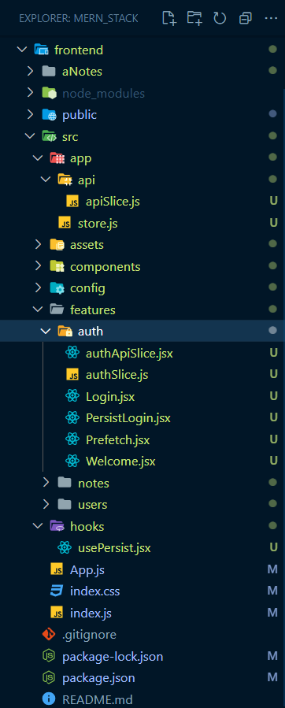

# 1. Folder Structure



# 2. package.json

- No package.json or No dependencies

# 3. app/api/apiSlice.js

Certainly! Let's go through the code step by step with detailed comments to explain each part:

```javascript
import { createApi, fetchBaseQuery } from '@reduxjs/toolkit/query/react';
import { setCredentials } from '../../features/auth/authSlice';

// Define the baseQuery instance for making API requests.
const baseQuery = fetchBaseQuery({
  baseUrl: 'http://localhost:3500', // Base URL for your API
  credentials: 'include', // Include credentials (cookies) in requests
  prepareHeaders: (headers, { getState }) => {
    const token = getState().auth.token; // Get the authentication token from Redux store

    if (token) {
      headers.set('authorization', `Bearer ${token}`); // Add the Bearer token to the request headers
    }
    return headers;
  },
});

// Define a custom baseQuery function with token refresh logic.
const baseQueryWithReauth = async (args, api, extraOptions) => {
  // args: Request details (URL, method, body)
  // api: API-related utilities (signal, dispatch, getState())
  // extraOptions: Custom options (e.g., { shout: true })

  let result = await baseQuery(args, api, extraOptions); // Make the original API request

  // If the response has a 403 status code (token expired or invalid)
  if (result?.error?.status === 403) {
    console.log('sending refresh token');

    // Send a refresh token request to get a new access token
    const refreshResult = await baseQuery('/auth/refresh', api, extraOptions);

    if (refreshResult?.data) {
      // Store the new token in the Redux store
      api.dispatch(setCredentials({ ...refreshResult.data }));

      // Retry the original query with the new access token
      result = await baseQuery(args, api, extraOptions);
    } else {
      // If the refresh request also fails with a 403 status code, handle it as an expired login session
      if (refreshResult?.error?.status === 403) {
        refreshResult.error.data.message = 'Your login has expired. ';
      }
      return refreshResult; // Return the error response
    }
  }

  return result; // Return the original or refreshed result
};

// Create an API slice using createApi
export const apiSlice = createApi({
  baseQuery: baseQueryWithReauth, // Use the custom baseQuery with token refresh logic
  tagTypes: ['Note', 'User'], // Define tag types for caching
  endpoints: (builder) => ({}), // Define your API endpoints here when needed
});
```

Now, let's break down the code with comments:

1. Import necessary dependencies, including `createApi` and `fetchBaseQuery` from Redux Toolkit's query module and `setCredentials` from your authentication slice.

2. Define a `baseQuery` instance using `fetchBaseQuery`. This instance sets up the base URL for your API, includes credentials (cookies) in requests, and prepares headers by adding the Bearer token if available in the Redux store.

3. Define a custom `baseQueryWithReauth` function that will be used as the base query for your API slice. This function takes three arguments: `args`, `api`, and `extraOptions`.

4. Inside `baseQueryWithReauth`, you call the original `baseQuery` function to make the API request based on the provided `args`, `api`, and `extraOptions`.

5. If the response has a 403 status code, it indicates that the token has expired or is invalid. In this case, you attempt to refresh the token by making a request to `/auth/refresh` using the `baseQuery`.

6. If the refresh request is successful and returns new token data, you update the token in your Redux store using `api.dispatch(setCredentials(...))`.

7. After updating the token, you retry the original request with the new access token by calling `baseQuery` again.

8. If the refresh request fails with a 403 status code, you handle it as an expired login session by setting a custom error message in the response.

9. Finally, you return the result, which could be the original response or the refreshed response.

10. You define an `apiSlice` using `createApi`. This slice uses your custom `baseQueryWithReauth` as the `baseQuery` for making API requests. You also specify tag types for caching and provide an empty `endpoints` object. You can define actual API endpoints inside the `builder` function when needed.

This code sets up the foundation for making authenticated API requests with token refresh logic built in. It ensures that your application can handle token expiration and refresh it automatically when necessary.

# 4. hooks/usePersist.jsx

The code you provided defines a custom React hook called `usePersist`. This hook is designed to manage and persist a boolean value in the browser's `localStorage`. Here's a breakdown of what this code does:

```javascript
import { useState, useEffect } from 'react';

const usePersist = () => {
  // Initialize the 'persist' state variable with the value stored in localStorage,
  // or 'false' if there's no value stored.
  const [persist, setPersist] = useState(
    JSON.parse(localStorage.getItem('persist')) || false
  );

  // Use the 'useEffect' hook to watch for changes to the 'persist' state variable.
  useEffect(() => {
    // When 'persist' changes, store its value in localStorage as a JSON string.
    localStorage.setItem('persist', JSON.stringify(persist));
  }, [persist]);

  // Return the 'persist' state variable and the 'setPersist' function to update it.
  return [persist, setPersist];
};

export default usePersist;
```

Here's how this hook works:

1. `useState` is used to declare a state variable called `persist`. The initial value of `persist` is retrieved from `localStorage` using `localStorage.getItem('persist')`. If there's no value stored in `localStorage`, it defaults to `false`.

2. The `useEffect` hook is employed to watch for changes in the `persist` state variable. This effect runs whenever `persist` changes.

3. Inside the `useEffect`, the current value of `persist` is stored in `localStorage` using `localStorage.setItem('persist', JSON.stringify(persist))`. This ensures that the `persist` value is always kept in sync with the browser's `localStorage`.

4. The hook returns an array containing two elements:
   - The first element is the `persist` state variable, which represents the boolean value that you want to persist.
   - The second element is the `setPersist` function, which allows you to update the `persist` state variable when needed.

# 5. features/auth/Login.jsx

The code you provided appears to be a React component for handling user login. It seems to be part of a web application, possibly with user authentication functionality using Redux Toolkit's `authSlice` and `authApiSlice`. I'll provide a detailed breakdown of this code with comments to help you understand its functionality:

```javascript
import { useRef, useState, useEffect } from 'react';
import { useNavigate, Link } from 'react-router-dom';

import { useDispatch } from 'react-redux';
import { setCredentials } from './authSlice';
import { useLoginMutation } from './authApiSlice';

import usePersist from '../../hooks/usePersist';

const Login = () => {
  // Refs for focusing on input elements
  const userRef = useRef();
  const errRef = useRef();

  // State variables for username, password, and error message
  const [username, setUsername] = useState('');
  const [password, setPassword] = useState('');
  const [errMsg, setErrMsg] = useState('');

  // Custom hook to manage and persist a boolean value in localStorage
  const [persist, setPersist] = usePersist();

  // React Router's navigation hook
  const navigate = useNavigate();

  // Redux dispatch function
  const dispatch = useDispatch();

  // Mutation function for user login using Redux Toolkit Query
  const [login, { isLoading }] = useLoginMutation();

  // Use effect to focus on the username input when the component mounts
  useEffect(() => {
    userRef.current.focus();
  }, []);

  // Use effect to clear error message when username or password changes
  useEffect(() => {
    setErrMsg('');
  }, [username, password]);

  // Handle form submission
  const handleSubmit = async (e) => {
    e.preventDefault();
    try {
      // Attempt to log in using the 'login' mutation function
      const { accessToken } = await login({ username, password }).unwrap();

      // Update Redux store with the access token
      dispatch(setCredentials({ accessToken }));

      // Clear username and password fields
      setUsername('');
      setPassword('');

      // Navigate to the '/dash' route upon successful login
      navigate('/dash');
    } catch (err) {
      if (!err.status) {
        setErrMsg('No Server Response');
      } else if (err.status === 400) {
        setErrMsg('Missing Username or Password');
      } else if (err.status === 401) {
        setErrMsg('Unauthorized');
      } else {
        setErrMsg(err.data?.message);
      }
      errRef.current.focus();
    }
  };

  // Event handlers for input fields and "Trust This Device" checkbox
  const handleUserInput = (e) => setUsername(e.target.value);
  const handlePwdInput = (e) => setPassword(e.target.value);
  const handleToggle = () => setPersist((prev) => !prev);

  // Determine CSS class for displaying error message
  const errClass = errMsg ? 'errmsg' : 'offscreen';

  // Render loading message if a login request is in progress
  if (isLoading) return <p>Loading...</p>;

  // Define the content of the login page
  const content = (
    <section className="public">
      <header>
        <h1>Employee Login</h1>
      </header>

      {/* Login Form */}
      <main className="login">
        <p ref={errRef} className={errClass} aria-live="assertive">
          {errMsg}
        </p>

        <form className="form" onSubmit={handleSubmit}>
          <label htmlFor="username">Username:</label>
          <input
            className="form__input"
            type="text"
            id="username"
            ref={userRef}
            value={username}
            onChange={handleUserInput}
            autoComplete="off"
            required
          />

          <label htmlFor="password">Password:</label>
          <input
            className="form__input"
            type="text"
            id="password"
            onChange={handlePwdInput}
            value={password}
            required
          />
          <button className="form__submit-button">Sign In</button>

          <label htmlFor="persist" className="form__persist">
            <input
              type="checkbox"
              className="form__checkbox"
              id="persist"
              onChange={handleToggle}
              checked={persist}
            />
            Trust This Device
          </label>
        </form>
      </main>

      {/* Footer */}
      <footer>
        <Link to="/">Back to Home</Link>
      </footer>
    </section>
  );

  return content;
};

export default Login;
```

Here's a breakdown of the key functionality in this code:

1. It imports necessary React hooks (`useState`, `useEffect`, `useRef`) and libraries like React Router (`useNavigate`, `Link`) and Redux (`useDispatch`).

2. It imports actions and hooks related to user authentication from Redux Toolkit.

3. It uses the custom `usePersist` hook to manage and persist a boolean value (`persist`) in `localStorage`. This value might control whether the user's login session is remembered on the device.

4. The component uses `useEffect` to focus on the username input element when the component mounts and to clear the error message when the username or password changes.

5. It defines an `handleSubmit` function that handles the form submission. This function attempts to log in the user using the `login` mutation function from the `authApiSlice`, dispatches the access token to the Redux store, and handles different error cases.

6. Event handlers (`handleUserInput`, `handlePwdInput`, `handleToggle`) manage input field changes and toggling the "Trust This Device" checkbox.

7. It determines the CSS class for displaying the error message based on the `errMsg` state variable.

8. If a login request is in progress (`isLoading` is `true`), it displays a loading message.

9. The component renders a login form, including input fields for the username and password, a "Sign In" button, and a "Trust This Device" checkbox.

10. It renders links to navigate back to the home page.

This code appears to be a complete login component for handling user authentication, including form validation, error handling, and navigation.

# 6. features/auth/PersistLogin.jsx

The provided code appears to be a React component called `PersistLogin`, which seems to handle the persistence of a user's login session by checking for a valid token and refreshing it when necessary. Let's break down this code with detailed comments to understand its functionality:

```javascript
// Import necessary dependencies and hooks
import { Outlet, Link } from 'react-router-dom';
import { useEffect, useRef, useState } from 'react';
import { useRefreshMutation } from './authApiSlice'; // Mutation for token refresh
import usePersist from '../../hooks/usePersist'; // Custom hook for session persistence
import { useSelector } from 'react-redux'; // Redux selector for current token
import { selectCurrentToken } from './authSlice'; // Redux selector for the current token

// Define the 'PersistLogin' component
const PersistLogin = () => {
  // Use the 'usePersist' hook to retrieve the 'persist' value from localStorage
  const [persist] = usePersist();

  // Use the 'useSelector' hook to retrieve the current authentication token from Redux store
  const token = useSelector(selectCurrentToken);

  // Create a ref to keep track of whether the 'useEffect' has run
  const effectRan = useRef(false);

  // State variable to track whether token refresh was successful
  const [trueSuccess, setTrueSuccess] = useState(false);

  // Use the 'useRefreshMutation' hook to define the 'refresh' mutation function
  const [refresh, { isUninitialized, isLoading, isSuccess, isError, error }] =
    useRefreshMutation();

  // Use 'useEffect' to perform actions when the component mounts
  useEffect(() => {
    // Check if the 'useEffect' has already run or if not in development mode
    if (effectRan.current === true || process.env.NODE_ENV !== 'development') {
      // React 18 Strict Mode

      // Define a function to verify the refresh token
      const verifyRefreshToken = async () => {
        console.log('verifying refresh token');
        try {
          // Call the 'refresh' mutation to refresh the token
          await refresh();
          // If successful, set 'trueSuccess' to true
          setTrueSuccess(true);
        } catch (err) {
          console.error(err); // Handle and log any errors
        }
      };

      // Check if there is no token and 'persist' is enabled
      if (!token && persist) {
        // Verify the refresh token
        verifyRefreshToken();
      }
    }

    // Define a cleanup function that marks the 'useEffect' as run
    return () => (effectRan.current = true);

    // eslint-disable-next-line
  }, []);

  let content;

  // Determine the content to render based on different conditions
  if (!persist) {
    console.log('no persist'); // If persistence is disabled
    content = <Outlet />; // Render the child routes
  } else if (isLoading) {
    console.log('loading'); // If loading the refresh token
    content = <p>Loading...</p>;
  } else if (isError) {
    console.log('error'); // If an error occurred during refresh
    content = (
      <p className="errmsg">
        {error.data?.message}
        <Link to="/login">Please login again</Link>.
      </p>
    );
  } else if (isSuccess && trueSuccess) {
    console.log('success'); // If refresh was successful
    content = <Outlet />; // Render the child routes
  } else if (token && isUninitialized) {
    console.log('token and uninit'); // If there's a token and it's uninitialized
    console.log(isUninitialized);
    content = <Outlet />; // Render the child routes
  }

  return content;
};

export default PersistLogin;
```

Now, let's provide detailed comments for the functionality:

1. The component imports necessary dependencies, including React Router's `Outlet` and `Link`, React hooks (`useEffect`, `useRef`, `useState`), the `useRefreshMutation` hook for token refresh, a custom `usePersist` hook for session persistence, and Redux-related functions for selecting the current token.

2. Inside the component function, it uses the `usePersist` hook to retrieve the `persist` value from localStorage and the `useSelector` hook to retrieve the current authentication token from the Redux store.

3. A ref called `effectRan` is created using `useRef` to keep track of whether the `useEffect` has run.

4. A state variable called `trueSuccess` is initialized using `useState` to track whether the token refresh was successful.

5. The `useRefreshMutation` hook is used to define the `refresh` mutation function, and its result is destructured into several variables (`isUninitialized`, `isLoading`, `isSuccess`, `isError`, `error`) for handling the mutation state.

6. The `useEffect` hook is used to run code when the component mounts. It checks if the `effectRan` ref is `true` (indicating that the `useEffect` has run before) or if the application is not in development mode (React 18 Strict Mode).

7. Inside the `useEffect`, a function `verifyRefreshToken` is defined to verify the refresh token by calling the `refresh` mutation function. If successful, it sets the `trueSuccess` state to `true`.

8. It checks if there is no token (`!token`) and `persist` is enabled. If both conditions are met, it calls `verifyRefreshToken` to attempt token refresh.

9. A cleanup function is defined in the `useEffect` to set `effectRan.current` to `true`, indicating that the `useEffect` has run.

10. The `content` variable is declared to determine what content to render based on different conditions.

11. If `persist` is disabled, it renders child routes using `<Outlet />`.

12. If the token refresh is in progress (`isLoading`), it displays a loading

message.

13. If there is an error during refresh (`isError`), it displays an error message and a link to the login page.

14. If the token refresh is successful (`isSuccess` and `trueSuccess`), it renders child routes using `<Outlet />`.

15. If there is a token (`token`) and it's uninitialized (`isUninitialized`), it renders child routes using `<Outlet />`.

16. Finally, the component returns the determined `content` for rendering.

This `PersistLogin` component appears to be responsible for handling the persistence of a user's login session by checking for a valid token, attempting to refresh it when needed, and rendering child routes accordingly based on various conditions.

# 7. features/auth/authApiSlice.js

Certainly! Let's provide in-depth comments for each section of the code to clarify its purpose and functionality:

```javascript
// Import necessary dependencies and actions
import { apiSlice } from '../../app/api/apiSlice';
import { logOut, setCredentials } from './authSlice';

// Create an 'authApiSlice' by injecting authentication endpoints
export const authApiSlice = apiSlice.injectEndpoints({
  endpoints: (builder) => ({
    // Define the 'login' endpoint
    login: builder.mutation({
      query: (credentials) => ({
        url: '/auth', // URL for the login endpoint
        method: 'POST', // HTTP method for the request
        body: { ...credentials }, // Request body with user credentials
      }),
    }),

    // Define the 'sendLogout' endpoint
    sendLogout: builder.mutation({
      query: () => ({
        url: '/auth/logout', // URL for the logout endpoint
        method: 'POST', // HTTP method for the request
      }),
      // Define an asynchronous callback when the logout request is initiated
      async onQueryStarted(arg, { dispatch, queryFulfilled }) {
        try {
          const { data } = await queryFulfilled; // Get data from the response
          console.log(data); // Log the response data
          dispatch(logOut()); // Dispatch the 'logOut' action
          setTimeout(() => {
            dispatch(apiSlice.util.resetApiState()); // Reset the API state after logout
          }, 1000); // Delay for 1 second before resetting the state
        } catch (err) {
          console.log(err); // Log any errors that occur
        }
      },
    }),

    // Define the 'refresh' token endpoint
    refresh: builder.mutation({
      query: () => ({
        url: '/auth/refresh', // URL for the token refresh endpoint
        method: 'GET', // HTTP method for the request
      }),
      // Define an asynchronous callback when the token refresh request is initiated
      async onQueryStarted(arg, { dispatch, queryFulfilled }) {
        try {
          const { data } = await queryFulfilled; // Get data from the response
          console.log(data); // Log the response data
          const { accessToken } = data; // Extract the new access token
          dispatch(setCredentials({ accessToken })); // Dispatch the 'setCredentials' action with the new token
        } catch (err) {
          console.log(err); // Log any errors that occur
        }
      },
    }),
  }),
});

// Export hooks for using the authentication mutations in components
export const { useLoginMutation, useSendLogoutMutation, useRefreshMutation } =
  authApiSlice;
```

Now, let's break down the code and provide detailed comments:

1. The code begins by importing necessary dependencies and actions. It imports the `apiSlice` from the API-related module and actions (`logOut` and `setCredentials`) from the authentication slice (`authSlice`).

2. It creates an `authApiSlice` by invoking `apiSlice.injectEndpoints()`. This method is used to define and configure API endpoints for authentication-related actions.

3. Inside the `endpoints` property of the object passed to `injectEndpoints`, three endpoints are defined: `login`, `sendLogout`, and `refresh`. Each endpoint is defined using `builder.mutation()`.

4. For the `login` endpoint:

   - The `query` function specifies the URL (`/auth`), HTTP method (`POST`), and request body, which includes user credentials.

5. For the `sendLogout` endpoint:

   - The `query` function specifies the URL (`/auth/logout`) and HTTP method (`POST`).
   - An asynchronous callback (`onQueryStarted`) is defined to handle actions when the logout request is initiated.
   - Inside this callback:
     - The response data is retrieved with `queryFulfilled`.
     - The response data is logged to the console.
     - The `logOut` action is dispatched to clear the user's authentication state.
     - A `setTimeout` is used to delay resetting the API state using `apiSlice.util.resetApiState()` by 1 second.

6. For the `refresh` endpoint:

   - The `query` function specifies the URL (`/auth/refresh`), HTTP method (`GET`), and no request body.
   - An asynchronous callback (`onQueryStarted`) is defined to handle actions when the token refresh request is initiated.
   - Inside this callback:
     - The response data is retrieved with `queryFulfilled`.
     - The response data is logged to the console.
     - The new access token is extracted from the response.
     - The `setCredentials` action is dispatched with the new access token.

7. Finally, hooks for using the authentication mutations in components are exported: `useLoginMutation`, `useSendLogoutMutation`, and `useRefreshMutation`. These hooks provide convenient methods for making API requests and handling authentication actions in React components.

In summary, this code sets up and configures API endpoints for authentication-related actions, including login, logout, and token refresh. It integrates these endpoints with Redux Toolkit's Query API and provides hooks for easily using these authentication mutations in React components.

# 8. App.js

```js
import { Routes, Route } from 'react-router-dom';
import Layout from './components/Layout';
import Public from './components/Public';
import Login from './features/auth/Login';
import DashLayout from './components/DashLayout';
import Welcome from './features/auth/Welcome';
import NotesList from './features/notes/NotesList';
import UsersList from './features/users/UsersList';
import EditUser from './features/users/EditUser';
import NewUserForm from './features/users/NewUserForm';
import EditNote from './features/notes/EditNote';
import NewNote from './features/notes/NewNote';
import Prefetch from './features/auth/Prefetch';
import PersistLogin from './features/auth/PersistLogin';

function App() {
  return (
    <Routes>
      <Route path="/" element={<Layout />}>
        <Route index element={<Public />} />
        <Route path="login" element={<Login />} />

        <Route element={<PersistLogin />}>
          <Route element={<Prefetch />}>
            <Route path="dash" element={<DashLayout />}>
              <Route index element={<Welcome />} />

              <Route path="users">
                <Route index element={<UsersList />} />
                <Route path=":id" element={<EditUser />} />
                <Route path="new" element={<NewUserForm />} />
              </Route>

              <Route path="notes">
                <Route index element={<NotesList />} />
                <Route path=":id" element={<EditNote />} />
                <Route path="new" element={<NewNote />} />
              </Route>
            </Route>
            {/* End Dash */}
          </Route>
        </Route>
      </Route>
    </Routes>
  );
}

export default App;
```
